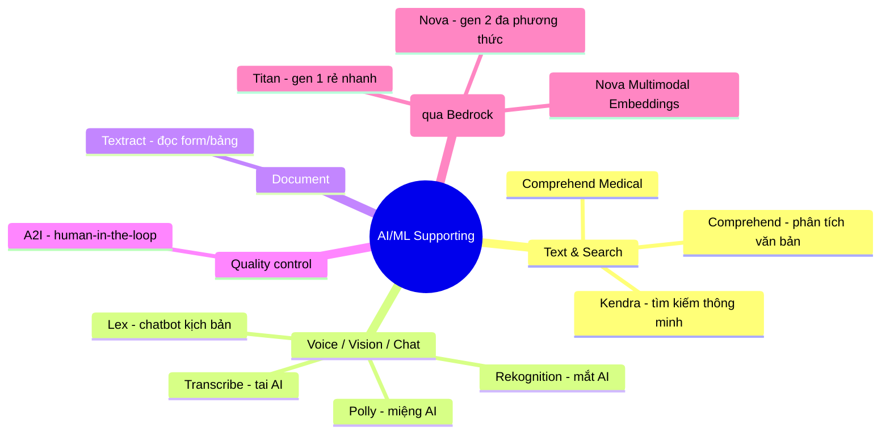

# 03. AI/ML Supporting Services

[← Về Basic Knowledge](./README.md)

> Nhóm "diễn viên phụ xuất sắc" — các dịch vụ AI **truyền thống** (có sẵn từ lâu) của AWS. Đề AIP-C01 không chỉ hỏi GenAI thuần, mà kiểm tra bạn có biết **ghép AI truyền thống + FM** để ra kiến trúc tối ưu **chi phí & hiệu năng** hay không.
>
> **Quy luật "Búa & Dao mổ":** FM (Claude, Nova) là "dao mổ" đa năng đắt tiền. Nếu chỉ cần đóng cái đinh (phân tích cảm xúc, đếm người trong ảnh) → dùng "búa" (Comprehend, Rekognition) cho **nhanh, rẻ, output có cấu trúc**. AI truyền thống thường làm **lớp tiền xử lý (preprocessing)**; FM nằm ở lõi làm việc cần suy luận sâu.

## Mindmap nhóm này

## Bảng tra nhanh

| Service | Mô tả ngắn gọn trong 1 câu | Domain liên quan |
|---|---|---|
| Comprehend | Phân tích văn bản: cảm xúc, thực thể, PII | D1, D2 |
| Comprehend Medical | Comprehend chuyên y khoa | D1, D3 |
| Kendra | Search engine ngữ nghĩa (trả tài liệu, không sinh văn) | D1, D2 |
| Lex | Chatbot/voicebot theo kịch bản (intent + slot) | D2 |
| Rekognition | "Mắt AI": phân tích ảnh/video, content moderation | D1, D3 |
| Transcribe | "Tai AI": speech-to-text + speaker diarization | D1 |
| Polly | "Miệng AI": text-to-speech | D2 |
| Textract | Đọc form/bảng/OCR (form cố định) | D1 |
| A2I (Augmented AI) | Human-in-the-loop khi confidence thấp | D3, D5 |
| Amazon Titan | FM "gen 1" của Amazon (rẻ, nhanh) | D1 |
| Amazon Nova | FM "gen 2" đa phương thức + embeddings | D1 |

---

## Nhóm Text & Search

### Amazon Comprehend

> **Mô tả ngắn gọn trong 1 câu:** "Chuyên gia phân tích văn bản" — đọc đoạn văn, rút ra insight có cấu trúc (JSON).

- **Giải quyết bài toán gì:** Sentiment (khen/chê/trung tính), Entity Recognition (tên/ngày/địa điểm), Language Detection, Topic Modeling, **PII detection/redaction**.
- **Khi nào dùng (thay vì FM):** cần xử lý **khối lượng lớn, tốc độ mili-giây, chi phí rẻ, output JSON chuẩn 100%**. FM tốn kém & chậm hơn cho phân loại đơn giản, lại có thể "lắm lời" làm hỏng JSON.
- **Khi nào KHÔNG dùng / dễ nhầm:** cần *viết văn*, hiểu châm biếm, phân loại tài liệu lạ → FM (Bedrock). Comprehend chỉ **bóc tách**, không "sáng tác".
- **Liên quan domain thi:** D1, D2.
- **⚠️ Điểm phải nhớ:** output đã được chỉ định sẵn (cảm xúc/thực thể) → ưu tiên Comprehend. Trong luồng xử lý, **PII Redaction** của Comprehend rẻ & chính xác hơn nhờ FM tự che.
- **🧪 Ví dụ 1 dòng:** che `***` số thẻ tín dụng trong transcript trước khi đưa cho Bedrock.

🏥 Amazon Comprehend Medical

Bản Comprehend huấn luyện riêng cho y khoa: đọc bệnh án lộn xộn, trích chuẩn xác **tên bệnh, đơn thuốc, liều lượng, thói quen…**. Dùng FM cho bệnh án **chỉ khi** cần *tóm tắt* hay *viết email dặn dò* (việc đòi sáng tác), còn *bóc tách dữ liệu* y khoa → Comprehend Medical.

### Amazon Kendra

> **Mô tả ngắn gọn trong 1 câu:** "Google thu nhỏ cho công ty" — tìm kiếm theo **ngữ nghĩa**, trả về **đoạn văn gốc + confidence score**, không tự chế câu trả lời.

- **Giải quyết bài toán gì:** enterprise search hiểu câu hỏi tự nhiên.
- **Khi nào dùng:** đề chỉ yêu cầu **"tìm và trả về tài liệu liên quan"**.
- **Khi nào KHÔNG dùng / dễ nhầm:** **🔑 Kendra trả tài liệu; Knowledge Bases (RAG) đọc tài liệu rồi *sinh* câu trả lời hoàn chỉnh.** Đề yêu cầu "đọc tài liệu và tự trả lời / xâu chuỗi nhiều nguồn" → Knowledge Bases. (Kendra có thể đóng vai retriever bên dưới RAG.)
- **Liên quan domain thi:** D1, D2.
- **⚠️ Điểm phải nhớ:** Kendra **không** tổng hợp/so sánh nhiều tài liệu thành 1 câu trả lời — đó là việc của RAG.
- **🧪 Ví dụ 1 dòng:** hỏi "chính sách thai sản" → Kendra trả 2 link + trích đoạn; muốn *so sánh 2023 vs 2024 thành bảng* → Knowledge Bases.

---

## Nhóm Voice / Vision / Chat

### Amazon Lex

> **Mô tả ngắn gọn trong 1 câu:** "Người xây chatbot theo kịch bản" — dựa trên **Intents (ý định) + Slots (tham số)**, kỷ luật, không "ảo giác".

- **Giải quyết bài toán gì:** chatbot/voicebot quy trình rõ (đặt vé, đặt hàng) qua slot-filling.
- **Khi nào dùng:** tác vụ **có cấu trúc**, cần ép người dùng điền đủ thông tin.
- **Khi nào KHÔNG dùng / dễ nhầm:** câu hỏi mở/linh hoạt → chuyển (hand-off) cho FM.
- **Liên quan domain thi:** D2.
- **⚠️ Điểm phải nhớ:** Lex **không tự đoán bừa** — thiếu slot thì hỏi lại tới khi đúng. Kết hợp GenAI qua **Fallback Intent**.
- **🧪 Ví dụ 1 dòng:** Lex giữ kỷ luật quy trình đặt vé; câu hỏi linh tinh đẩy sang Bedrock.

🔀 Đào sâu: Hand-off Lex → Bedrock (Fallback Intent)

Khi user nói câu **không khớp kịch bản nào** (đang đặt vé bỗng hỏi "Tokyo hôm nay mặc gì?"), Lex kích **Fallback Intent** → gọi **Lambda** → Lambda gửi câu hỏi sang **Bedrock** → FM trả lời → Lambda trả về Lex hiển thị. Lex làm "bảo vệ" giữ kỷ luật nghiệp vụ; Bedrock làm "học giả" xử câu hỏi mở.

### Amazon Rekognition

> **Mô tả ngắn gọn trong 1 câu:** "Đôi mắt AI" — phân tích ảnh/video: nhận đồ vật, khuôn mặt, chữ trong ảnh, và **kiểm duyệt nội dung**.

- **Giải quyết bài toán gì:** object/face detection, text-in-image, **Content Moderation** (`DetectModerationLabels`), **Custom Labels** (dạy nhận logo/linh kiện riêng).
- **Khi nào dùng:** **tiền xử lý** ảnh trước khi đưa FM (kiểm duyệt rẻ & nhanh); nhận diện chuyên biệt.
- **Khi nào KHÔNG dùng / dễ nhầm:** bài toán **tìm kiếm ảnh (RAG)** → dùng **Nova Multimodal Embeddings**, không phải Rekognition (bẫy hay gặp).
- **Liên quan domain thi:** D1, D3.
- **⚠️ Điểm phải nhớ:** quét ảnh rẻ trước (Rekognition) để chặn ảnh rác/phản cảm → tránh trả tiền oan & tránh FM crash vì vi phạm policy.
- **🧪 Ví dụ 1 dòng:** chặn ảnh 18+ bằng `DetectModerationLabels` trước khi cho FM phân tích.

### Amazon Transcribe

> **Mô tả ngắn gọn trong 1 câu:** "Đôi tai AI" — chuyển giọng nói → văn bản (speech-to-text).

- **Giải quyết bài toán gì:** transcribe audio; **Speaker Diarization** (phân biệt người nói); **Custom Vocabulary** (thuật ngữ riêng).
- **Khi nào dùng:** xử lý audio/cuộc gọi trước khi FM tóm tắt/phân tích.
- **Khi nào KHÔNG dùng / dễ nhầm:** Transcribe = nghe; Polly = nói (ngược chiều).
- **Liên quan domain thi:** D1.
- **⚠️ Điểm phải nhớ:** điểm yếu là **crosstalk** (nói đè nhau) dễ gán nhầm người → dùng mic riêng/đa hướng. Transcribe cũng có PII redaction tích hợp.
- **🧪 Ví dụ 1 dòng:** ghi âm họp → Transcribe (diarization) → Bedrock tóm tắt theo từng người.

🔬 Đào sâu: Speaker Diarization hoạt động ra sao

3 bước: (1) **Trích đặc trưng âm thanh** (tần số, âm sắc…) → mã hoá thành **voiceprint** (như vân tay giọng); (2) **Clustering** các voiceprint gần nhau thành cụm "Speaker 0/1…"; (3) gán nhãn theo cụm (không cần biết tên thật). Lọc nhiễu nền tốt, nhưng **crosstalk** vẫn là điểm yếu.

### Amazon Polly

> **Mô tả ngắn gọn trong 1 câu:** "Miệng AI" — text-to-speech, đọc văn bản thành giọng nói tự nhiên.

- **Khi nào dùng:** đọc lại câu trả lời cho user (voice UX), khâu cuối của luồng hội thoại.
- **Dễ nhầm:** Polly = text→speech; Transcribe = speech→text. (D2)
- **🧪 Ví dụ 1 dòng:** Bedrock soạn câu trả lời → Polly đọc cho khách qua điện thoại.

---

## Nhóm Document

### Amazon Textract

> **Mô tả ngắn gọn trong 1 câu:** "Chuyên gia đọc form/bảng" — OCR + Key-Value + giữ nguyên cấu trúc bảng từ PDF/ảnh.

- **Khi nào dùng:** **form cố định**, hoá đơn chuẩn, số hoá nhanh-rẻ-ổn định (deterministic).
- **Khi nào KHÔNG dùng / dễ nhầm:** tài liệu **lộn xộn nhiều định dạng, cần hiểu ngữ cảnh** → **Bedrock Data Automation** (xem [nhóm 01](./01-amazon-bedrock-services.md)). Textract bóc *đúng cái có trên giấy*; Data Automation *suy luận ngữ nghĩa*.
- **Liên quan domain thi:** D1.
- **🧪 Ví dụ 1 dòng:** bóc bảng số liệu từ form đăng ký chuẩn của ngân hàng.

---

## Nhóm Quality Control

### Amazon Augmented AI (A2I)

> **Mô tả ngắn gọn trong 1 câu:** "Vòng lặp con người" — khi AI tự tin thấp, treo kết quả lại và đẩy cho người duyệt (human-in-the-loop).

- **Giải quyết bài toán gì:** chèn người vào quy trình AI khi **Confidence Score < ngưỡng** (vd < 80%).
- **Khi nào dùng:** thấy "**human review / quality control / low-confidence results**" → chốt A2I.
- **Khi nào KHÔNG dùng / dễ nhầm:** đừng nhầm với Model Monitor (giám sát drift). A2I là **người duyệt từng kết quả**.
- **Liên quan domain thi:** D3, D5.
- **⚠️ Điểm phải nhớ:** A2I tích hợp Textract/Rekognition/FM/custom; có thể đặt làm **cổng phê duyệt thủ công giữa CI/CD Pipeline**.
- **🧪 Ví dụ 1 dòng:** Bedrock đọc thư vay vốn, confidence < 80% → A2I gửi nhân viên tín dụng xác nhận.

🔬 Đào sâu: A2I trong CI/CD (ngành rủi ro cao)

Luồng đọc phim X-quang: **CI** tự train + check accuracy → trước khi deploy, Pipeline gọi **A2I** chọn 100 phim khó nhất cho hội đồng bác sĩ duyệt → Pipeline ở trạng thái *Paused* → bác sĩ OK thì **CD** tự deploy, chê thì huỷ bản cập nhật. A2I = "phanh tay an toàn" giữa hệ thống tự động.

---

## Họ Foundation Model của Amazon (truy cập qua Bedrock)

> *Lưu ý xếp nhóm:* Titan/Nova là FM **của Amazon, dùng qua Bedrock (nhóm 01)**; đặt ở đây theo cách gom của anh. AWS hay "ưu ái" hỏi về model "con đẻ".

### Amazon Titan (gen 1 — rẻ, nhanh)

> **Mô tả ngắn gọn trong 1 câu:** "Thực tập sinh" — xử lý văn bản cơ bản, quy luật rõ, ưu tiên chi phí thấp.

- **Gồm:** Titan Text, Titan Image Generator, Titan Embeddings (và Titan Multimodal Embeddings).
- **Khi nào dùng:** tác vụ đơn giản khối lượng lớn (tóm tắt email, phân loại phòng ban) — nhanh, siêu rẻ.
- **Liên quan domain thi:** D1.
- **🧪 Ví dụ 1 dòng:** Titan Text tóm tắt 10.000 email/ngày thành 2 gạch đầu dòng.

### Amazon Nova (gen 2 — đa phương thức)

> **Mô tả ngắn gọn trong 1 câu:** "Chuyên gia thâm niên" — đa phương thức (text/ảnh/video), context dài, giá tốt.

- **Gồm & thông số (đã verify):**
  - **Nova Micro** — text-only, context **128K**.
  - **Nova Lite / Nova Pro** — multimodal, context **300K**.
  - **Nova Premier** — mạnh nhất, context **1M token** (mô hình "teacher" để distill).
  - **Nova Canvas** — sinh ảnh; **Nova Reel** — sinh video (ban đầu ~6s; bản mới Reel 1.1 tới ~2 phút).
- **Khi nào dùng:** RAG/agentic, hiểu ảnh-video, cần context lớn.
- **Liên quan domain thi:** D1.
- **⚠️ Điểm phải nhớ — đính chính:** "1M token" là **riêng Premier** (không phải cả họ). *(Đã có thế hệ Nova 2 mới hơn cuối 2025; với AIP-C01 tập trung họ Nova 1 là đủ.)*
- **🧪 Ví dụ 1 dòng:** Nova Pro phân tích báo cáo tài chính kèm biểu đồ.

### Amazon Nova Multimodal Embeddings ⭐ (vũ khí cho RAG)

> **Mô tả ngắn gọn trong 1 câu:** Biến **chữ, ảnh, video, audio vào CÙNG một không gian vector** → tìm chéo phương thức (cross-modal retrieval).

- **Giải quyết bài toán gì:** dùng 1 câu chữ tìm đoạn video tương ứng; dùng ảnh tìm sản phẩm. (AWS ra mắt **11/2025**, "industry's first unified embedding".)
- **Khi nào dùng:** RAG đa phương thức — đề bài "tìm kiếm bằng ảnh, trả về text/video".
- **Khi nào KHÔNG dùng / dễ nhầm:** **🔑 bài toán *tìm kiếm/RAG* trên ảnh → Nova Multimodal Embeddings, KHÔNG phải Rekognition** (Rekognition để *nhận diện/kiểm duyệt*, không tạo vector để retrieval).
- **Liên quan domain thi:** D1.
- **🧪 Ví dụ 1 dòng:** khách chụp ảnh ghế sofa → embed → tìm vector gần nhất trong DB → trả về sản phẩm + video "giống 98%".

---

## Tư duy luồng dữ liệu (preprocessing rẻ trước, FM sau)

> AWS hay bắt **ráp nhiều dịch vụ**. Nguyên tắc: AI truyền thống làm lớp tiền xử lý (nhanh, rẻ, có cấu trúc) → FM làm lõi suy luận.

🔗 4 luồng kinh điển

1. **Phân tích cuộc gọi (không lọt PII):** `Audio (S3) → Transcribe (diarization) → Comprehend (PII redaction) → Bedrock (tóm tắt)`. *Vì sao Comprehend che PII chứ không Bedrock?* rẻ, nhanh, chính xác 100%, FM có thể "ảo giác" để lọt PII.
2. **Xử lý hồ sơ vay (IDP):** `PDF (S3) → Textract (form chuẩn) → Data Automation (thư tay lộn xộn) → A2I (confidence < 80% → người duyệt)`.
3. **RAG đa phương thức (kỹ sư bảo trì):** `Ảnh + câu hỏi → Nova Multimodal Embeddings → Vector DB (OpenSearch) → Bedrock (Nova Pro) viết hướng dẫn`. *Bẫy:* không dùng Rekognition cho bước tìm kiếm.
4. **Sinh nội dung an toàn cho trẻ em (defense-in-depth):** `Ảnh user → Rekognition (moderation) → Prompt → Bedrock Guardrails → Bedrock sinh truyện` (Guardrails cũng kiểm lại output).

---

## Bảng so sánh service dễ nhầm trong nhóm ("vũ khí đi thi")

| Tình huống / từ khoá đề | Đừng chọn (bẫy) | Hãy chọn (đúng) |
|---|---|---|
| Phân loại cảm xúc/thực thể, khối lượng lớn, rẻ | FM (Bedrock) | **Comprehend** |
| Bóc tách dữ liệu y khoa từ bệnh án | Comprehend thường | **Comprehend Medical** |
| Chỉ tìm & trả về tài liệu liên quan | Knowledge Bases | **Kendra** |
| Đọc tài liệu rồi tự trả lời / xâu chuỗi nhiều nguồn | Kendra | **Knowledge Bases (RAG)** |
| Chatbot quy trình cứng (đặt vé), không ảo giác | FM thuần | **Lex** (+ Fallback → Bedrock) |
| Kiểm duyệt ảnh / nhận diện vật thể | FM Vision (đắt) | **Rekognition** (tiền xử lý) |
| Tìm kiếm ảnh (RAG) trả về text/video | Rekognition | **Nova Multimodal Embeddings** |
| Speech-to-text + phân biệt người nói | — | **Transcribe** (diarization) |
| Đọc form cố định, OCR bảng | Data Automation | **Textract** |
| Tài liệu lộn xộn, cần hiểu ngữ cảnh | Textract | **Bedrock Data Automation** |
| "human review / low-confidence / quality control" | Model Monitor | **A2I** |

## ⚠️ Bẫy thường gặp của nhóm

- **Búa & Dao mổ:** tác vụ đơn giản → AI truyền thống rẻ/nhanh; cần suy luận sâu → FM.
- **Kendra (trả tài liệu) vs Knowledge Bases (sinh câu trả lời).**
- **Rekognition (nhận diện/kiểm duyệt) vs Nova Multimodal Embeddings (tìm kiếm/RAG ảnh).**
- **A2I** = từ khoá "human review / low-confidence".
- AI truyền thống = lớp **tiền xử lý** rẻ; FM = lõi.

## Liên quan exam domain

Phủ mạnh **D1** (xử lý data Task 1.3) & **D2** (integration), chạm **D3** (Rekognition moderation, A2I). Xem [bản đồ cross-map](./README.md#bản-đồ-nhóm-service--5-exam-domain).

🔗 **Liên quan:** [Case studies](../02-case-studies/) · [Practice exam](../03-practice-exam/) · [← 02. SageMaker](./02-sagemaker-services.md) · [04. Amazon Q →](./04-amazon-q-services.md)
