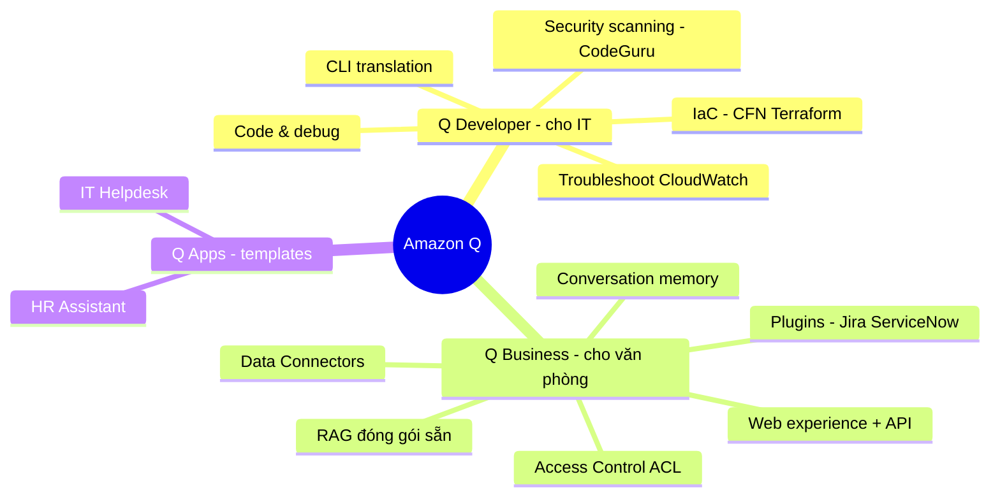

# 04. Amazon Q Services

[← Về Basic Knowledge](./README.md)

> Nếu Bedrock/SageMaker là nơi bạn **tạo ra** AI, thì **Amazon Q là các sản phẩm AI đóng gói sẵn** để dùng luôn — gia đình của Năng suất (Productivity). Tưởng tượng công ty vừa tuyển 3 nhân viên AI: **Q Developer** (coder), **Q Business** (thủ thư doanh nghiệp), **Q Apps** (mì ăn liền).
>
> *Ghi chú phạm vi:* Amazon Q xuất hiện trong AIP-C01 ở mức **vừa phải** (chủ yếu D2). Học để **phân biệt** với Bedrock Knowledge Bases là chính.

## Mindmap nhóm này

## Bảng tra nhanh

| Service | Một câu | Domain liên quan |
|---|---|---|
| Amazon Q Developer | Trợ lý code + hạ tầng AWS (trong IDE & Console) | D2 |
| Amazon Q Business | RAG doanh nghiệp đóng gói sẵn + phân quyền | D2, D3 |
| Amazon Q Apps | Template app dựng sẵn trên Q Business (HR, IT) | D2 |

---

## Service cards

### Amazon Q Developer

> **Một câu:** "Senior coder + chuyên gia AWS" sống trong IDE (VS Code, JetBrains) **và** trên AWS Console.

- **Giải quyết bài toán gì:** tăng tốc viết code & quản hạ tầng AWS.
- **Khả năng chính:**
  - **Code & debug:** đọc hiểu project, viết code theo style của bạn, giải thích code.
  - **Security Scanning (hay thi):** chạy ngầm bắt lỗi bảo mật (hardcoded credentials, SQL injection) **trước khi commit**.
  - **IaC:** sinh CloudFormation/Terraform theo chuẩn Well-Architected.
  - **CLI translation:** "cho tôi xem máy chủ đang chạy" → tự dịch ra lệnh `aws ec2 describe-instances`.
  - **Troubleshooting:** ngay trên Console, đọc CloudWatch Logs → tìm root cause (vd thiếu quyền IAM) → gợi ý sửa.
- **Khi nào dùng:** đụng đến **code, hạ tầng, lệnh AWS, IDE, gỡ lỗi hạ tầng**.
- **Khi nào KHÔNG dùng / dễ nhầm:** **Q Developer ≠ Q Business.** Q Developer cho lập trình viên; Q Business để nhân viên tra cứu tài liệu. Security Scanning **khác** Bedrock Guardrails (Guardrails lọc nội dung/PII của prompt, không quét lỗi code) và **khác** CodeGuru Profiler (đo hiệu năng runtime).
- **Liên quan domain thi:** D2.
- **⚠️ Điểm phải nhớ:** lõi Security Scanning kế thừa **CodeGuru Security** → cập nhật CVE/OWASP **real-time trên cloud** (không phải AI tĩnh). Tiền thân của Q Developer là **CodeWhisperer**.
- **🧪 Ví dụ 1 dòng:** Q Developer bắt đoạn Lambda hardcode mật khẩu DB ngay khi gõ.

🔬 Đào sâu: project lớn xử lý thế nào? (context limit)

Q Developer không gửi cả triệu dòng code lên mây. Nó dùng **Local Semantic Indexing** + RAG trong IDE: tạo "mục lục" ẩn, chỉ gửi đoạn code liên quan nhất (file đang mở, hàm bôi đen, file import trực tiếp). Project phức tạp có thể "mất bối cảnh" → dùng tag **@workspace** (bản Pro) để ép rà soát toàn mục lục, hoặc nối thẳng vào GitHub/GitLab/CodeCommit để index toàn repo.

### Amazon Q Business

> **Một câu:** "Thủ thư thông minh của doanh nghiệp" — một hệ **RAG đóng gói 100%**: cắm vào kho dữ liệu công ty, có sẵn giao diện chat.

- **Giải quyết bài toán gì:** nhân viên (Sales/HR/Marketing) hỏi-đáp tài liệu nội bộ. Cắm **Data Connectors** (S3, SharePoint, Google Drive, Salesforce) → tự hút, băm, tạo vector, cho UI chat.
- **Khi nào dùng:** enterprise search/RAG **ít công sức**, cần **phân quyền nghiêm ngặt**, multi-turn.
- **Khi nào KHÔNG dùng / dễ nhầm:** muốn **tự code, tự xây UI, kiểm soát sâu luồng RAG**, hoặc làm app RAG cho khách bên ngoài → **Bedrock Knowledge Bases** (Q Business là SaaS, không can thiệp sâu được). Không phải công cụ viết code (đó là Q Developer).
- **Liên quan domain thi:** D2, D3.
- **⚠️ Điểm phải nhớ:** tính năng "vĩ đại nhất" = **kế thừa quyền truy cập (ACL)** từ hệ thống gốc → chống rò rỉ dữ liệu chéo. **Conversation memory** giữ ngữ cảnh multi-turn không cần code. **Web experience** out-of-the-box (đổi logo/màu là chạy) hoặc dùng **Q Business API** để nhúng UI riêng.
- **🧪 Ví dụ 1 dòng:** nhà thầu hỏi "lương CEO?" → Q kiểm ACL thấy DENY thư mục `finance/` → trả lời "tôi không có thông tin này".

🔐 Đào sâu: Access Control (ACL) & Plugins

- **ACL:** Q Business tôn trọng quyền gốc. Vd file JSON ACL: group `finance-team` = ALLOW, `contractors` = DENY trên prefix `finance/`. Người bị DENY hỏi tài liệu đó → Q giả như nó **không tồn tại**.
- **Plugins (tay chân — hành động ghi):** kết nối sẵn Jira/ServiceNow/Salesforce/Zendesk. Nhân viên chat "hỏng chuột" → Q hỏi "tạo ticket Jira nhé?" → click là tạo. *So với Bedrock Agents:* Agents linh hoạt nhưng phải tự code Lambda/OpenAPI; Plugins là **đầu cắm dựng sẵn cho enterprise**, cấu hình bằng click.
- **Data Connectors** chỉ **đọc (read-only)** để hút tài liệu; muốn **hành động (write)** thì là **Plugins**.

### Amazon Q Apps (Q Business Apps)

> **Một câu:** "Mì ăn liền" — template app dựng sẵn (HR Assistant, IT Helpdesk) **nằm trên** nền Q Business.

- **Giải quyết bài toán gì:** triển khai cực nhanh (vài ngày), có sẵn System Prompt chuyên ngành + giao diện, không cần tự viết prompt/UI.
- **Khi nào dùng:** cần bot HR/IT **nhanh nhất**, ít tùy biến.
- **Khi nào KHÔNG dùng / dễ nhầm:** **hiểu đúng:** Q App **không** chứa dữ liệu HR của công ty khác — nó chỉ là cái "khuôn" (template prompt + UI). **Linh hồn vẫn là dữ liệu của bạn** (vẫn phải trỏ connector vào S3/SharePoint chứa sổ tay nội bộ). Vì là RAG nên nó trả lời **đúng quy định công ty bạn**, không "chém" theo kiến thức chung.
- **Liên quan domain thi:** D2.
- **⚠️ Điểm phải nhớ:** nhanh nhưng **ít linh hoạt (less flexible)** so với tự dựng Q Business gốc.
- **🧪 Ví dụ 1 dòng:** App HR + trỏ S3 chứa "sổ tay nhân sự" → vài ngày là có bot trả lời chính sách nghỉ phép.

---

## Bảng so sánh service dễ nhầm trong nhóm ("vũ khí đi thi")

| Tình huống / từ khoá đề | Đừng chọn (bẫy) | Hãy chọn (đúng) |
|---|---|---|
| Tìm lỗi bảo mật trong code, viết CFN/Terraform, dịch CLI | Q Business | **Q Developer** |
| Gỡ lỗi hạ tầng từ CloudWatch Logs trên Console | Comprehend / IDE explain | **Q Developer trên Console** |
| Chat tra cứu tài liệu nội bộ (SharePoint/S3) + phân quyền chặt, ít công sức | Bedrock KB (tự code ACL) | **Q Business** |
| RAG nhưng cần tự code, tự xây UI, kiểm soát sâu / cho khách ngoài | Q Business (SaaS) | **Bedrock Knowledge Bases** |
| Bot HR/IT triển khai nhanh, không tự viết prompt/UI | Q Business gốc / Bedrock | **Q Apps** |
| Chatbot tự tạo ticket Jira/ServiceNow | Data Connectors | **Q Business Plugins** |
| Hút dữ liệu read-only từ S3/SharePoint | Plugins | **Data Connectors** |
| Quét lỗi bảo mật code | Bedrock Guardrails / CodeGuru Profiler | **Q Developer (Security Scanning)** |

## ⚠️ Bẫy thường gặp của nhóm

- **Q Developer (code/hạ tầng) vs Q Business (tài liệu nội bộ) vs Bedrock KB (tự build RAG).**
- **Q Apps** chỉ là template — dữ liệu vẫn là của công ty bạn (vẫn RAG).
- **Plugins = hành động (write)**, **Data Connectors = đọc (read)**.
- Security Scanning của Q Developer **≠** Guardrails (nội dung) **≠** CodeGuru Profiler (hiệu năng).
- Cần độ trễ/kiểm soát sâu, UI riêng, khách ngoài → nghiêng về **Bedrock**, không phải Q.

## Liên quan exam domain

Phủ mạnh **D2** (implementation/integration), chạm **D3** (ACL/governance của Q Business) và **D1**. Amazon Q nhìn chung là chủ đề **vừa phải** của AIP-C01. Xem [bản đồ cross-map](./README.md#bản-đồ-nhóm-service--5-exam-domain).

🔗 **Liên quan:** [Case studies](../02-case-studies/) · [Practice exam](../03-practice-exam/) · [← 03. AI/ML Supporting](./03-ai-ml-supporting-services.md) · [05. Data & Analytics →](./05-data-analytics-services.md)
