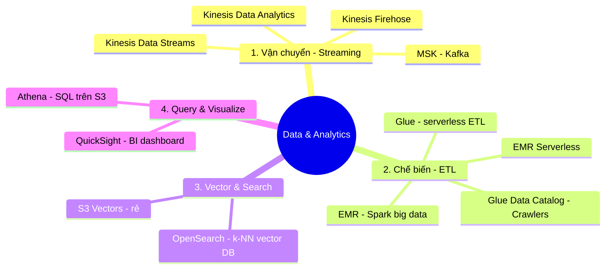

# 05. Data & Analytics Services

[← Về Basic Knowledge](./README.md)

> Lớp **chiếm tỷ trọng điểm cao** (đóng góp nhiều cho D1 = 31%). AI giỏi mấy mà "nguyên liệu" (data) ôi thiu/lộn xộn thì cũng hỏng. Nhóm này lo **chuẩn bị, vận chuyển, lưu trữ-tìm kiếm và báo cáo** dữ liệu.
>
> Nhớ theo **4 công đoạn của nhà máy dữ liệu:** Vận chuyển → Chế biến (ETL) → Lưu trữ & tìm kiếm (Vector) → Truy vấn & biểu đồ.

## Mindmap nhóm này



## Bảng tra nhanh

| Service | Mô tả ngắn gọn trong 1 câu | Domain liên quan |
|---|---|---|
| Kinesis Data Streams | Ống hứng dữ liệu real-time (tự code xử lý) | D1 |
| Kinesis Firehose | Phễu tự nén + chia thư mục + đổ vào S3 (no-code) | D1, D4 |
| Kinesis Data Analytics | Lọc/bắt lỗi ngay trong ống bằng SQL | D1, D5 |
| Amazon MSK | Kinesis bản Kafka (mã nguồn mở) | D1 |
| AWS Glue | ETL serverless + Data Catalog (trái tim data) | D1 |
| Amazon EMR | Cụm Spark/Hadoop cho big data nặng | D1 |
| OpenSearch Service | Vector DB (k-NN) — backend chuẩn cho RAG | D1 |
| Amazon Athena | SQL serverless query thẳng trên S3 | D1, D4 |
| QuickSight | BI dashboard cho lãnh đạo | D4 |

---

## Công đoạn 1 — Vận chuyển (Streaming)

### Amazon Kinesis

> **Mô tả ngắn gọn trong 1 câu:** "Đường ống AWS nội bộ" hứng dữ liệu chảy về liên tục theo thời gian thực.

- **3 thành phần:**
  - **Data Streams:** bơm dữ liệu real-time vào; **bạn tự viết code (Lambda)** xử lý từng bản ghi.
  - **Firehose (hay thi):** "phễu tự động" — nước chảy vào tự **nén + partition theo ngày + đổ vào S3**, không cần code.
  - **Data Analytics:** lọc/bắt lỗi **ngay trong ống** bằng SQL (vd AI trả sai 10 lần/phút).
- **Khi nào dùng:** ingest log/click/event real-time.
- **Khi nào KHÔNG dùng / dễ nhầm:** "gom dữ liệu, tự nén, chia thư mục, đổ vào S3" → **Firehose** (đừng chọn Data Streams vì nó bắt tự code).
- **Liên quan domain thi:** D1 (D4 nhờ Firehose nén/partition tiết kiệm).
- **🧪 Ví dụ 1 dòng:** Epic Games hứng hàng triệu event/giây từ game thủ bằng Data Streams.

### Amazon MSK (Managed Apache Kafka)

> **Mô tả ngắn gọn trong 1 câu:** Giống Kinesis nhưng là **Apache Kafka mã nguồn mở** được AWS quản lý.

- **Khi nào dùng:** công ty **đã có hệ Kafka** từ trước (bê lên cloud không phải viết lại), hoặc tải cực khủng.
- **Khi nào KHÔNG dùng / dễ nhầm:** đề **không nhắc "Kafka"** → mặc định chọn **Kinesis**.
- **Liên quan domain thi:** D1.
- **🧪 Ví dụ 1 dòng:** Uber/Netflix bê kiến trúc Kafka cũ lên AWS bằng MSK.

---

## Công đoạn 2 — Chế biến (ETL)

### AWS Glue

> **Mô tả ngắn gọn trong 1 câu:** "Máy xay sinh tố tự động" — ETL **serverless**, chạy xong tự tắt; rất hay dùng chuẩn bị data cho RAG.

- **Giải quyết bài toán gì:** Extract–Transform–Load dữ liệu trong S3 bằng vài dòng Python/Scala.
- **Thành phần đắt giá:**
  - **Glue Data Catalog** = "trái tim" data AWS: **Crawlers** tự bò vào S3 đọc schema (cột, kiểu) → ghi vào mục lục chung để các service khác (Athena…) biết S3 chứa gì.
  - **Glue Studio:** giao diện kéo-thả cho ai lười code.
- **Khi nào dùng:** ETL đơn giản, serverless, tự động hoá.
- **Khi nào KHÔNG dùng / dễ nhầm:** data **hàng chục TB** hoặc biến đổi ML cực phức tạp → **EMR** (Glue đuối).
- **Liên quan domain thi:** D1.
- **🧪 Ví dụ 1 dòng:** Glue Crawler quét S3 tạo Catalog để Athena query được.

### Amazon EMR

> **Mô tả ngắn gọn trong 1 câu:** "Khu công nghiệp big data" — cụm máy chủ chạy Apache Spark/Hadoop, mạnh khủng khiếp.

- **Khi nào dùng:** data **hàng chục TB**, biến đổi ML phức tạp mà Glue không kham; chạy phân tán hàng nghìn node.
- **Khi nào KHÔNG dùng / dễ nhầm:** query nhanh hay ETL nhẹ → Athena/Glue. EMR phải quản cụm (trừ **EMR Serverless**).
- **Liên quan domain thi:** D1.
- **⚠️ Điểm phải nhớ — đính chính note:** **CÓ Amazon EMR Serverless** (ném code PySpark, AWS tự bật/tắt, trả theo giây). Chọn EMR Serverless thay Glue khi cần **thư viện Spark/ML đặc thù mà Glue không hỗ trợ**.
- **🧪 Ví dụ 1 dòng:** xử lý 50TB dữ liệu xe tự lái/đêm: blur mặt người + sync GPS bằng Spark trên EMR.

---

## Công đoạn 3 — Vector & Search

### Amazon OpenSearch Service

> **Mô tả ngắn gọn trong 1 câu:** Công cụ tìm kiếm toàn văn, đồng thời là **Vector Database (k-NN)** — "kho sách" chuẩn nhất cho RAG.

- **Giải quyết bài toán gì:** lưu embeddings + tìm **hàng xóm gần nhất (k-NN)**; cũng dùng cho real-time log analytics.
- **Khi nào dùng:** backend Vector DB cho Bedrock Knowledge Bases; tìm kiếm ngữ nghĩa độ trễ mili-giây.
- **Khi nào KHÔNG dùng / dễ nhầm:** **OpenSearch = vector/semantic search**; **Athena = SQL tĩnh trên S3**. Cần vector rẻ, ít truy vấn → **S3 Vectors** ([nhóm 06](./06-integration-orchestration-services.md)).
- **Liên quan domain thi:** D1.
- **🧪 Ví dụ 1 dòng:** lưu vector tài liệu, truy k-NN top-5 đoạn gần nghĩa nhất cho RAG.

<details><summary>🔑 Đào sâu: k-NN ≠ Top-k / Top-p / Temperature (rất hay nhầm)</summary>

- **k-NN** (trong OpenSearch): **TÌM KIẾM** — "lấy cho tôi 5 tài liệu gần nghĩa câu hỏi nhất".
- 3 "nút vặn" sau là để **SINH chữ** trong Bedrock (không liên quan tìm kiếm):
  - **Temperature:** độ "bay bổng". ~0 = luôn chọn từ xác suất cao nhất (chuẩn, máy móc → dùng cho **RAG/code/pháp lý**). Cao (vd 0.9) = san phẳng xác suất, chọn cả từ hiếm (sáng tạo/thơ/marketing).
  - **Top-k:** chỉ giữ **k từ** xác suất cao nhất rồi mới random (vd k=3).
  - **Top-p (nucleus):** cộng dồn xác suất tới mốc **p%** thì cắt (vd p=0.85).
- **Mẹo thi:** muốn **RAG chính xác, không bịa** → kéo **Temperature về 0**; muốn sáng tạo → tăng Temperature + Top-p.
</details>

---

## Công đoạn 4 — Query & Visualize

### Amazon Athena

> **Mô tả ngắn gọn trong 1 câu:** "Nhà thám hiểm S3" — **SQL serverless** chạy thẳng trên file trong S3, không cần copy vào database.

- **Khi nào dùng:** dùng SQL truy vấn JSON/CSV/Parquet đang nằm yên trong S3 (vd lọc log lỗi).
- **Khi nào KHÔNG dùng / dễ nhầm:** xử lý phức tạp/ML nặng → EMR; lưu vector/semantic → OpenSearch.
- **Liên quan domain thi:** D1, D4.
- **⚠️ Điểm phải nhớ (tiết kiệm tiền):** Athena tính tiền theo **dung lượng quét**. Phải **Partition theo ngày** → query ngày 15/5 chỉ quét đúng thư mục đó → rẻ & nhanh. (Parquet dạng cột cũng giảm mạnh chi phí quét.)
- **🧪 Ví dụ 1 dòng:** `SELECT * FROM logs WHERE error=true AND dt='2026-05-15'` chạy thẳng trên S3.

### Amazon QuickSight (Quick Suite)

> **Mô tả ngắn gọn trong 1 câu:** "Hoạ sĩ vẽ biểu đồ" — công cụ BI vẽ dashboard kinh doanh đẹp cho lãnh đạo.

- **Khi nào dùng:** lấy kết quả Athena → vẽ biểu đồ cột/tròn cho **business stakeholders**.
- **Khi nào KHÔNG dùng / dễ nhầm:** **QuickSight = biểu đồ kinh doanh cho sếp; CloudWatch = biểu đồ kỹ thuật (latency/lỗi) cho dân IT.**
- **Liên quan domain thi:** D4.
- **🧪 Ví dụ 1 dòng:** dashboard "AI tiêu bao nhiêu tiền tháng này" cho giám đốc.

---

## Luồng data chuẩn cho GenAI (hay thi)

```
Hệ thống sinh log → Kinesis Firehose (nén + partition) → S3
   → Glue Crawler tạo Data Catalog
   → Athena gõ SQL lọc lỗi (dựa trên Catalog)
   → QuickSight nối Athena vẽ báo cáo cho Sếp
```

## Bảng so sánh "tử huyệt"

| Yêu cầu (keyword) | Chọn | Vì sao không chọn cái kia |
|---|---|---|
| SQL truy vấn file JSON/CSV nằm yên trong S3 | **Athena** | EMR cho xử lý phức tạp, không phải query nhanh |
| ETL đơn giản, serverless, tự động | **Glue** | EMR phải quản cụm, nặng nề hơn |
| Biến đổi ML phức tạp trên 50TB bằng Spark | **EMR** | Glue đuối với data quá lớn/phức tạp |
| Gom data, tự nén, chia thư mục, đổ vào S3 | **Kinesis Firehose** | Data Streams bắt tự viết code |
| Lưu vector + tìm kiếm ngữ nghĩa cho RAG | **OpenSearch** | Athena là SQL tĩnh, không phải Vector DB |
| Vector cực nhiều, ít truy vấn, tối ưu chi phí | **S3 Vectors** | OpenSearch nhanh nhưng đắt |
| Dashboard kinh doanh cho quản lý | **QuickSight** | CloudWatch là metrics kỹ thuật cho IT |
| Đã có Kafka từ trước / tải khủng | **MSK** | Kinesis nếu đề không nhắc Kafka |

## ⚠️ Bẫy thường gặp của nhóm

- **Firehose (no-code, nén/partition) vs Data Streams (tự code).**
- **Glue (serverless ETL nhẹ) vs EMR (Spark big data nặng)** — có cả **EMR Serverless**.
- **OpenSearch (vector/semantic) vs Athena (SQL tĩnh).**
- **QuickSight (sếp) vs CloudWatch (IT).**
- **Athena:** luôn nhớ **partition + Parquet** để rẻ.
- **k-NN ≠ Top-k/Top-p/Temperature.**

## Liên quan exam domain

Phủ **rất mạnh D1** (data pipeline, vector store, RAG backend — Task 1.3/1.4) và chạm **D4** (tối ưu chi phí: Firehose, Athena partition). Xem [bản đồ cross-map](./README.md#bản-đồ-nhóm-service--5-exam-domain).

🔗 **Liên quan:** [Case studies](../02-case-studies/) · [Practice exam](../03-practice-exam/) · [← 04. Amazon Q](./04-amazon-q-services.md) · [06. Integration & Orchestration →](./06-integration-orchestration-services.md)
