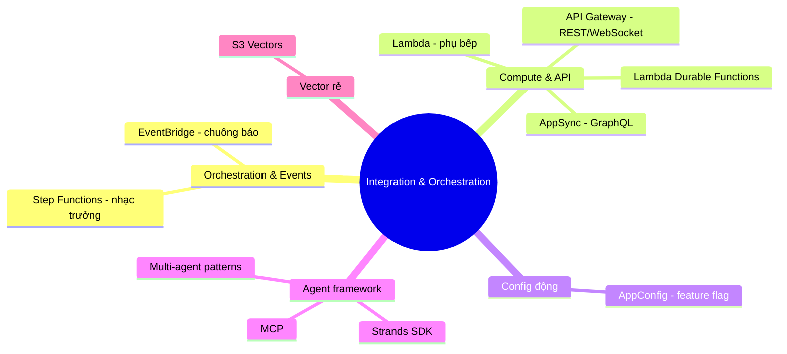

# 06. Integration & Orchestration Services

[← Về Basic Knowledge](./README.md)

> Nhóm "nhân sự vòng ngoài" của **D2 (26%)**. Nếu FM (Claude, Titan) là "siêu đầu bếp", thì nhà hàng còn cần: **lễ tân nhận order** (API Gateway/AppSync), **quản lý điều phối** (Step Functions), **phụ bếp** (Lambda), **chuông báo món** (EventBridge), và **bảng công tắc** đổi món không cần đóng cửa (AppConfig).

## Mindmap nhóm này

## Bảng tra nhanh

| Service | Mô tả ngắn gọn trong 1 câu | Domain liên quan |
|---|---|---|
| Step Functions | Điều phối nhiều bước có rẽ nhánh/retry (state machine) | D2 |
| EventBridge | Bus sự kiện để tách rời (decouple) hệ thống | D2 |
| Lambda | Compute serverless "keo dán" (≤15 phút) | D2 |
| Lambda Durable Functions | Lambda chạy tới 1 năm, checkpoint/replay | D2, D4 |
| API Gateway | Lễ tân REST/WebSocket: auth, rate-limit, streaming | D2 |
| AppSync | Lễ tân GraphQL: query linh hoạt 1 lần lấy nhiều | D2 |
| AppConfig | Đổi model/cấu hình **không cần deploy lại** | D2, D4 |
| Strands Agents SDK | Framework code agent tự trị (model-driven) | D2 |
| Amazon S3 Vectors | Lưu vector siêu rẻ cho RAG | D1 |

---

## Nhóm 1 — Orchestration & Events

### AWS Step Functions

> **Mô tả ngắn gọn trong 1 câu:** "Ông quản lý nhà hàng" — điều phối các bước theo lưu đồ (state machine) với bắt lỗi & retry mạnh.

- **Giải quyết bài toán gì:** nối nhiều dịch vụ AWS theo quy trình có **rẽ nhánh, chờ đợi, retry, human approval**.
- **Khi nào dùng:** thấy "**visual workflow / orchestrate multiple AWS services / error handling / retry**".
- **Khi nào KHÔNG dùng / dễ nhầm:** quy trình thẳng tắp đơn giản → chỉ cần Lambda. Quy trình **AI tự suy nghĩ chọn bước** (không định sẵn) → **Strands/AgentCore**, KHÔNG phải Step Functions.
- **Liên quan domain thi:** D2.
- **⚠️ Điểm phải nhớ:** **Standard workflow** giữ trạng thái tới **1 năm**; định nghĩa bằng JSON (Amazon States Language).
- **🧪 Ví dụ 1 dòng:** duyệt hồ sơ vay: phân tích → chờ giám đốc duyệt 3 ngày → gọi API ngân hàng.

🔬 Đào sâu: Step Functions vs Bedrock Prompt Flows

| | Prompt Flows | Step Functions |
|---|---|---|
| Phạm vi | Trong hệ Bedrock (nối prompt/model/RAG) | 200+ dịch vụ AWS (Lambda, SQS, DynamoDB…) |
| Thời gian | giây/phút | tới **1 năm** |
| Giao diện | kéo-thả cho AI/Prompt Engineer | JSON (ASL) cho backend/DevOps |
| Bắt lỗi/rẽ nhánh | cơ bản | rất mạnh (retry, catch, loop) |

"Bếp trưởng" (Prompt Flows, lo trong bếp) vs "Quản lý nhà hàng" (Step Functions, lo cả quy trình kinh doanh dài ngày).

### Amazon EventBridge

> **Mô tả ngắn gọn trong 1 câu:** "Hệ thống chuông báo" — **decouple** (tách rời) hệ thống bằng sự kiện.

- **Giải quyết bài toán gì:** thành phần A phát event, EventBridge định tuyến tới nhiều target mà A không cần biết ai nghe.
- **Khi nào dùng:** thấy "**decouple / route events to multiple targets / event-driven**".
- **Khi nào KHÔNG dùng / dễ nhầm:** cần quy trình tuần tự có trạng thái → Step Functions, không phải EventBridge.
- **Liên quan domain thi:** D2.
- **🧪 Ví dụ 1 dòng:** AI nấu xong "bấm chuông" → EventBridge báo cho mọi service quan tâm.

---

## Nhóm 2 — Compute & API

### AWS Lambda

> **Mô tả ngắn gọn trong 1 câu:** "Phụ bếp đa năng" — compute serverless, có việc thì chạy, xong thì tắt; làm "keo dán" (glue code).

- **Khi nào dùng:** tiền/hậu xử lý (check chính tả input, cắt gọt JSON output), tác vụ ngắn.
- **⚠️ Điểm phải nhớ:** Lambda thường **tối đa 15 phút**.
- **Liên quan domain thi:** D2.
- **🧪 Ví dụ 1 dòng:** Lambda chuẩn hoá JSON câu trả lời FM trước khi trả cho client.

### AWS Lambda Durable Functions

> **Mô tả ngắn gọn trong 1 câu:** Bản Lambda "có trí nhớ & sống dai" — viết code tuần tự nhưng chạy tới **1 năm**, tự checkpoint, ngủ không tính tiền.

- **Giải quyết bài toán gì:** workflow nhiều bước/chờ lâu (human approval, AI chạy lâu) **trong một Lambda**, không cần Step Functions.
- **Khi nào dùng:** AI workflow nhiều bước cần fault-tolerant nhưng muốn giữ mô hình lập trình Lambda quen thuộc.
- **Liên quan domain thi:** D2, D4 (ngủ = không tốn tiền compute).
- **⚠️ Điểm phải nhớ (đã verify):** **mới ra re:Invent 12/2025**; checkpoint/replay, suspend tới ~366 ngày, chỉ trả tiền lúc chạy.
- **🧪 Ví dụ 1 dòng:** pipeline xử lý ticket: triage → chờ người phản hồi → đóng, gói trong 1 hàm.

### Amazon API Gateway

> **Mô tả ngắn gọn trong 1 câu:** "Lễ tân REST/WebSocket" — cửa đón request, đứng chắn trước Lambda.

- **Khi nào dùng:** thấy "**REST / rate limiting / authentication / streaming responses**".
- **⚠️ Điểm phải nhớ:** lo **Auth** (kiểm thẻ), **Rate Limiting** (chống spam), **WebSocket** (stream chữ AI ra từng dòng).
- **Liên quan domain thi:** D2.
- **🧪 Ví dụ 1 dòng:** WebSocket stream câu trả lời Bedrock realtime ra UI.

### AWS AppSync

> **Mô tả ngắn gọn trong 1 câu:** "Lễ tân GraphQL" — một lần gọi lấy nhiều dữ liệu khác nhau.

- **Khi nào dùng:** thấy "**GraphQL / flexible queries**" (vd lấy câu trả lời AI + avatar + lịch sử chat trong 1 request).
- **Dễ nhầm:** REST/WebSocket → API Gateway; GraphQL → AppSync.
- **Liên quan domain thi:** D2.

---

## Nhóm 3 — Config động

### AWS AppConfig

> **Mô tả ngắn gọn trong 1 câu:** "Công tắc thần kỳ" — đổi model/cấu hình bằng **Feature Flag** mà **không cần deploy lại code**.

- **Giải quyết bài toán gì:** gạt công tắc đổi Claude ↔ Llama tức thì; **Canary** mở 10% trước, lỗi thì tự gạt về.
- **Khi nào dùng:** thấy "**change model without redeploying / A-B testing / gradual rollout**".
- **Khi nào KHÔNG dùng / dễ nhầm:** lưu **mật khẩu/API key cần xoay vòng** → Secrets Manager; biến môi trường tĩnh → Parameter Store (xem [nhóm 07](./07-security-governance-services.md)).
- **Liên quan domain thi:** D2, D4.
- **🧪 Ví dụ 1 dòng:** chuyển 10% traffic sang Sonnet, CloudWatch báo lỗi → AppConfig tự về Haiku.

---

## Nhóm 4 — Agent framework (trọng tâm tăng mạnh 2026)

### Strands Agents SDK

> **Mô tả ngắn gọn trong 1 câu:** Thư viện code (Python/TypeScript) để viết **agent tự trị** theo hướng **model-driven** — đưa AI mục tiêu + tool, AI tự nghĩ các bước.

- **Giải quyết bài toán gì:** xây agent **tự quyết định** (khác Step Functions vẽ cứng quy trình).
- **Khi nào dùng:** thấy "**dynamic decision making / plan and execute / multi-agent / model-driven orchestration**".
- **Khi nào KHÔNG dùng / dễ nhầm:** quy trình cố định, rẽ nhánh xác định trước → Step Functions. RAG đơn thuần (đọc tài liệu trả lời) → Knowledge Bases.
- **Quan hệ với AgentCore:** **Strands = framework (viết code agent); AgentCore = hạ tầng (chạy agent đó trên AWS)** — đi liền nhau. (Exam guide chính thức còn nhắc cả framework **AWS Agent Squad**.)
- **Liên quan domain thi:** D2 (Task 2.1 — agentic AI).
- **🧪 Ví dụ 1 dòng:** agent đầu tư: tự gọi agent đọc báo + agent phân tích số liệu rồi tổng hợp.

🔬 Đào sâu: 4 multi-agent patterns + cách "cầm cương" AI

- **Agents-as-Tools (Sếp–Lính, hierarchical):** 1 orchestrator coi các agent chuyên gia là "tool" để sai vặt, tự tổng hợp kết quả. Dễ kiểm soát.
- **Swarms (bầy đàn, ngang hàng):** không có sếp, các agent tự "chuyền bóng" (handoff) cho nhau theo ngữ cảnh tới khi xong.
- **Graphs (dây chuyền, deterministic):** "đóng đinh" thứ tự bước (bước 1 xong mới sang 2), nhưng **bên trong mỗi bước agent tự do suy nghĩ**.
- **Handoffs (nối máy cho người):** agent gặp ca khó/nguy hiểm → chuyển toàn bộ chat cho **người thật** (vd y tế: "đau thắt ngực" → báo bác sĩ).

**Cầm cương AI (3 lớp):** (1) **Tool Schema** JSON nghiêm ngặt (thiếu tham số là SDK chặn); (2) **System Prompt** kỷ luật ("phải kiểm số dư TRƯỚC khi chuyển tiền"); (3) **AgentCore Policy (Cedar)** ở Gateway chặn hành động vượt quyền (vd > 5 triệu cần human approval).

🔌 MCP (Model Context Protocol) — "cổng USB-C của AI"

Chuẩn để agent cắm vào tool/hệ thống ngoài (Google Drive, SQL, Slack/Jira) mà không phải viết glue code riêng từng cái. Cộng đồng/AWS viết sẵn **MCP Servers**; trong Strands bạn chỉ khai báo MCP Client trỏ tới. AgentCore Gateway dùng MCP làm "ổ cắm đa năng" có quản quyền IAM.

---

## Nhóm 5 — Lưu trữ Vector siêu rẻ

### Amazon S3 Vectors

> **Mô tả ngắn gọn trong 1 câu:** Bucket S3 kiểu mới chuyên lưu vector — **rẻ hơn ~90%** so với OpenSearch, chậm hơn chút (dưới ~1 giây).

- **Khi nào dùng:** thấy "**cost-optimized vector storage / billions of vectors / infrequent queries**". Tích hợp thẳng Bedrock Knowledge Bases.
- **Khi nào KHÔNG dùng / dễ nhầm:** cần truy xuất **mili-giây, tần suất cao** → OpenSearch ([nhóm 05](./05-data-analytics-services.md)).
- **Liên quan domain thi:** D1.
- **🧪 Ví dụ 1 dòng:** 1 tỷ tài liệu cũ ít bị hỏi → S3 Vectors thay vì OpenSearch để tiết kiệm.

---

## Mẹo loại đáp án sai (từ khoá → dịch vụ)

| Từ khoá trong đề | Chọn |
|---|---|
| Visual workflow / orchestrate multiple AWS services / error handling, retry | **Step Functions** |
| Streaming responses / REST / rate limiting / auth | **API Gateway** |
| GraphQL / flexible queries | **AppSync** |
| Decouple / route events to multiple targets / event-driven | **EventBridge** |
| Change model without redeploying / A-B testing / gradual rollout | **AppConfig** |
| Multi-agent / swarms / model-driven / plan and execute | **Strands SDK** (+ AgentCore) |
| Cost-optimized vector storage / billions of vectors / infrequent | **S3 Vectors** |
| Multi-step AI workflow chạy lâu, fault-tolerant, vẫn là Lambda | **Lambda Durable Functions** |

## ⚠️ Bẫy thường gặp của nhóm

- **Step Functions (quy trình vẽ cứng) vs Strands/AgentCore (AI tự quyết định).**
- **API Gateway (REST/WebSocket) vs AppSync (GraphQL).**
- **AppConfig (cấu hình động) vs Secrets Manager (bí mật) vs Parameter Store (tĩnh)** — xem 07.
- **Strands = framework, AgentCore = hạ tầng** (đi cùng nhau).
- **S3 Vectors (rẻ, chậm) vs OpenSearch (đắt, nhanh).**

## Liên quan exam domain

Phủ **rất mạnh D2** (implementation/integration, agentic), chạm **D1** (S3 Vectors) và **D4** (AppConfig, Durable Functions tiết kiệm). Xem [bản đồ cross-map](./README.md#bản-đồ-nhóm-service--5-exam-domain).

🔗 **Liên quan:** [Case studies](../02-case-studies/) · [Practice exam](../03-practice-exam/) · [← 05. Data & Analytics](./05-data-analytics-services.md) · [07. Security & Governance →](./07-security-governance-services.md)
