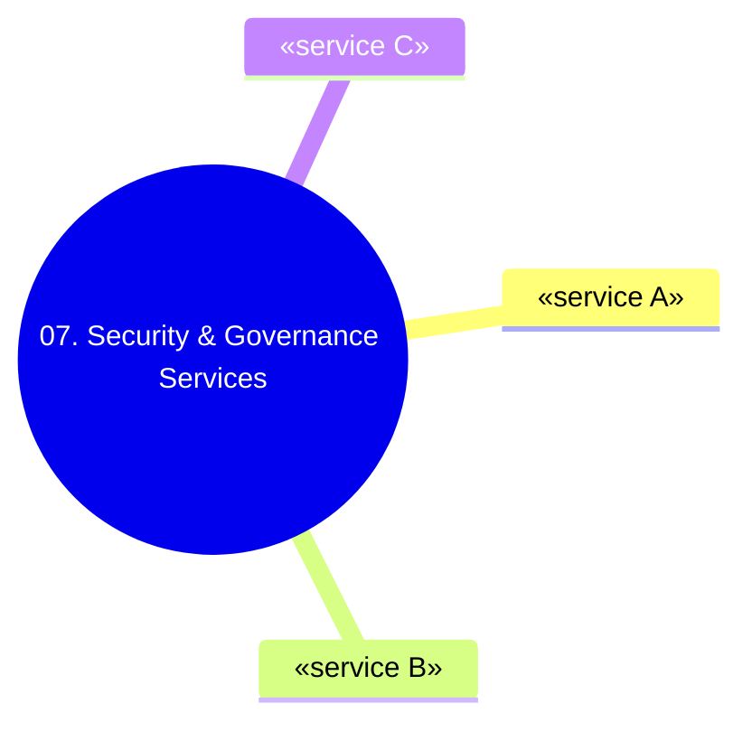

# 07. Security & Governance Services

[← Về Basic Knowledge](./README.md)

> Bảo mật, kiểm soát truy cập, mã hoá, audit và bảo vệ dữ liệu nhạy cảm cho hệ thống GenAI.

## Trạng thái: 🔲 chờ nội dung anh gửi

## Mindmap nhóm này

## Bảng tra nhanh
| Service | Một câu | Domain liên quan |
|---|---|---|
| «IAM, KMS, VPC Endpoint/PrivateLink, CloudTrail, CloudWatch, Macie, Secrets Manager» | «...» | «...» |

## Service cards

### «Tên service» &nbsp;`«chờ nội dung»`
> **Một câu:** «ví von dễ hiểu»

- **Giải quyết bài toán gì:** «...»
- **Khi nào dùng:** «...»
- **Khi nào KHÔNG dùng / dễ nhầm:** «...»
- **Liên quan domain thi:** «...»
- **⚠️ Điểm phải nhớ:** «...»
- **🧪 Ví dụ 1 dòng:** «...»

> Anh dán nội dung nhóm này, tôi viết tiếp theo đúng khuôn service card (xem mẫu đầy đủ ở [01-amazon-bedrock-services.md](./01-amazon-bedrock-services.md)).

## Bảng so sánh service dễ nhầm trong nhóm
| Tình huống | Đừng chọn | Hãy chọn |
|---|---|---|
| «...» | «...» | «...» |

## ⚠️ Bẫy thường gặp của nhóm
- «...»

## Liên quan exam domain
Nhóm này phủ mạnh: **D3 (chính), D4, D5**. Xem [bản đồ cross-map](./README.md#bản-đồ-nhóm-service--5-exam-domain).

🔗 **Liên quan:** [Case studies](../02-case-studies/) · [Practice exam](../03-practice-exam/)
