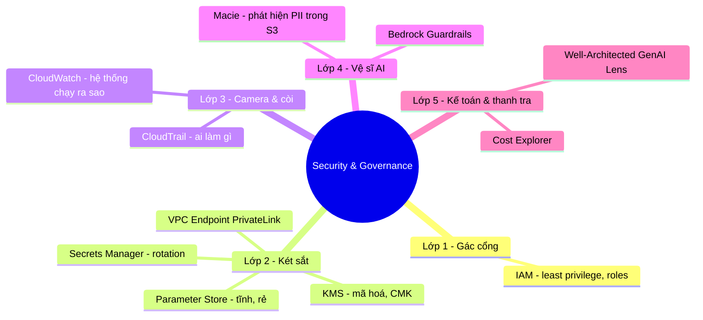

# 07. Security & Governance Services

[← Về Basic Knowledge](./README.md)

> Lớp "phòng thủ" chiếm **D3 (20%)** — quyết định hệ thống GenAI có được **đưa vào sử dụng** hay không. Hãy hình dung hệ thống là một **Ngân hàng AI** với nhiều lớp bảo vệ.

## Mindmap nhóm này

## Bảng tra nhanh

| Service | Mô tả ngắn gọn trong 1 câu | Domain liên quan |
|---|---|---|
| IAM | Ai được làm gì với cái nào (least privilege) | D3 |
| KMS | Quản chìa khoá mã hoá dữ liệu at-rest | D3 |
| Secrets Manager | Két sắt cho secret + tự xoay vòng | D3 |
| Parameter Store | Ngăn kéo lưu cấu hình tĩnh, rẻ | D3 |
| VPC Endpoint (PrivateLink) | Gọi Bedrock không ra internet | D3 |
| CloudTrail | "Camera kiểm toán": ai gọi API nào | D3, D5 |
| CloudWatch | "Đồng hồ đo": latency, lỗi, log | D5, D4 |
| Bedrock Guardrails | Vệ sĩ AI: lọc nội dung, che PII, chặn chủ đề | D3 |
| Macie | Phát hiện PII/dữ liệu nhạy cảm trong S3 | D3 |
| Cost Explorer | Soi chi phí token, phát hiện bất thường | D4 |
| Well-Architected (GenAI Lens) | "Sách giáo khoa" đánh giá kiến trúc | D3, D4 |

---

## Lớp 1 — Người gác cổng

### AWS IAM

> **Mô tả ngắn gọn trong 1 câu:** Quyết định **Ai (Principal)** được làm **Gì (Action)** với **Cái nào (Resource)**.

- **Giải quyết bài toán gì:** kiểm soát truy cập tài nguyên.
- **Khi nào dùng:** thấy "**control access / who can call the model**".
- **⚠️ Điểm phải nhớ:** nguyên tắc **Least Privilege** — đừng cấp `bedrock:*`, chỉ cho gọi đúng model cần. **IAM Roles**: Lambda/EC2 không có user/mật khẩu, dùng Role mượn thẻ tạm thời.
- **Liên quan domain thi:** D3.
- **🧪 Ví dụ 1 dòng:** Role chỉ cho Lambda gọi `bedrock:InvokeModel` đúng Claude 3, không model khác.

---

## Lớp 2 — Két sắt & hộp khoá

### AWS KMS

> **Mô tả ngắn gọn trong 1 câu:** Quản **chìa khoá mã hoá** dữ liệu đang nằm yên (encryption at rest) trên S3/DynamoDB.

- **Khi nào dùng:** thấy "**encrypt data / manage keys**".
- **⚠️ Điểm phải nhớ:** đề nhắc **Compliance/Audit** → chọn **Customer-Managed Keys (CMK)** thay khoá mặc định AWS, vì CMK cho **toàn quyền kiểm soát & nhật ký dùng khoá**.
- **Liên quan domain thi:** D3.
- **🧪 Ví dụ 1 dòng:** mã hoá tài liệu RAG trong S3 bằng CMK để kiểm toán.

### AWS Secrets Manager vs Parameter Store (cặp bẫy kinh điển)

> **Secrets Manager — Mô tả ngắn gọn trong 1 câu:** "Két sắt thông minh" cho secret nhạy cảm, **tự xoay vòng (rotation)**.
> **Parameter Store — Mô tả ngắn gọn trong 1 câu:** "Ngăn kéo" lưu cấu hình tĩnh/không nhạy cảm, **rẻ/miễn phí**.

- **Secrets Manager:** mật khẩu DB, API key (OpenAI/Anthropic) — tính năng đắt giá là **Automatic Rotation** (đổi mật khẩu DB mỗi 30 ngày không sập app). Tốn phí/secret.
- **Parameter Store (Systems Manager):** ID model, URL, tên môi trường Dev/Prod — rẻ, phân cấp theo thư mục `/dev/db/url`.
- **🔑 Phân biệt với AppConfig** ([nhóm 06](./06-integration-orchestration-services.md)): AppConfig = **cấu hình động/feature flag** đổi không cần deploy.
- **Liên quan domain thi:** D3.
- **🧪 Ví dụ 1 dòng:** mật khẩu DB cần rotate → Secrets Manager; URL API phụ trợ cố định → Parameter Store.

🔬 Đào sâu: Secrets Manager vs Parameter Store vs AppConfig

| | Secrets Manager | Parameter Store | AppConfig |
|---|---|---|---|
| Mục đích | Secret cần bảo mật cao | Cấu hình tĩnh/biến môi trường | Cấu hình động, feature flag |
| Đắt giá | Auto-rotation | Miễn phí (standard), phân cấp | Đổi không cần deploy + canary |
| Chi phí | Đắt ($/secret) | Rẻ/free | Theo dung lượng & API |

Đụng **mật khẩu/API key cần đổi** → Secrets Manager · **biến môi trường tĩnh** → Parameter Store · **bật/tắt tính năng, A/B, rollout từ từ** → AppConfig.

### VPC Endpoint (PrivateLink)

> **Mô tả ngắn gọn trong 1 câu:** Cho ứng dụng gọi Bedrock/S3 **qua mạng riêng AWS, không ra internet công cộng**.

- **Khi nào dùng:** yêu cầu dữ liệu không rời mạng nội bộ (compliance, dữ liệu nhạy cảm).
- **Liên quan domain thi:** D3.
- **🧪 Ví dụ 1 dòng:** Lambda gọi Bedrock qua VPC Endpoint để prompt/PII không đi qua internet.

---

## Lớp 3 — Camera & còi báo động (cặp hay nhầm nhất)

### AWS CloudTrail vs Amazon CloudWatch

> **CloudTrail — Mô tả ngắn gọn trong 1 câu:** "Camera kiểm toán" — ghi **AI/người đã gọi API nào, lúc nào**.
> **CloudWatch — Mô tả ngắn gọn trong 1 câu:** "Đồng hồ đo" — **hệ thống đang chạy ra sao** (latency, lỗi, log).

| Tiêu chí | CloudTrail | CloudWatch |
|---|---|---|
| Câu hỏi cốt lõi | **Ai đã làm gì, lúc nào?** | **Hệ thống chạy thế nào?** |
| Dữ liệu | API calls (lịch sử gọi) | Metrics (latency, error) & logs |
| GenAI | Kiểm toán: chứng minh chỉ Role A gọi được FM | Báo động khi AI trả lời > 5s hoặc lỗi tăng vọt |

- **Liên quan domain thi:** D3 (CloudTrail audit), D5/D4 (CloudWatch monitor).
- **⚠️ Điểm phải nhớ:** "tìm bằng chứng **ai** gọi API" → **CloudTrail**; "theo dõi **độ trễ/lỗi**, vẽ biểu đồ kỹ thuật" → **CloudWatch**. (CloudWatch Logs có **Data Protection** che PII trong log.)
- **🧪 Ví dụ 1 dòng:** thanh tra hỏi "ai tải file S3 lúc 2h sáng?" → CloudTrail.

---

## Lớp 4 — Vệ sĩ chuyên biệt cho AI

### Amazon Bedrock Guardrails

> **Mô tả ngắn gọn trong 1 câu:** "Ông giám thị" đứng giữa, **phòng thủ 2 chiều** — kiểm cả **đầu vào (prompt)** lẫn **đầu ra (response)**.

- **Giải quyết bài toán gì:** chặn nội dung độc hại, **che PII**, giữ AI đúng chủ đề, chống prompt injection. (Đây là card lặp lại từ [nhóm 01](./01-amazon-bedrock-services.md) nhưng đào sâu phần cấu hình governance.)
- **Khi nào dùng:** thấy "**chặn AI nói bậy / che PII / cấm chủ đề**".
- **Khi nào KHÔNG dùng / dễ nhầm:** Guardrails = **NỘI DUNG**; kiểm soát **HÀNH ĐỘNG** agent = **AgentCore Policy**.
- **Liên quan domain thi:** D3 (chính).
- **🧪 Ví dụ 1 dòng:** chatbot bán giày bị hỏi mua cổ phiếu → Topic Filter chặn.

🔬 Đào sâu: cấu hình Guardrails (rất hay thi)

- **PII:** 2 hành vi — **BLOCK** (chặn đứng, báo lỗi) hoặc **MASK/REDACT** (thay bằng `[PHONE_NUMBER]`, mượt hơn, **khuyên dùng**).
- **Content Filters:** 6 nhóm — Hate, Insults, Sexual, Violence, Misconduct/khuyên tự tử, **Prompt Injection** — mỗi nhóm có thanh **Low/Medium/High**.
- **Topic Filters:** định nghĩa chủ đề cấm bằng **ngôn ngữ tự nhiên** (vd "Medical_Advice: mọi câu về bệnh lý, chẩn đoán, thuốc"), không cần liệt kê từ khoá.
- **Word Filters:** danh sách đen từ khoá (tên đối thủ, từ lóng tục).
- **Blocked Messaging:** câu trả lời lịch sự tuỳ chỉnh thay vì lỗi đỏ.
- **Mẹo thi:** "ẩn số thẻ tín dụng" → **PII Masking**; "chatbot bán giày đừng khuyên mua cổ phiếu" → **Topic Filters**.

### Amazon Macie

> **Mô tả ngắn gọn trong 1 câu:** Dùng ML **phát hiện PII/dữ liệu nhạy cảm nằm trong S3** (vd dữ liệu training lỡ chứa CMND, thẻ tín dụng).

- **Khi nào dùng:** rà soát data lake/training data xem có rò rỉ PII trước khi đưa vào RAG/fine-tune.
- **Dễ nhầm:** Macie **quét data nằm trong S3**; Guardrails **lọc nội dung lúc chat**; Comprehend PII **bóc/redact trong pipeline xử lý**.
- **Liên quan domain thi:** D3.
- **🧪 Ví dụ 1 dòng:** Macie quét bucket training, cảnh báo file chứa số thẻ.

---

## Lớp 5 — Kế toán & thanh tra

### AWS Cost Explorer

> **Mô tả ngắn gọn trong 1 câu:** Soi chi phí (token có thể tăng phi mã), phát hiện bất thường (Anomaly Detection), chia hoá đơn theo **Tags**.

- **Khi nào dùng:** kiểm soát/chia chi phí GenAI theo phòng ban.
- **Liên quan domain thi:** D4.
- **🧪 Ví dụ 1 dòng:** cảnh báo khi chi phí Bedrock tăng đột biến cuối tháng.

### AWS Well-Architected Tool (Generative AI Lens)

> **Mô tả ngắn gọn trong 1 câu:** "Sách giáo khoa" của AWS để **đánh giá kiến trúc GenAI** có đúng chuẩn bảo mật/chi phí/độ tin cậy.

- **Khi nào dùng:** đề hỏi "**làm sao đánh giá/review kiến trúc GenAI theo best practice**" → đáp án là đây.
- **Liên quan domain thi:** D3, D4.
- **🧪 Ví dụ 1 dòng:** rà soát hệ thống RAG theo GenAI Lens trước khi lên production.

---

## Tổng kết ánh xạ nhanh (keyword → dịch vụ)

| Đề hỏi | Chọn |
|---|---|
| Kiểm soát quyền truy cập | **IAM** (least privilege) |
| Mã hoá dữ liệu, quản chìa khoá, compliance/audit | **KMS (CMK)** |
| Lưu API key/mật khẩu + tự đổi mới | **Secrets Manager** |
| Biến môi trường/cấu hình tĩnh, rẻ | **Parameter Store** |
| Đổi cấu hình không cần deploy / A-B / rollout | **AppConfig** (nhóm 06) |
| Tìm bằng chứng ai gọi API | **CloudTrail** |
| Theo dõi độ trễ/lỗi, biểu đồ kỹ thuật | **CloudWatch** |
| Chặn AI nói bậy / che PII / cấm chủ đề | **Bedrock Guardrails** |
| Kiểm soát hành động agent (tool nào được gọi) | **AgentCore Policy** (nhóm 01) |
| Phát hiện PII trong S3 | **Macie** |
| Dữ liệu không ra internet | **VPC Endpoint (PrivateLink)** |
| Đánh giá kiến trúc GenAI chuẩn | **Well-Architected GenAI Lens** |

## ⚠️ Bẫy thường gặp của nhóm

- **CloudTrail (ai làm gì — audit) vs CloudWatch (chạy thế nào — metrics).**
- **Secrets Manager (rotation) vs Parameter Store (tĩnh) vs AppConfig (động).**
- **Guardrails (nội dung) vs AgentCore Policy (hành động) vs Macie (PII trong S3).**
- KMS + **CMK** khi nhắc compliance/audit.
- Luôn ưu tiên **Least Privilege**, không `bedrock:*`.

## Liên quan exam domain

Phủ **rất mạnh D3** (security/governance/responsible AI), chạm **D4** (Cost Explorer, Well-Architected) và **D5** (CloudWatch, CloudTrail). Xem [bản đồ cross-map](./README.md#bản-đồ-nhóm-service--5-exam-domain).

🔗 **Liên quan:** [Case studies](../02-case-studies/) · [Practice exam](../03-practice-exam/) · [← 06. Integration & Orchestration](./06-integration-orchestration-services.md) · [Về index ↑](./README.md)
