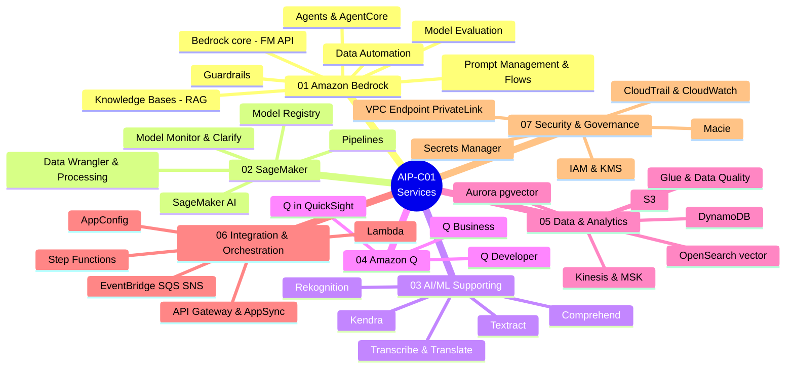

# 📚 Basic Knowledge — theo nhóm Service

[← Về trang chủ](../../README.vi.md)

Phần này tổ chức kiến thức **theo nhóm dịch vụ AWS** (thay vì theo 5 domain hàn lâm) để dễ tra cứu: muốn ôn Bedrock thì vào đúng 1 chỗ, muốn ôn bảo mật thì vào đúng 1 chỗ.

> ⚠️ Đề thi vẫn tính điểm theo **5 domain**. Để không mất tính bám đề, mỗi service đều gắn tag *domain liên quan*, và có [bảng cross-map nhóm service ↔ domain](#bản-đồ-nhóm-service--5-exam-domain) bên dưới.

## 📌 Cập nhật trọng tâm 2026 (Agentic AI)

Trọng tâm GenAI 2026 dịch từ **RAG** (tìm & trả lời) sang **Agentic AI** (tự suy nghĩ & hành động). Điều này **xác nhận được** từ exam guide chính thức AIP-C01: có hẳn **Task 2.1 "Implement agentic AI solutions and tool integrations"**, nhắc đích danh **Strands Agents**, **AWS Agent Squad**, ReAct, và **Amazon Bedrock AgentCore**.

- **Học sâu hơn:** AgentCore (Runtime/Memory/Gateway/Policy — [nhóm 01](./01-amazon-bedrock-services.md)) và Strands SDK + multi-agent patterns + MCP ([nhóm 06](./06-integration-orchestration-services.md)).
- **Mẹo chọn đáp án:** đề chỉ "đọc tài liệu trả lời khách" → **Knowledge Bases (RAG)**; đề có "tự quyết định tool / plan-and-execute / multi-step không định trước / multi-agent" → **Strands SDK + AgentCore**, *đừng* chọn Step Functions cho bài "tự suy nghĩ".
- **Quan hệ:** **Strands = framework (viết code)**, **AgentCore = hạ tầng (chạy)** — đi liền nhau.

> *Mức độ chắc chắn:* RAG/MLOps/Security/Data vẫn là xương sống (~90% kiến thức không đổi). Phần **agentic là trọng tâm chính thức**. Còn chi tiết "bản Standard ra ngày 18/3/2026" và "microcredential Agentic AI" thì **chưa xác nhận chính xác** — bản beta chạy đến ~31/3/2026, ngày ra bản full chưa được AWS công bố rõ. Đừng coi 2 chi tiết này là chắc chắn.

## Mindmap 7 nhóm service

## 7 nhóm service

| # | Nhóm | Gồm gì (ví dụ tiêu biểu) | File |
|---|---|---|---|
| 01 | **Amazon Bedrock Services** | Bedrock core, Knowledge Bases, Guardrails, Prompt Management/Flows, Agents/AgentCore, Model Evaluation, Data Automation | [→](./01-amazon-bedrock-services.md) |
| 02 | **SageMaker Services** | SageMaker AI, Model Registry, Pipelines, Data Wrangler, Processing, Model Monitor, Clarify, JumpStart | [→](./02-sagemaker-services.md) |
| 03 | **AI/ML Supporting Services** | Comprehend, Textract, Transcribe, Translate, Rekognition, Polly, Kendra | [→](./03-ai-ml-supporting-services.md) |
| 04 | **Amazon Q Services** | Q Business, Q Developer, Q in QuickSight | [→](./04-amazon-q-services.md) |
| 05 | **Data & Analytics Services** | S3, OpenSearch (vector), Aurora pgvector, DynamoDB, Glue (Data Quality), Kinesis, MSK, Athena | [→](./05-data-analytics-services.md) |
| 06 | **Integration & Orchestration Services** | Lambda, Step Functions, API Gateway, AppSync, EventBridge, SQS, SNS, AppConfig | [→](./06-integration-orchestration-services.md) |
| 07 | **Security & Governance Services** | IAM, KMS, VPC Endpoint/PrivateLink, CloudTrail, CloudWatch, Macie, Secrets Manager | [→](./07-security-governance-services.md) |

## Bản đồ: nhóm service ↔ 5 exam domain

Bảng này cho thấy mỗi nhóm service "phục vụ" domain nào nhiều nhất — để khi ôn theo service vẫn biết mình đang phủ phần điểm nào.

| Nhóm service \ Domain | D1 (31%) | D2 (26%) | D3 (20%) | D4 (12%) | D5 (11%) |
|---|:---:|:---:|:---:|:---:|:---:|
| 01 Bedrock | ●●● | ●●● | ●● | ●● | ●● |
| 02 SageMaker | ●● | ●● | ● | ● | ●● |
| 03 AI/ML Supporting | ●● | ●● | ● | | |
| 04 Amazon Q | ● | ●● | ● | | |
| 05 Data & Analytics | ●●● | ● | ● | ● | |
| 06 Integration & Orchestration | ●● | ●●● | | ●● | ● |
| 07 Security & Governance | ● | | ●●● | ● | ● |

> ● phụ · ●● vừa · ●●● chính. (Mức độ là ước lượng định hướng ôn tập, không phải con số chính thức của AWS.)
> Nhắc lại 5 domain: **D1** FM Integration & Data · **D2** Implementation & Integration · **D3** AI Safety/Security/Governance · **D4** Operational Efficiency · **D5** Testing/Validation/Troubleshooting.

## Cách đọc mỗi "service card"

Mỗi service trình bày ngắn gọn, đời thường (không hàn lâm) theo khuôn:

- **Mô tả ngắn gọn trong 1 câu** — giải thích bằng ví von dễ hình dung.
- **Giải quyết bài toán gì** — dùng để làm gì trong thực tế.
- **Khi nào dùng** — dấu hiệu trong đề/dự án để chọn nó.
- **Khi nào KHÔNG dùng / dễ nhầm với** — ranh giới với service khác.
- **Liên quan domain thi** — tag D1…D5.
- **⚠️ Điểm phải nhớ** — bẫy hay gặp.
- **🧪 Ví dụ 1 dòng** — minh hoạ nhanh.
