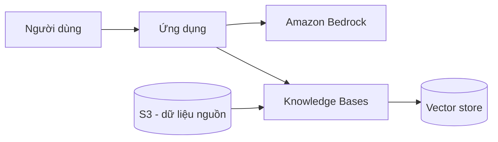

# Case Study 0X — «Tiêu đề ngắn»

[← Về Case Studies](./README.md)

| | |
|---|---|
| **Concept chính** | «vd: RAG được quản lý để giảm hallucination» |
| **Domain liên quan** | «D1 / D2 ...» |
| **Service trọng tâm** | «Amazon Bedrock Knowledge Bases, OpenSearch ...» |

## 1. Bối cảnh (Context)
> «Mô tả doanh nghiệp/tình huống tự nghĩ — khác ngành so với nguồn gốc.»

## 2. Bài toán (Problem)
> «Yêu cầu nghiệp vụ + ràng buộc (chi phí, độ trễ, bảo mật, compliance).»

## 3. Kiến trúc giải pháp (Architecture)

> «Thay bằng diagram thật của case. Có thể nhúng ảnh: ``»

## 4. Vì sao chọn giải pháp này (Rationale)
> «Giải thích từng quyết định kiến trúc, gắn với ràng buộc ở mục 2.»

## 5. Phương án thay thế & đánh đổi (Alternatives & trade-offs)
> «Cái gì khác có thể dùng, vì sao không tối ưu bằng.»

## 6. 💡 Bài học rút ra (Lesson learned)
> «1-3 gạch đầu dòng — đây là phần đáng nhớ nhất.»

🔗 **Liên quan:** [Basic knowledge](../01-basic-knowledge/) · [Practice exam](../03-practice-exam/)
