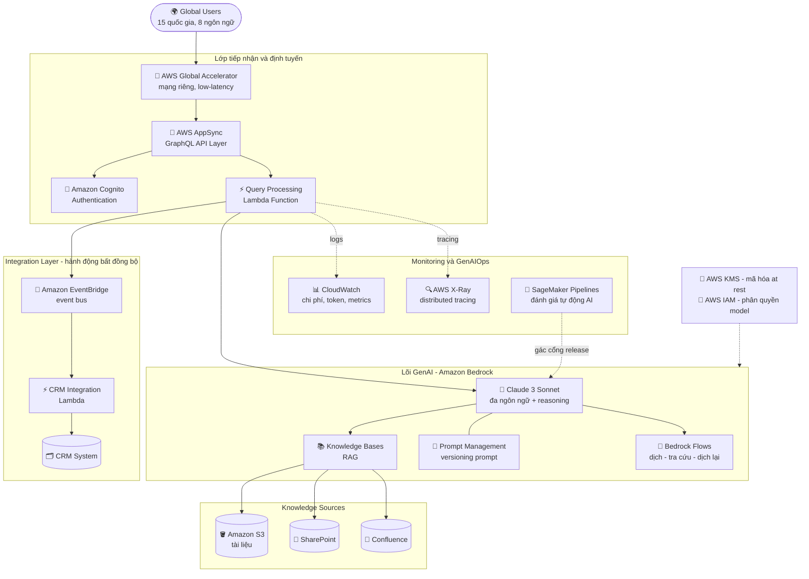

# Case Study 01 — Chatbot CSKH cho ngân hàng đa quốc gia

[← Về Case Studies](./README.md)

| | |
|---|---|
| **Concept chính** | Kiến trúc GenAI end-to-end: từ chọn FM → RAG an toàn → tích hợp CRM → mạng toàn cầu → GenAIOps |
| **Domain liên quan** | D1 (FM & Data), D2 (Integration), D3 (Security/Governance), D4 (Operational Efficiency) |
| **Service trọng tâm** | Bedrock (Claude 3 Sonnet, Knowledge Bases, Prompt Management, Flows), AppSync, EventBridge, Global Accelerator, Cognito, KMS, IAM, CloudWatch, X-Ray, SageMaker Pipelines |

---

## 1. Summary use case

> Một công ty **dịch vụ tài chính đa quốc gia** muốn nâng cấp bộ phận chăm sóc khách hàng (CSKH) trên **15 quốc gia, 8 ngôn ngữ**. Họ cần một giải pháp GenAI: hiểu được câu hỏi của khách, trả lời **chính xác dựa trên kho tài liệu nội bộ**, và **tích hợp mượt với hệ thống CRM** sẵn có. Giải pháp phải **tuân thủ luật tài chính**, **giữ riêng tư dữ liệu**, mang lại **trải nghiệm nhất quán giữa các khu vực**, và **giảm 70% thời gian phản hồi**.

Hãy hình dung bạn được giao xây một **"Trung tâm CSKH bằng AI cho một ngân hàng quốc tế"**. Không phải dựng một con chatbot trả lời cho vui, mà là một nhân viên ảo: nói được 8 thứ tiếng, hiểu nghiệp vụ tài chính, không bịa lãi suất, biết khi nào thì "chuyển việc cho người thật", và chạy nhanh như nhau dù khách ở Tokyo hay São Paulo.

### Các requirement phải giải

Bóc use case ra thành các yêu cầu cụ thể — đây chính là "đề bài" mà kiến trúc bên dưới phải đáp ứng từng cái một:

| # | Requirement | Diễn giải (vì sao khó) |
|---|---|---|
| R1 | **Đa ngôn ngữ + suy luận tài chính** | 8 ngôn ngữ, câu hỏi tài chính phức tạp → cần một "bộ não" giỏi cả ngôn ngữ lẫn reasoning |
| R2 | **Trả lời chính xác từ kho nội bộ, không bịa** | Sai một con số lãi suất là rủi ro pháp lý → bắt buộc RAG, cấm hallucinate |
| R3 | **Tích hợp CRM an toàn** | Khách bảo "mở thẻ tín dụng" → hệ thống phải hành động, nhưng AI **không được** tự đụng vào core banking |
| R4 | **Phản hồi nhanh & nhất quán toàn cầu** | Giảm 70% thời gian, khách ở 15 nước phải có trải nghiệm như nhau |
| R5 | **Bảo mật & tuân thủ tài chính** | Xác thực người dùng, mã hóa dữ liệu nhạy cảm, phân quyền chặt |
| R6 | **Vận hành tin cậy (GenAIOps)** | Đo chi phí/token, tìm điểm nghẽn, kiểm định chất lượng AI trước khi release |

---

## 2. Sơ đồ kiến trúc

---

## 3. Vì sao kiến trúc này đáp ứng được bài toán (Design Rationale)

### R1 → "Bộ não": Claude 3 Sonnet (không phải model rẻ nhất)

Bạn không thể tuyển một nhân viên CSKH chỉ biết tiếng Anh và suy nghĩ chậm để phục vụ khách 8 nước nói tiếng phức tạp về tài chính.

Khi phải lựa chọn giữa nhiều FM (Titan, Llama, Cohere, Claude), chọn **Claude 3 Sonnet** vì nó cân bằng tốt nhất giữa **đa ngôn ngữ (multilingual)** và **suy luận phức tạp (reasoning)** ở tầm chi phí hợp lý. Các model khác có thể rẻ hơn nhưng dễ trượt ở khả năng ngôn ngữ hoặc không nắm được ngữ cảnh tài chính. *(Lưu ý: sơ đồ gốc ghi "Claude 3 Sonnet"; nguyên tắc chọn vẫn đúng với các bản Claude mới hơn — ưu tiên model mạnh về reasoning + đa ngôn ngữ.)*

### R2 → "Sổ tay trí nhớ": Bedrock Knowledge Bases (RAG), không phải fine-tuning

Thay vì bắt nhân viên học thuộc lòng toàn bộ quy định ngân hàng (và quên/nhớ sai), bạn đưa cho họ một **cuốn sổ tay tra cứu** nối thẳng vào tủ hồ sơ. Khách hỏi → mở sổ → tra → trả lời.

**Knowledge Bases** tự động chunk → embed → lưu vector → truy xuất, giúp AI trả lời dựa trên tài liệu thật, **chống bịa (hallucinate)** số liệu tài chính. Quan trọng: nó có sẵn **connector** cắm thẳng vào **S3, SharePoint, Confluence** → không phải viết code lấy data thủ công.

- **Vì sao không fine-tuning?** Quy định/lãi suất đổi liên tục; fine-tune lại mỗi lần đổi là cực đắt và chậm. RAG chỉ cần cập nhật tài liệu nguồn — đây là cái bẫy kinh điển: "update internal knowledge" → luôn nghĩ RAG trước.

### R3 → "Tay chân" có kỷ luật: EventBridge, không cho AI gọi DB trực tiếp

Khi khách bảo "mở cho tôi cái thẻ tín dụng", AI **không được tự thò tay vào kho tiền** (core banking). AI chỉ được viết một **"phiếu yêu cầu"** rồi bỏ vào hộp thư; bộ phận nghiệp vụ (CRM) nhận phiếu và xử lý.

Cái "hộp thư" đó là **Amazon EventBridge**: AI/Lambda phát một **Event** → EventBridge định tuyến tới **CRM Integration Lambda** → CRM mở ticket **bất đồng bộ (async)**.

- **Vì sao EventBridge chứ không để AI gọi thẳng API/DB?** Tách rời (decoupling) → an toàn (AI không có quyền ghi vào core banking), chịu lỗi (nếu CRM bận, event vẫn nằm chờ), và mở rộng dễ. Cho AI quyền viết trực tiếp vào DB tài chính là rủi ro bảo mật không thể chấp nhận.
- **Vì sao AppSync (GraphQL) chứ không REST thường?** Khách dùng **app di động**; GraphQL cho app chỉ query đúng dữ liệu cần → tiết kiệm băng thông 3G/4G, giảm over-fetching.

### R4 → "Đường cao tốc VIP": Global Accelerator, KHÔNG phải CloudFront

CloudFront giống **kho đông lạnh đặt gần nhà** (cache sẵn ảnh/video tĩnh). Nhưng chat AI là **dữ liệu động, sinh mới mỗi câu**, không cache được. Bạn cần một **con đường cao tốc riêng** xuyên đại dương.

> ⚠️ **Điểm dễ sai:** rất nhiều kỹ sư phản xạ chọn **CloudFront** để "tăng tốc toàn cầu". Sai cho tình huống này. CloudFront tối ưu cho **nội dung tĩnh cache được**. Với API GenAI (động, không cache) cần **low-latency toàn cầu**, đáp án là **AWS Global Accelerator** — định tuyến traffic qua **mạng cáp quang riêng (private backbone) của AWS** thay vì Internet công cộng, cho độ trễ thấp và ổn định. Đây là chìa khóa để đạt mục tiêu **giảm 70% thời gian phản hồi** và **trải nghiệm nhất quán** giữa 15 nước.

### R5 → "Đội bảo vệ": Cognito + KMS + IAM (bộ ba quyền lực)

**Cognito** = chú bảo vệ kiểm tra căn cước ở cửa; **KMS** = chiếc két sắt mã hóa; **IAM** = thẻ phân quyền nội bộ.

- **Amazon Cognito** — xác thực (authentication): đúng khách hàng ngân hàng mới được vào.
- **AWS KMS** — mã hóa dữ liệu tài chính nhạy cảm khi lưu trữ (encryption at rest).
- **AWS IAM** — phân quyền theo role: ví dụ chỉ Role A được gọi Claude 3 Sonnet (đắt, mạnh), Role B chỉ được gọi model rẻ hơn. Đây là yếu tố trực tiếp đáp ứng **tuân thủ tài chính + riêng tư dữ liệu**.

### R6 → "Thám tử & thanh tra": X-Ray + CloudWatch + SageMaker Pipelines

**CloudWatch** = kế toán ghi sổ hôm nay AI tiêu hết bao nhiêu tiền/token. **X-Ray** = thám tử cầm đồng hồ bấm giờ từng công đoạn. **SageMaker Pipelines** = thanh tra chất lượng đứng gác cổng trước khi cho lên sóng.

- **CloudWatch** — dashboard chi phí, token, metrics vận hành.
- **AWS X-Ray:** khi khách than "app chat chậm", làm sao biết chậm do **truy vấn Vector DB** hay do **LLM trả lời lâu**? → **X-Ray (distributed tracing)** đo thời gian từng bước, chỉ đúng điểm nghẽn. CloudWatch cho bạn biết "có chậm", X-Ray cho biết "chậm Ở ĐÂU".
- **SageMaker Pipelines:** với phần mềm thường, bạn test bằng CodePipeline/GitLab CI. Nhưng với AI, **code không sai mà NỘI DUNG AI nói có thể sai** (bịa lãi suất, lệch chuẩn, thiên vị). AWS dùng **SageMaker Pipelines** để dựng **luồng đánh giá tự động (automated evaluation)** — kiểm accuracy, bias, tính tuân thủ — trước khi release version model mới.

---

## 4. Phương án thay thế & đánh đổi (Alternatives & trade-offs)

| Quyết định | Lựa chọn đúng | Lựa chọn sai thường gặp | Vì sao |
|---|---|---|---|
| Cập nhật kiến thức nội bộ | **Knowledge Bases (RAG)** | Fine-tuning | Tài liệu đổi liên tục; RAG chỉ cần thay file, fine-tune thì đắt & chậm |
| Tăng tốc API động toàn cầu | **Global Accelerator** | CloudFront | CloudFront chỉ cache nội dung tĩnh; chat AI là dữ liệu động |
| AI thực hiện hành động (mở thẻ) | **EventBridge** (async) | Cho AI gọi thẳng DB/API | Decoupling = an toàn + chịu lỗi; AI không được chạm core banking |
| API cho mobile | **AppSync (GraphQL)** | REST đa endpoint | GraphQL query đúng-đủ dữ liệu, tiết kiệm băng thông |
| Tìm điểm nghẽn latency | **X-Ray** | Chỉ dùng CloudWatch | CloudWatch báo "chậm", X-Ray chỉ ra "chậm ở bước nào" |
| Kiểm định chất lượng AI | **SageMaker Pipelines** | CodePipeline/GitLab CI | CI thường test code; AI cần test accuracy/bias/compliance |

---

## 5. 💡 Bài học rút ra (Lesson learned)

> **Khi gặp bài toán có** **"Doanh nghiệp toàn cầu + RAG an toàn + chat phản hồi nhanh + tuân thủ"**, nghĩ ngay tới bộ tứ:
> **Claude 3 (bộ não) + Bedrock Knowledge Bases (sổ tay RAG) + Global Accelerator (đường truyền) + SageMaker Pipelines (thanh tra QA).**

- **RAG ≠ fine-tuning:** "cập nhật kiến thức nội bộ" → luôn nghĩ RAG trước.
- **Global Accelerator ≠ CloudFront:** API động low-latency toàn cầu → Global Accelerator; nội dung tĩnh cache → CloudFront.
- **AI không bao giờ tự hành động trực tiếp lên hệ thống lõi:** luôn qua **EventBridge** (event-driven, async) để tách rời và an toàn.
- **X-Ray ≠ CloudWatch:** CloudWatch = "có chậm"; X-Ray = "chậm ở đâu".
- **GenAIOps ≠ DevOps thường:** kiểm định AI (accuracy/bias/compliance) → **SageMaker Pipelines**, không phải CI/CD code thuần.

🔗 **Liên quan:** [01. Bedrock](../01-basic-knowledge/01-amazon-bedrock-services.md) · [06. Integration & Orchestration](../01-basic-knowledge/06-integration-orchestration-services.md) · [07. Security & Governance](../01-basic-knowledge/07-security-governance-services.md) · [Practice exam](../03-practice-exam/)
