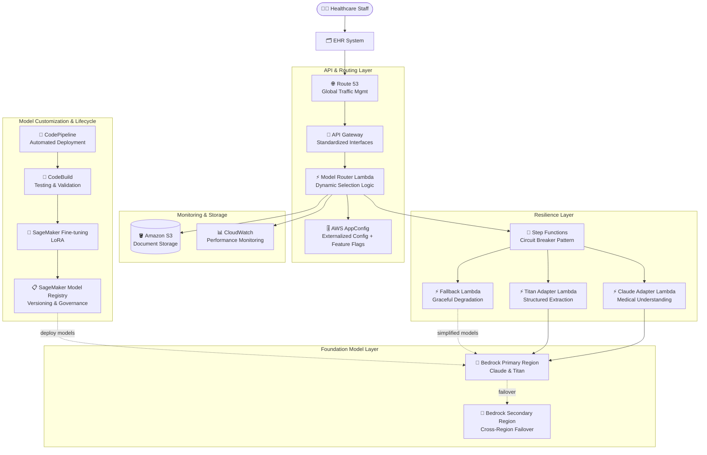

# Case Study 02 — Hệ thống phân tích hồ sơ y tế cho nhà cung cấp dịch vụ chăm sóc sức khỏe

[← Về Case Studies](./README.md)

| | |
|---|---|
| **Concept chính** | Lớp trừu tượng (abstraction layer) đa-FM + resilience (chịu lỗi) + GenAIOps cho hệ thống y tế trọng yếu |
| **Domain liên quan** | D1 (FM Selection & Data), D2 (Integration), D4 (Operational Efficiency), D5 (Testing/Resilience) |
| **Service trọng tâm** | Bedrock (Model Evaluation, Cross-Region Inference), Lambda, API Gateway, AppConfig, Step Functions, Route 53, SageMaker (Fine-tuning + LoRA, Model Registry, Model Monitor), CodePipeline/CodeBuild, S3, CloudWatch |

---

## 1. Summary use case

> Một **nhà cung cấp dịch vụ y tế lớn** ở Bắc Mỹ cần hệ thống AI để **phân tích hồ sơ y tế, trích xuất thông tin lâm sàng then chốt, và tạo báo cáo có cấu trúc** đưa vào hệ thống bệnh án điện tử (EHR). Hệ thống phải xử lý nhiều loại tài liệu (ghi chú lâm sàng, kết quả xét nghiệm, chẩn đoán hình ảnh, tiền sử bệnh nhân), **tuân thủ nghiêm ngặt HIPAA**, đạt **99.9% availability**, **độ chính xác cao về thuật ngữ y khoa**, và **thích nghi được khi y học/thuật ngữ thay đổi**.

Hãy hình dung bạn xây một "phòng xử lý hồ sơ bệnh án bằng AI" cho một bệnh viện lớn. Vấn đề sống còn ở đây không phải là chọn được một model AI thông minh, mà là: nếu model đó **lỗi giữa chừng** hoặc một region của AWS **sập**, hệ thống không được dừng — vì phía sau là quy trình lâm sàng ảnh hưởng tới bệnh nhân. Bài toán này test khả năng thiết kế một hệ thống **không phụ thuộc vào một FM duy nhất** và **tự phục hồi khi sự cố**.

### Các requirement phải giải

| # | Requirement | Diễn giải (vì sao khó) |
|---|---|---|
| R1 | **Chọn FM phù hợp y khoa, có cơ sở** | Phải so sánh khách quan nhiều FM trên kiến thức y khoa + trích xuất có cấu trúc, không chọn theo cảm tính |
| R2 | **Không khóa cứng vào một FM** | Y học thay đổi; phải đổi/thử model mới mà không phải sửa lại toàn bộ code |
| R3 | **99.9% availability, chịu lỗi** | Hồ sơ y tế là trọng yếu; một FM lỗi hoặc một region sập không được làm dừng hệ thống |
| R4 | **Tuân thủ HIPAA + bảo vệ PHI** | Phải nhận diện và che thông tin sức khỏe cá nhân (PHI) |
| R5 | **Tùy biến cho thuật ngữ y khoa riêng** | FM chung không đủ sâu; cần fine-tune nhưng phải tiết kiệm chi phí tính toán |
| R6 | **Quản trị vòng đời model + kiểm định lâm sàng** | Phải version, truy vết, và có bước bác sĩ duyệt trước khi model lên production |

---

## 2. Sơ đồ kiến trúc

---

## 3. Vì sao kiến trúc này đáp ứng được bài toán (Design Rationale)

### R1 → Chọn FM bằng dữ liệu: Bedrock Model Evaluation

Bạn không nên chọn "bộ não" cho hệ thống y tế bằng cảm giác. **Amazon Bedrock Model Evaluation** cho phép benchmark nhiều FM một cách hệ thống trên đúng tiêu chí y khoa: độ chính xác trích xuất thuật ngữ, khả năng nhận diện & che PHI, và suy luận y khoa phức tạp. Kết quả được xét cùng ràng buộc vận hành (latency, throughput lúc cao điểm, chi phí) — biến việc chọn model thành quyết định dựa trên TCO, không phải sở thích.

### R2 → Không khóa cứng FM: Abstraction Layer (Lambda + API Gateway + AppConfig)

Hãy coi mỗi FM như một "nhà cung cấp" có thể thay thế. Bạn không hàn cứng business logic vào một nhà cung cấp.

- **API Gateway** tạo một giao diện request/response chuẩn — ứng dụng gọi "phân tích tài liệu" mà không cần biết FM nào đứng sau.
- **Adapter Lambda** chuẩn hóa input/output giữa các FM khác nhau (Claude adapter, Titan adapter), giúp app hành xử nhất quán dù model nào xử lý.
- **AWS AppConfig** đẩy tiêu chí chọn model ra ngoài code (externalized). Muốn đổi model hay bật **A/B testing** cho một khoa cụ thể → đổi **feature flag**, **không cần deploy lại code**.

> ⚠️ **Điểm dễ sai:** đừng hard-code lựa chọn model trong source. Khi đề nói "đổi model lúc runtime / A-B testing không deploy lại" → đó là **AppConfig**, không phải sửa code.

### R3 → Chịu lỗi: Step Functions (Circuit Breaker) + Cross-Region Inference + Route 53

Đây là phần quan trọng nhất của một hệ thống y tế trọng yếu.

- **Step Functions** đóng vai **circuit breaker (cầu dao tự động)**: theo dõi hiệu năng FM, khi một model suy giảm/lỗi thì **tự định tuyến sang model thay thế**, có retry với **exponential backoff**.
- **Bedrock Cross-Region Inference + Route 53 health checks**: khi một region trục trặc, traffic tự chuyển sang **region khỏe mạnh**. Đây chính là cơ chế giúp hệ thống chỉ gián đoạn ~3 phút khi một region AWS gặp sự cố (thay vì nhiều giờ).
- **Fallback Lambda (graceful degradation)**: khi FM cao cấp không sẵn sàng, vẫn giữ chức năng lõi bằng model đơn giản hơn hoặc rule-based.

> ⚠️ **Điểm dễ sai:** "circuit breaker / tự chuyển sang model khác khi lỗi" → **Step Functions**, không phải tự viết try/catch rời rạc. "High availability đa region ở tầng model" → **Cross-Region Inference + Route 53**, không nhầm với chỉ một region.

### R4 → Tuân thủ HIPAA + bảo vệ PHI

Việc nhận diện và **che PHI (protected health information)** được đưa vào tiêu chí đánh giá FM (R1) và xử lý trong luồng. Kết hợp CloudWatch giám sát + S3 lưu trữ có kiểm soát để đảm bảo dấu vết tuân thủ.

### R5 → Tùy biến tiết kiệm: SageMaker Fine-tuning với LoRA

FM chung không đủ sâu cho thuật ngữ y khoa riêng. Bạn fine-tune bằng **SageMaker AI**, nhưng dùng **LoRA (Low-Rank Adaptation)** — kỹ thuật **parameter-efficient**: đạt hiệu năng gần như fine-tune toàn phần nhưng **giảm mạnh chi phí tính toán** (chỉ huấn luyện một phần nhỏ tham số thay vì toàn bộ model).

### R6 → Quản trị vòng đời: Model Registry + Model Monitor + CodePipeline

- **SageMaker Model Registry**: version model tùy biến, truy vết lineage (dataset → model deploy), và **approval workflow có bước kiểm định lâm sàng** (bác sĩ duyệt) trước khi lên production.
- **CodePipeline + CodeBuild**: pipeline tự động test (độ chính xác y khoa, tuân thủ HIPAA, tích hợp EHR) → deploy. Dùng **blue-green deployment** qua Lambda alias để chuyển version mượt.
- **SageMaker Model Monitor**: theo dõi **drift** về thuật ngữ y khoa, định dạng tài liệu, độ chính xác trích xuất.

---

## 4. Phương án thay thế & đánh đổi (Alternatives & trade-offs)

| Quyết định | Lựa chọn đúng | Lựa chọn sai thường gặp | Vì sao |
|---|---|---|---|
| Chọn FM | **Bedrock Model Evaluation** | Chọn theo cảm tính/giá | Cần benchmark khách quan trên tiêu chí y khoa |
| Đổi model lúc runtime | **AppConfig (feature flags)** | Hard-code + deploy lại | AppConfig đổi config không cần deploy |
| Tự chuyển model khi lỗi | **Step Functions (circuit breaker)** | try/catch rời rạc | SF điều phối retry/failover có hệ thống |
| HA đa region tầng model | **Cross-Region Inference + Route 53** | Chỉ một region | Region sập là mất toàn hệ thống |
| Fine-tune tiết kiệm | **LoRA trên SageMaker** | Full fine-tuning | LoRA đạt hiệu năng tương đương, rẻ hơn nhiều |
| Quản trị model | **Model Registry + approval** | Deploy thẳng | Y tế cần bước bác sĩ kiểm định trước production |

---

## 5. 💡 Bài học rút ra (Lesson learned)

> **Khi gặp bài toán có** **"hệ thống trọng yếu (y tế/tài chính) + nhiều FM + cần chịu lỗi cao + tùy biến domain"**, nghĩ ngay tới combo:
> **Bedrock Model Evaluation (chọn FM) + Abstraction Layer qua AppConfig (đổi model linh hoạt) + Step Functions circuit breaker + Cross-Region Inference (chịu lỗi) + LoRA + Model Registry (vòng đời).**

- **Abstraction layer = không khóa cứng FM:** API Gateway chuẩn hóa + Adapter Lambda + AppConfig externalize → đổi model không sửa code.
- **Resilience = Circuit breaker + Cross-Region + Graceful degradation:** ba lớp này là lý do hệ thống chỉ gián đoạn vài phút khi region sập.
- **LoRA:** fine-tune đạt hiệu năng gần full nhưng rẻ hơn nhiều — chọn khi cần "tùy biến tiết kiệm".
- **Model Registry + approval lâm sàng:** ngành trọng yếu luôn cần human-in-the-loop duyệt model trước production.
- **AppConfig ≠ Secrets Manager ≠ Parameter Store:** AppConfig là dynamic config/feature flag để A-B test & rollout.

🔗 **Liên quan:** [01. Bedrock](../01-basic-knowledge/01-amazon-bedrock-services.md) · [02. SageMaker](../01-basic-knowledge/02-sagemaker-services.md) · [06. Integration & Orchestration](../01-basic-knowledge/06-integration-orchestration-services.md) · [Practice exam](../03-practice-exam/)
