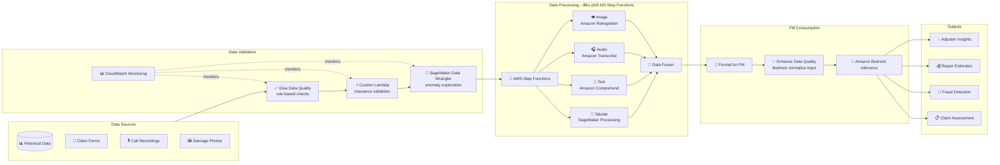

# Case Study 03 — Pipeline đa phương thức (multi-modal) đánh giá yêu cầu bồi thường bảo hiểm

[← Về Case Studies](./README.md)

| | |
|---|---|
| **Concept chính** | Pipeline đa phương thức (text + ảnh + audio + tabular) được điều phối, hợp nhất dữ liệu (data fusion) rồi đưa vào FM |
| **Domain liên quan** | D1 (Data & FM), D2 (Integration & Orchestration), D5 (Validation) |
| **Service trọng tâm** | Step Functions, Glue Data Quality, SageMaker (Data Wrangler, Processing), Lambda, Comprehend, Transcribe, Rekognition, Bedrock, CloudWatch |

---

## 1. Summary use case

> Một **công ty bảo hiểm lớn** cần hiện đại hóa hệ thống xử lý yêu cầu bồi thường (claims) bằng AI, có khả năng phân tích **nhiều nguồn dữ liệu khác nhau**: đơn yêu cầu (form), **ảnh thiệt hại**, **ghi âm cuộc gọi khách hàng**, và **dữ liệu claim lịch sử**. Mục tiêu: đánh giá tính hợp lệ của claim, ước lượng chi phí sửa chữa, **phát hiện gian lận**, và cung cấp cho nhân viên thẩm định (adjuster) cái nhìn toàn diện.

Hãy hình dung bạn xây một "phòng thẩm định bồi thường tự động". Cái khó không phải xử lý một loại dữ liệu, mà là **bốn loại dữ liệu rất khác nhau** đổ về cùng lúc — chữ, ảnh, giọng nói, bảng số — rồi phải **ghép chúng lại thành một bức tranh mạch lạc** cho AI đọc. Bài toán test khả năng thiết kế một dây chuyền xử lý song song, mỗi loại dữ liệu một công cụ chuyên dụng, có điều phối và kiểm tra chất lượng đầu vào.

### Các requirement phải giải

| # | Requirement | Diễn giải (vì sao khó) |
|---|---|---|
| R1 | **Kiểm tra chất lượng dữ liệu đầu vào** | Dữ liệu từ hệ thống cũ lệch chuẩn (số policy sai định dạng…); rác vào → rác ra |
| R2 | **Xử lý 4 loại dữ liệu khác nhau song song** | Text, ảnh, audio, tabular — mỗi loại cần công cụ riêng, chạy song song để nhanh |
| R3 | **Hợp nhất dữ liệu đa phương thức** | Phải ghép thông tin từ 4 nguồn thành một "hồ sơ claim" mạch lạc cho FM |
| R4 | **Điều phối luồng phức tạp, giữ quan hệ dữ liệu** | Nhiều bước song song nhưng phải giữ liên kết logic giữa các phần liên quan |
| R5 | **Chuẩn hóa đầu vào trước khi đưa vào FM** | Mô tả thiệt hại lệch chuẩn, viết tắt bảo hiểm → giảm độ chính xác FM |
| R6 | **Giám sát chất lượng theo thời gian** | Cảnh báo khi chỉ số chất lượng tụt dưới ngưỡng |

---

## 2. Sơ đồ kiến trúc

---

## 3. Vì sao kiến trúc này đáp ứng được bài toán (Design Rationale)

### R1 → Kiểm chất lượng đầu vào: Glue Data Quality + Lambda + Data Wrangler

"Rác vào thì rác ra" — với claim bảo hiểm, dữ liệu bẩn dẫn tới thẩm định sai và mất tiền. Ba lớp kiểm tra bổ trợ nhau:

- **AWS Glue Data Quality**: kiểm tra rule-based cho dữ liệu có cấu trúc — số policy hợp lệ, ngày thiệt hại nằm trong kỳ bảo hiểm, số tiền claim trong giới hạn policy.
- **SageMaker Data Wrangler**: khám phá trực quan phân phối dữ liệu, phát hiện bất thường (ví dụ số policy lệch định dạng giữa các hệ thống cũ).
- **Custom Lambda**: logic đặc thù bảo hiểm — VIN khớp make/model, mã thủ thuật y tế hợp lệ, mô tả thiệt hại khớp ảnh.

### R2 + R4 → Xử lý song song & điều phối: Step Functions, mỗi loại một công cụ chuyên dụng

Đây là trái tim kiến trúc. **Step Functions** điều phối các luồng **song song**, mỗi loại dữ liệu giao cho công cụ giỏi nhất việc đó:

- **Text (mô tả claim)** → **Amazon Comprehend**: phát hiện ngôn ngữ, sentiment, thực thể.
- **Image (ảnh thiệt hại)** → **Amazon Rekognition**: nhận diện vật thể, mẫu thiệt hại, chất lượng ảnh; SageMaker Processing cho phân tích mức độ nghiêm trọng.
- **Audio (ghi âm)** → **Amazon Transcribe**: chuyển giọng nói thành text; Transcribe Call Analytics cho sentiment + chỉ dấu gian lận.
- **Tabular** → **SageMaker Processing**.

> ⚠️ **Điểm dễ sai:** với pipeline nhiều bước song song cần giữ quan hệ logic giữa các phần → **Step Functions** (orchestration), không phải nhồi tất cả vào một Lambda khổng lồ. Đừng dùng một công cụ cho mọi loại dữ liệu — mỗi modality một service chuyên dụng (Comprehend cho text, Rekognition cho ảnh, Transcribe cho audio).

### R3 → Hợp nhất dữ liệu: Data Fusion

Sau khi 4 nhánh xử lý xong, **Data Fusion** (điều phối bởi Step Functions) căn chỉnh thông tin giữa các modality, tạo một "hồ sơ claim" mạch lạc, toàn diện để FM tiêu thụ.

### R5 → Chuẩn hóa đầu vào: dùng chính Bedrock để "làm sạch" trước khi suy luận

Phát hiện input lệch chuẩn (mô tả thiệt hại không nhất quán, viết tắt bảo hiểm, lỗi ngữ pháp) làm giảm độ chính xác FM. Giải pháp khéo: **dùng chính Amazon Bedrock với prompt chuyên dụng** để chuẩn hóa input — mở rộng viết tắt, sửa lỗi — **trước khi** đẩy vào model thẩm định chính. Comprehend lo entity extraction; bổ sung ngữ cảnh từ knowledge base (thông số xe, benchmark chi phí sửa).

### R6 → Giám sát: CloudWatch

CloudWatch metrics + alarms theo dõi kết quả validation theo thời gian, cảnh báo tự động khi chất lượng tụt dưới ngưỡng.

---

## 4. Phương án thay thế & đánh đổi (Alternatives & trade-offs)

| Quyết định | Lựa chọn đúng | Lựa chọn sai thường gặp | Vì sao |
|---|---|---|---|
| Điều phối pipeline đa bước | **Step Functions** | Một Lambda khổng lồ | SF giữ quan hệ logic, xử lý song song, dễ retry |
| Phân tích text | **Comprehend** | Tự viết NLP | Managed, có sẵn entity/sentiment |
| Phân tích ảnh | **Rekognition** | Tự train model thị giác | Managed, nhận diện vật thể/thiệt hại ngay |
| Chuyển audio→text | **Transcribe** | Tự xử lý | Có Call Analytics + sentiment + fraud indicators |
| Kiểm chất lượng dữ liệu có cấu trúc | **Glue Data Quality** | Tự viết rule rải rác | Rule-based check tập trung, có giám sát |
| Chuẩn hóa input cho FM | **Bedrock với prompt chuẩn hóa** | Bỏ qua | Input sạch → độ chính xác FM cao hơn rõ rệt |

---

## 5. 💡 Bài học rút ra (Lesson learned)

> **Khi gặp bài toán có** **"nhiều loại dữ liệu (text/ảnh/audio/bảng) cần xử lý rồi đưa vào FM"**, nghĩ ngay tới combo:
> **Step Functions (điều phối song song) + Comprehend/Rekognition/Transcribe (mỗi modality một công cụ) + Data Fusion + Bedrock (chuẩn hóa input & suy luận).**

- **Mỗi modality một service chuyên dụng:** text → Comprehend, ảnh → Rekognition, audio → Transcribe. Đừng ép một công cụ làm tất cả.
- **Orchestration phức tạp = Step Functions:** giữ quan hệ logic + xử lý song song, không nhồi vào một Lambda.
- **"Rác vào rác ra":** đầu tư lớp data quality (Glue Data Quality + Data Wrangler + Lambda) trước khi vào pipeline.
- **Dùng chính FM để làm sạch input:** một mẹo hiệu quả — Bedrock chuẩn hóa/expand input trước khi đưa vào model chính.

🔗 **Liên quan:** [03. Data & RAG](../01-basic-knowledge/03-data-rag-knowledge-services.md) · [05. Specialized AI](../01-basic-knowledge/05-specialized-ai-services.md) · [06. Integration & Orchestration](../01-basic-knowledge/06-integration-orchestration-services.md) · [Practice exam](../03-practice-exam/)
