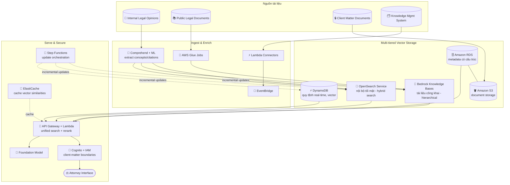

# Case Study 04 — Trợ lý tra cứu pháp lý cho hãng luật toàn cầu

[← Về Case Studies](./README.md)

| | |
|---|---|
| **Concept chính** | Kiến trúc vector database đa tầng (multi-tiered) — chọn đúng kho lưu trữ cho từng loại dữ liệu pháp lý |
| **Domain liên quan** | D1 (Data & RAG), D2 (Integration), D3 (Security) |
| **Service trọng tâm** | Bedrock Knowledge Bases, OpenSearch Service (neural plugin), RDS, S3, DynamoDB, Comprehend, Glue, EventBridge, Step Functions, ElastiCache, API Gateway, Lambda, Cognito, IAM |

---

## 1. Summary use case

> Một **hãng luật toàn cầu** có văn phòng ở **30 quốc gia** cần trợ lý nghiên cứu pháp lý bằng AI, giúp luật sư nhanh chóng tìm án lệ, luật, quy định, và ý kiến pháp lý nội bộ trên **hàng triệu tài liệu, nhiều ngôn ngữ**. Hệ thống cũ chỉ khớp từ khóa (keyword matching) → luật sư mất trung bình **15 giờ/tuần** nghiên cứu với kết quả thiếu nhất quán.

Hãy hình dung bạn xây một "thủ thư AI" cho hãng luật. Cái khó cốt lõi: dữ liệu pháp lý **không đồng nhất** — tài liệu công khai, ý kiến nội bộ tối mật, metadata có cấu trúc, và quy định thay đổi theo thời gian thực. Mỗi loại có yêu cầu khác nhau về bảo mật, tốc độ, và cách truy vấn. Bài toán test khả năng **chọn đúng kho lưu trữ cho từng loại dữ liệu** thay vì nhét tất cả vào một chỗ.

### Các requirement phải giải

| # | Requirement | Diễn giải (vì sao khó) |
|---|---|---|
| R1 | **Tìm kiếm ngữ nghĩa thay keyword** | Keyword matching cho kết quả kém; cần semantic search hiểu ngữ cảnh pháp lý |
| R2 | **Nhiều loại dữ liệu, mỗi loại một yêu cầu** | Tài liệu công khai vs nội bộ tối mật vs metadata vs quy định real-time — không thể dùng một kho |
| R3 | **Bảo mật ranh giới client-matter** | Luật sư chỉ được thấy kết quả mình có quyền (privilege boundaries) |
| R4 | **Hiệu năng trên 15 triệu tài liệu** | Truy vấn sub-second trên khối lượng khổng lồ |
| R5 | **Cập nhật pháp lý theo thời gian thực** | Án lệ/luật mới phải xuất hiện trong vài giờ sau khi ban hành |
| R6 | **Tích hợp hệ thống quản lý tài liệu sẵn có** | Kết nối nhiều DMS, knowledge management system |

---

## 2. Sơ đồ kiến trúc

---

## 3. Vì sao kiến trúc này đáp ứng được bài toán (Design Rationale)

### R1 + R2 → Kho lưu trữ đa tầng: chọn đúng công cụ cho từng loại dữ liệu

Đây là tinh thần chính của case. Không có một kho nào tối ưu cho mọi loại dữ liệu pháp lý, nên dùng **multi-tiered**:

- **Bedrock Knowledge Bases** cho **tài liệu pháp lý công khai**: tổ chức phân cấp (hierarchical) theo thẩm quyền (jurisdiction) và lĩnh vực, giữ cấu trúc logic của văn bản khi chunking. Đây là RAG managed, ít vận hành.
- **OpenSearch Service (neural plugin)** cho **ý kiến nội bộ & tài liệu khách hàng nhạy cảm**: cho phép phân đoạn theo chủ đề, giữ **ranh giới bảo mật nghiêm ngặt**, và hỗ trợ **hybrid search** (kết hợp ngữ nghĩa + từ khóa) — quan trọng cho thuật ngữ pháp lý cần độ chính xác từng chữ.
- **RDS** cho **metadata có cấu trúc** + **S3** cho lưu trữ tài liệu: cho phép lọc phức tạp (metadata filtering) song song với semantic search.
- **DynamoDB (vector storage)** cho **quy định thay đổi real-time**: truy xuất độ trễ thấp cho cập nhật mới nhất.

> ⚠️ **Điểm dễ sai:** đừng nhét tất cả vào một vector store. Tài liệu công khai (managed, hierarchical) → Knowledge Bases; nội bộ nhạy cảm cần hybrid search + bảo mật chặt → OpenSearch; real-time low-latency → DynamoDB.

### R3 → Bảo mật client-matter: Cognito + IAM

Hãng luật có ràng buộc privilege nghiêm ngặt — luật sư A không được thấy tài liệu của khách hàng mà họ không phụ trách. **Cognito + IAM** dựng framework xác thực tôn trọng **client-matter boundaries**, đảm bảo kết quả tìm kiếm chỉ trả về những gì luật sư được phép. Việc tách dữ liệu nhạy cảm sang OpenSearch (R2) cũng phục vụ mục tiêu này.

### R4 → Hiệu năng sub-second trên 15 triệu tài liệu: sharding + ElastiCache

- **OpenSearch cluster** cấu hình **sharding theo practice area** + **sub-sharding theo thời gian** → tài liệu gần đây trong lĩnh vực liên quan được truy xuất nhanh hơn.
- **Multi-index** với thuật toán similarity riêng cho từng lĩnh vực pháp lý.
- **ElastiCache** cache trước các similarity cho mẫu truy vấn phổ biến → giảm mạnh latency cho kịch bản nghiên cứu thường gặp.

### R5 → Cập nhật real-time: EventBridge + Lambda + Step Functions

- **EventBridge rules + Lambda** xử lý án lệ mới ngay khi công bố (incremental update).
- Hệ thống phát hiện thay đổi real-time giám sát nguồn chính thức, kích hoạt cập nhật ngay cho tài liệu bị ảnh hưởng.
- **Step Functions** điều phối luồng cập nhật phức tạp (từ trích xuất nội dung → lưu vector). Pipeline refresh định kỳ reprocess toàn bộ corpus bằng embedding model mới nhất; CloudWatch theo dõi độ chính xác truy xuất.

### R6 → Tích hợp DMS sẵn có: Lambda Connectors + Glue + API Gateway

- **Lambda-based connectors** cho nhiều hệ thống quản lý tài liệu, bắt sự kiện qua **EventBridge**.
- **AWS Glue jobs** biến đổi insight pháp lý đã tuyển chọn sang định dạng tương thích vector.
- **API Gateway + Lambda** tạo giao diện tìm kiếm hợp nhất, tổng hợp kết quả từ nhiều vector store + DB pháp lý truyền thống, định tuyến truy vấn tới nguồn phù hợp và **rerank** theo độ liên quan + giá trị án lệ.

---

## 4. Phương án thay thế & đánh đổi (Alternatives & trade-offs)

| Loại dữ liệu / nhu cầu | Lựa chọn đúng | Vì sao không dùng cái khác |
|---|---|---|
| Tài liệu công khai, RAG managed | **Bedrock Knowledge Bases** | Hierarchical + ít vận hành; không cần tự quản cluster |
| Nội bộ nhạy cảm, hybrid search | **OpenSearch (neural plugin)** | Bảo mật chặt + kết hợp semantic/keyword; KB không đủ kiểm soát phân đoạn |
| Metadata có cấu trúc | **RDS** | Lọc phức tạp; vector store thuần không làm tốt structured query |
| Quy định real-time | **DynamoDB (vector)** | Low-latency, cập nhật liên tục |
| Cache truy vấn nóng | **ElastiCache** | Giảm latency cho mẫu truy vấn lặp lại |
| Bảo mật theo quyền | **Cognito + IAM** | Tôn trọng client-matter/privilege boundaries |
| Cập nhật real-time | **EventBridge + Lambda + Step Functions** | Event-driven, không dùng cron chậm |

---

## 5. 💡 Bài học rút ra (Lesson learned)

> **Khi gặp bài toán có** **"khối lượng dữ liệu lớn + nhiều loại dữ liệu khác nhau về bảo mật/tốc độ/cách truy vấn"**, nghĩ ngay tới kiến trúc **multi-tiered vector storage** — chọn đúng kho cho từng loại, đừng nhét tất cả vào một chỗ.

- **Knowledge Bases vs OpenSearch:** managed RAG cho dữ liệu công khai vs kiểm soát chặt + hybrid search cho dữ liệu nhạy cảm.
- **DynamoDB cho vector real-time:** khi cần low-latency và cập nhật liên tục.
- **RDS + S3** cho structured metadata + document storage song song với semantic search.
- **ElastiCache** giảm latency cho truy vấn lặp lại trên corpus khổng lồ.
- **Cập nhật real-time = EventBridge + Lambda + Step Functions**, không phải cron job.
- **Bảo mật pháp lý = Cognito + IAM** tôn trọng client-matter boundaries.

🔗 **Liên quan:** [01. Bedrock](../01-basic-knowledge/01-amazon-bedrock-services.md) · [03. Data & RAG](../01-basic-knowledge/03-data-rag-knowledge-services.md) · [07. Security & Governance](../01-basic-knowledge/07-security-governance-services.md) · [Practice exam](../03-practice-exam/)
