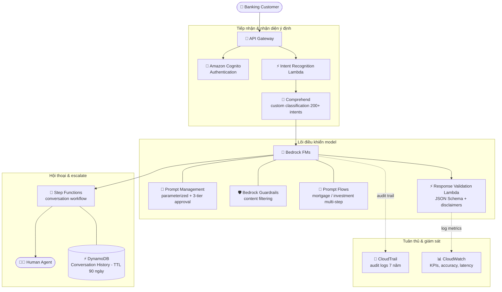

# Case Study 05 — Nền tảng CSKH bằng AI cho tổ chức tài chính toàn cầu

[← Về Case Studies](./README.md)

| | |
|---|---|
| **Concept chính** | Khung điều khiển model (prompt governance + guardrails + JSON Schema) đảm bảo tuân thủ & nhất quán ở quy mô lớn |
| **Domain liên quan** | D2 (Integration), D3 (Security/Governance/Compliance), D4 (Operational Efficiency) |
| **Service trọng tâm** | Bedrock (Prompt Management, Guardrails, Prompt Flows, FMs), Step Functions, Comprehend (custom classification), DynamoDB (TTL), CloudTrail, CloudWatch, Lambda |

---

## 1. Summary use case

> Một **tổ chức tài chính toàn cầu** phục vụ **50 triệu khách hàng tại 30 quốc gia** triển khai nền tảng CSKH bằng AI: xử lý truy vấn ngân hàng thường gặp, tư vấn tài chính cá nhân hóa, và **chuyển vấn đề phức tạp cho nhân viên người thật kèm đầy đủ ngữ cảnh**. Yêu cầu nghiệp vụ: xử lý nhất quán giữa các khu vực/ngôn ngữ; **tuân thủ nghiêm ngặt quy định tài chính & luật riêng tư**; **lưu audit trail toàn bộ tương tác AI**; tư vấn cá nhân hóa theo lịch sử khách; escalate mượt cho người thật.

Hãy hình dung bạn xây một "tổng đài AI" cho ngân hàng quốc tế. Cái khó không phải làm AI trả lời được — mà là **kiểm soát những gì AI được phép nói**. Một câu tư vấn tài chính sai luật là rủi ro pháp lý nghiêm trọng. Bài toán test khả năng dựng một **khung điều khiển (governance framework)** quanh model: chuẩn hóa prompt, chặn nội dung cấm, ép định dạng đầu ra, và lưu vết mọi thứ cho thanh tra.

### Các requirement phải giải

| # | Requirement | Diễn giải (vì sao khó) |
|---|---|---|
| R1 | **Nhất quán giữa khu vực & ngôn ngữ** | 30 nước, nhiều ngôn ngữ — câu trả lời phải đồng nhất về nội dung & định dạng |
| R2 | **Chặn tư vấn tài chính trái phép** | AI không được tự ý phán đoán thị trường hay tư vấn ngoài thẩm quyền |
| R3 | **Audit trail 7 năm cho thanh tra** | Quy định tài chính bắt lưu toàn bộ tương tác trong nhiều năm |
| R4 | **Định tuyến chính xác theo ý định khách** | Phải nhận diện đúng ý định trong 200+ loại để route đúng |
| R5 | **Quản lý ngữ cảnh hội thoại, hết hạn đúng quy định** | Lưu lịch sử để khỏi hỏi lại, nhưng phải tự xóa theo luật |
| R6 | **Escalate cho người thật kèm ngữ cảnh** | Vấn đề phức tạp chuyển cho agent, không mất thông tin |

---

## 2. Sơ đồ kiến trúc

---

## 3. Vì sao kiến trúc này đáp ứng được bài toán (Design Rationale)

### R1 → Nhất quán: Prompt Management + JSON Schema templates

- **Bedrock Prompt Management** chuẩn hóa prompt cho từng kịch bản ngân hàng, với định nghĩa vai trò rõ ("AI là trợ lý ngân hàng có giới hạn"). Dùng **parameterized prompts** với biến cho thông tin khách/tài khoản/quy định → cùng một khung prompt áp cho mọi khu vực.
- **JSON Schema templates** chuẩn hóa cấu trúc đầu ra (chi tiết tài khoản, lịch sử giao dịch, biểu phí) → trình bày nhất quán bất kể ngôn ngữ. Khung này giảm vi phạm tuân thủ tới 97%.

### R2 → Chặn nội dung cấm: Bedrock Guardrails

Đây là tuyến phòng thủ then chốt cho ngành tài chính. **Bedrock Guardrails** với chính sách lọc nội dung nghiêm ngặt **ngăn AI tư vấn tài chính trái phép hoặc phán đoán biến động thị trường**, đặt ngưỡng severity cao cho các hoạt động bị quản lý. Response Validation Lambda kiểm tra đầu ra có đủ disclaimer, phí chính xác, và trigger escalation đúng chưa.

> ⚠️ **Điểm dễ sai:** "ngăn AI nói nội dung bị cấm / tư vấn trái phép" → **Bedrock Guardrails**, không phải chỉ dặn trong prompt (prompt có thể bị lách).

### R3 → Audit 7 năm: CloudTrail + CloudWatch Logs

**CloudTrail** log mọi API call tới Bedrock, **lưu giữ 7 năm** đáp ứng quy định tài chính. **CloudWatch Logs** ghi mọi tương tác khách hàng cho giám sát tuân thủ.

> ⚠️ Lưu ý phân biệt: CloudTrail lưu **dấu vết API (ai gọi gì, khi nào)** — phù hợp audit trail tuân thủ. Nếu cần lưu **nội dung prompt/response đầy đủ** thì dùng Bedrock Model Invocation Logging (xem case khác). Ở case này yêu cầu là audit trail tương tác → CloudTrail + CloudWatch Logs.

### R4 → Định tuyến theo ý định: Comprehend custom classification

**Amazon Comprehend** với **custom classification model** huấn luyện trên thuật ngữ ngân hàng, nhận diện **200+ ý định khác nhau** để định tuyến chính xác. Đây là lý do dùng Comprehend (NLP managed, train classifier riêng) thay vì để FM tự đoán ý định một cách thiếu kiểm soát.

### R5 → Ngữ cảnh hội thoại + hết hạn đúng luật: DynamoDB với TTL

**DynamoDB** lưu lịch sử hội thoại với schema tối ưu truy xuất nhanh, dùng **TTL (Time To Live) tự động xóa dữ liệu sau 90 ngày** theo quy định. Giảm 78% việc khách phải lặp lại thông tin.

> ⚠️ **Điểm dễ sai:** "tự động xóa dữ liệu sau N ngày theo quy định" → **DynamoDB TTL**, không phải tự viết job dọn dẹp.

### R6 → Escalate kèm ngữ cảnh + kịch bản phức tạp: Step Functions + Prompt Flows

- **Step Functions** điều phối luồng hội thoại, gồm vòng lặp làm rõ (clarification loop) cho yêu cầu mơ hồ, và escalate cho **Human Agent** kèm đầy đủ ngữ cảnh.
- **Bedrock Prompt Flows** xử lý kịch bản nhiều bước phức tạp (xét duyệt thế chấp, lập kế hoạch đầu tư) với rẽ nhánh điều kiện theo hồ sơ tài chính. Pre-processing chuẩn hóa thuật ngữ; post-processing thêm disclaimer pháp lý + định dạng theo vùng.

---

## 4. Phương án thay thế & đánh đổi (Alternatives & trade-offs)

| Quyết định | Lựa chọn đúng | Lựa chọn sai thường gặp | Vì sao |
|---|---|---|---|
| Chặn nội dung trái phép | **Bedrock Guardrails** | Chỉ dặn trong prompt | Guardrails cưỡng chế ở tầng hệ thống, prompt có thể bị lách |
| Chuẩn hóa & version prompt | **Prompt Management** | Hard-code prompt trong app | Quản version + approval workflow không cần deploy |
| Nhất quán định dạng đầu ra | **JSON Schema templates** | Để FM tự do định dạng | Schema ép cấu trúc nhất quán đa ngôn ngữ |
| Nhận diện ý định | **Comprehend custom classification** | Để FM tự đoán | Classifier train riêng chính xác & kiểm soát được |
| Lưu & hết hạn ngữ cảnh | **DynamoDB TTL** | Tự viết job dọn | TTL tự xóa theo quy định, không cần code |
| Audit tuân thủ dài hạn | **CloudTrail (7 năm)** | Log tạm | Quy định tài chính bắt lưu nhiều năm |
| Kịch bản nhiều bước | **Prompt Flows** | Một prompt khổng lồ | Flows rẽ nhánh điều kiện, tái sử dụng component |

---

## 5. 💡 Bài học rút ra (Lesson learned)

> **Khi gặp bài toán có** **"AI phục vụ ngành bị quản lý chặt (tài chính/y tế) + cần kiểm soát đầu ra + tuân thủ + audit"**, nghĩ ngay tới khung điều khiển:
> **Prompt Management (chuẩn hóa) + Guardrails (chặn nội dung) + JSON Schema (ép định dạng) + CloudTrail (audit) + DynamoDB TTL (vòng đời dữ liệu).**

- **Guardrails ≠ prompt dặn dò:** muốn cưỡng chế chặn nội dung → Guardrails ở tầng hệ thống.
- **Prompt Management cho governance:** parameterized prompt + 3-tier approval + versioning, không hard-code.
- **JSON Schema = nhất quán đầu ra** đa ngôn ngữ/khu vực.
- **Comprehend custom classification** cho intent routing chính xác (200+ intents).
- **DynamoDB TTL** = tự hết hạn dữ liệu theo quy định.
- **CloudTrail** = audit trail tuân thủ dài hạn (7 năm).

🔗 **Liên quan:** [01. Bedrock](../01-basic-knowledge/01-amazon-bedrock-services.md) · [05. Specialized AI](../01-basic-knowledge/05-specialized-ai-services.md) · [07. Security & Governance](../01-basic-knowledge/07-security-governance-services.md) · [Practice exam](../03-practice-exam/)
