# Case Study 06 — Hệ thống CSKH AI co giãn cho sàn thương mại điện tử toàn cầu

[← Về Case Studies](./README.md)

| | |
|---|---|
| **Concept chính** | Triển khai model theo tầng (tiered deployment) — chọn hạ tầng theo độ phức tạp truy vấn để cân bằng hiệu năng & chi phí |
| **Domain liên quan** | D2 (Integration), D4 (Operational Efficiency & Cost), D5 (Optimization) |
| **Service trọng tâm** | Lambda, Bedrock (Provisioned Throughput), SageMaker (Real-time endpoints, custom containers, Inference Recommender), API Gateway, Step Functions, CloudWatch, ElastiCache |

---

## 1. Summary use case

> Một **sàn thương mại điện tử toàn cầu** đang tăng trưởng nhanh cần hệ thống CSKH bằng AI, xử lý từ FAQ cơ bản đến **troubleshooting sản phẩm phức tạp**, **giữ hiệu năng cao trong mùa cao điểm** và **tối ưu chi phí lúc bình thường**. Yêu cầu: hỗ trợ **20+ ngôn ngữ**; chịu **10.000+ phiên đồng thời** lúc cao điểm; **latency dưới 1 giây** cho truy vấn thường; xử lý troubleshooting chi tiết chính xác; tối ưu chi phí lúc thấp điểm; tuân thủ chủ quyền dữ liệu (data sovereignty) theo vùng.

Hãy hình dung bạn xây tổng đài AI cho một sàn TMĐT. Cái khó là sự **dao động cực lớn**: lúc Black Friday thì 10.000 phiên cùng lúc, lúc thường thì lác đác. Và truy vấn rất khác nhau — "đơn của tôi đâu?" (đơn giản) vs "sản phẩm này lỗi firmware thế nào?" (phức tạp). Nếu dùng một loại hạ tầng cho tất cả thì hoặc đắt khủng khiếp, hoặc chậm lúc cao điểm. Bài toán test khả năng **phân tầng**: việc dễ giao máy rẻ, việc khó giao máy mạnh.

### Các requirement phải giải

| # | Requirement | Diễn giải (vì sao khó) |
|---|---|---|
| R1 | **Truy vấn đơn giản, rẻ, co giãn tự động** | FAQ chiếm số đông; không nên dùng GPU đắt cho việc nhẹ |
| R2 | **Tải bền vững & phức tạp vừa** | Cần throughput ổn định, dự đoán được lúc cao điểm |
| R3 | **Troubleshooting phức tạp, model tùy biến** | Cần custom model + context window lớn |
| R4 | **Định tuyến thông minh theo độ phức tạp** | Phải gửi đúng truy vấn tới đúng tầng model |
| R5 | **Tối ưu chi phí lúc thấp điểm** | Chọn instance hiệu quả nhất cho từng tầng |
| R6 | **Latency < 1s + 10.000 phiên đồng thời** | Vừa nhanh vừa chịu tải đỉnh |

---

## 2. Sơ đồ kiến trúc

```mermaid
flowchart TB
    CQ([🛒 Customer Query]) --> AGW[🔌 API Gateway]
    AGW --> RT[🔀 Intelligent Router<br/>Step Functions]
    EC[(🚀 ElastiCache<br/>Response Cache)] -. check cache .-> RT

    subgraph TIER[Tiered Model Deployment Strategy]
        T1[⚡ Tier 1: Simple Queries<br/>Lambda - Lightweight Models]
        T2[🧠 Tier 2: Medium Complexity<br/>Bedrock - Provisioned Throughput]
        T3[🔬 Tier 3: Complex Queries<br/>SageMaker Endpoints - Custom Models]
    end

    RT --> T1 & T2 & T3
    T1 & T2 & T3 --> RESP([💬 Customer Response])

    MON[📊 CloudWatch<br/>Monitoring & Optimization]
    IR[💲 SageMaker Inference Recommender<br/>chọn instance tối ưu chi phí]
    MON -. optimization feedback .-> RT
    T1 & T2 & T3 -. metrics .-> MON
    IR -. tư vấn instance .-> T3
```

---

## 3. Vì sao kiến trúc này đáp ứng được bài toán (Design Rationale)

### R1 + R2 + R3 → Ba tầng triển khai, mỗi tầng một hạ tầng

Đây là tinh thần cốt lõi: **chọn hạ tầng theo độ phức tạp**, không "một cỡ cho tất cả".

- **Tier 1 — FAQ đơn giản → Lambda (serverless):** model nhẹ trên Lambda, **on-demand, tự co giãn**, trả tiền theo lần gọi. Dùng **provisioned concurrency** để tránh cold start lúc dự báo cao điểm. Phù hợp việc nhẹ, số lượng lớn, không cần GPU.
- **Tier 2 — phức tạp vừa, tải bền vững → Bedrock Provisioned Throughput:** cấp throughput chuyên dụng theo phân tích traffic lịch sử (vd 10 model units lúc thường, **tự scale lên 25** lúc khuyến mãi, CloudWatch alarm kích hoạt khi utilization > 70% quá 5 phút). Phù hợp tải cao **ổn định, dự đoán được**.
- **Tier 3 — troubleshooting phức tạp, model tùy biến → SageMaker Real-time endpoints + custom containers:** auto scaling theo invocation metrics; custom container quản lý bộ nhớ hiệu quả cho context window lớn (lazy loading, quantization, dynamic batching, KV-cache).

> ⚠️ **Điểm dễ sai:** đừng dùng Provisioned Throughput cho việc nhẹ (lãng phí) hay Lambda cho model custom nặng (không kham nổi). Tải **đột biến, việc nhẹ** → Lambda serverless; tải **ổn định, dự đoán được** → Provisioned Throughput; **model tùy biến nặng** → SageMaker endpoints.

### R4 → Định tuyến thông minh: API Gateway + Step Functions

**API Gateway + Step Functions** điều phối traffic giữa ba tầng với logic định tuyến thông minh theo **ngôn ngữ, độ phức tạp, và tải hiện tại**. Thêm **model cascading**: bắt đầu bằng model nhẹ để phân loại truy vấn & trả lời thường, chỉ leo lên tầng cao khi cần.

### R5 → Tối ưu chi phí: ElastiCache + Inference Recommender + A/B testing

- **ElastiCache** cache đa tầng: cache response cho truy vấn phổ biến + cache embedding cho semantic search → giảm tới 40% tính toán dư thừa lúc cao điểm.
- **SageMaker Inference Recommender** tìm instance type rẻ-hiệu-quả nhất cho từng tầng model.
- **A/B testing** các cấu hình deployment với thu thập metric hiệu năng/chi phí tự động.

> ⚠️ **Điểm dễ sai:** "tìm instance type tối ưu chi phí cho model" → **SageMaker Inference Recommender**, đừng đoán thủ công.

### R6 → Latency < 1s + chịu 10.000 phiên: kết hợp toàn bộ

Latency thấp đạt được nhờ Tier 1 (Lambda nhẹ) + ElastiCache cho truy vấn thường; chịu tải đỉnh nhờ auto scaling ở cả ba tầng + cascading + caching giảm tải. CloudWatch dashboard giám sát thống nhất latency/throughput/error/cost cho từng loại truy vấn.

---

## 4. Phương án thay thế & đánh đổi (Alternatives & trade-offs)

| Loại truy vấn / nhu cầu | Lựa chọn đúng | Vì sao không dùng cái khác |
|---|---|---|
| FAQ nhẹ, số lượng lớn, đột biến | **Lambda (serverless)** | Tự co giãn, trả theo lần gọi; Provisioned Throughput sẽ lãng phí |
| Tải ổn định, dự đoán được | **Bedrock Provisioned Throughput** | Throughput cam kết; on-demand dễ bị throttle lúc đỉnh |
| Model custom nặng, context lớn | **SageMaker endpoints + custom containers** | Kiểm soát bộ nhớ/GPU; Lambda không kham model nặng |
| Định tuyến theo độ phức tạp | **API Gateway + Step Functions** | Routing thông minh + cascading |
| Chọn instance tối ưu chi phí | **SageMaker Inference Recommender** | Dữ liệu hóa quyết định, không đoán |
| Giảm tính toán dư thừa | **ElastiCache (multi-level cache)** | Cache response + embedding, giảm 40% |

---

## 5. 💡 Bài học rút ra (Lesson learned)

> **Khi gặp bài toán có** **"tải dao động lớn + truy vấn đủ độ phức tạp + vừa cần nhanh vừa cần rẻ"**, nghĩ ngay tới **tiered model deployment**: việc dễ giao hạ tầng rẻ, việc khó giao hạ tầng mạnh.

- **Ba tầng kinh điển:** Lambda (nhẹ, đột biến) → Bedrock Provisioned Throughput (ổn định, dự đoán được) → SageMaker endpoints (custom nặng).
- **Provisioned Throughput** cho tải **ổn định/dự đoán được**; on-demand/serverless cho tải **đột biến**.
- **Model cascading + caching (ElastiCache)** giảm chi phí mạnh lúc cao điểm.
- **Inference Recommender** = chọn instance tối ưu chi phí bằng dữ liệu.
- **Định tuyến theo độ phức tạp** = API Gateway + Step Functions.

🔗 **Liên quan:** [01. Bedrock](../01-basic-knowledge/01-amazon-bedrock-services.md) · [02. SageMaker](../01-basic-knowledge/02-sagemaker-services.md) · [04. Compute & Deployment](../01-basic-knowledge/04-compute-deployment-services.md) · [Practice exam](../03-practice-exam/)
