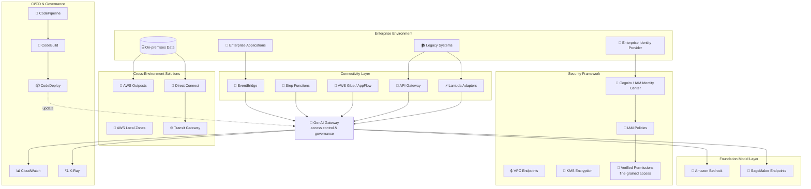

# Case Study 07 — Tích hợp GenAI toàn doanh nghiệp cho tổ chức tài chính

[← Về Case Studies](./README.md)

| | |
|---|---|
| **Concept chính** | Tích hợp FM vào hệ thống legacy toàn doanh nghiệp + bảo mật/chủ quyền dữ liệu + GenAI gateway tập trung |
| **Domain liên quan** | D2 (Integration), D3 (Security/Governance), D4 (Operational Efficiency) |
| **Service trọng tâm** | API Gateway, Lambda (adapters), EventBridge, Step Functions, Glue/AppFlow, IAM Identity Center/Cognito, Verified Permissions, KMS/ACM, VPC endpoints, Outposts/Local Zones/Wavelength, Direct Connect/Transit Gateway, CodePipeline/CodeBuild, CloudWatch/X-Ray/CloudTrail |

---

## 1. Summary use case

> Một **tổ chức tài chính đa quốc gia** hoạt động ở **30+ quốc gia** thực hiện chiến lược tích hợp GenAI **toàn doanh nghiệp**: nâng trải nghiệm khách, tăng hiệu quả vận hành, thúc đẩy đổi mới — trong khi vẫn **tuân thủ quy định tài chính & chủ quyền dữ liệu**. Thách thức: hệ thống **legacy** chứa dữ liệu trọng yếu nhưng **thiếu API hiện đại**; quy định khác nhau theo từng vùng tài phán; tiêu chuẩn bảo mật cao; cần năng lực AI nhất quán trên web/mobile/chi nhánh; cần **giám sát của con người** với nội dung AI trong giao tiếp bị quản lý; giao hàng liên tục không gián đoạn nghiệp vụ.

Hãy hình dung bạn không xây một ứng dụng AI mới toanh, mà phải **gắn AI vào một cỗ máy ngân hàng đã chạy hàng chục năm** — đầy hệ thống cũ không có API, dữ liệu không được rời khỏi biên giới một số nước. Cái khó là **kết nối** (legacy ↔ FM), **bảo mật nhiều tầng**, và **chủ quyền dữ liệu**. Bài toán test khả năng thiết kế lớp tích hợp + bảo mật doanh nghiệp, không phải một con chatbot.

### Các requirement phải giải

| # | Requirement | Diễn giải (vì sao khó) |
|---|---|---|
| R1 | **Kết nối FM với hệ thống legacy thiếu API** | Phải chuyển đổi protocol/định dạng giữa hệ cũ và FM |
| R2 | **Kiến trúc lỏng lẻo (loosely coupled), event-driven** | Không để FM dính cứng vào hệ thống nghiệp vụ |
| R3 | **Bảo mật cấp tài chính, phân quyền tinh** | Federation danh tính + least-privilege + fine-grained access |
| R4 | **Chủ quyền dữ liệu theo vùng tài phán** | Dữ liệu nhạy cảm không rời khỏi biên giới một số nước |
| R5 | **Quản trị & truy cập tập trung (GenAI gateway)** | Kiểm soát truy cập + governance toàn doanh nghiệp |
| R6 | **CI/CD cho ứng dụng FM, không gián đoạn** | Giao hàng liên tục với quality gate |

---

## 2. Sơ đồ kiến trúc

---

## 3. Vì sao kiến trúc này đáp ứng được bài toán (Design Rationale)

### R1 + R2 → Lớp kết nối: API Gateway + Lambda adapters + EventBridge + Step Functions

Hệ legacy không có API hiện đại, nên bạn dựng một "lớp phiên dịch":

- **API Gateway** tạo endpoint với request/response mapping để biến đổi dữ liệu giữa hệ cũ và FM.
- **Lambda adapters** xử lý chuyển đổi protocol/định dạng.
- **EventBridge** tạo kiến trúc **event-driven loosely coupled** — FM không dính cứng vào hệ nghiệp vụ.
- **Step Functions** điều phối tương tác phức tạp giữa FM và nhiều hệ thống.
- **Glue / AppFlow** đồng bộ dữ liệu để FM luôn có data mới.

> ⚠️ **Điểm dễ sai:** muốn FM và hệ thống nghiệp vụ **tách rời (loosely coupled)** → **EventBridge** (event-driven), không gọi đồng bộ trực tiếp gây ràng buộc cứng.

### R3 → Bảo mật nhiều tầng

- **IAM Identity Center / Cognito** cho **identity federation** với IdP doanh nghiệp.
- **IAM least-privilege policies** + **Amazon Verified Permissions** cho **fine-grained access** theo thuộc tính người dùng/tài nguyên.
- **KMS + ACM** mã hóa at-rest & in-transit; **VPC endpoints, security groups, network ACLs** cho network security.

> ⚠️ **Điểm dễ sai:** "phân quyền tinh theo thuộc tính (ABAC)" → **Verified Permissions**, vượt khả năng của IAM policy thuần.

### R4 → Chủ quyền dữ liệu: Outposts + Local Zones + Wavelength + Direct Connect/Transit Gateway

Đây là phần "ăn điểm" đặc thù case này. Dữ liệu nhạy cảm không được rời một số nước:

- **AWS Outposts** chạy FM inference **on-premises** trên dữ liệu nhạy cảm (giữ dữ liệu trong biên giới).
- **AWS Local Zones / Wavelength** giảm latency ở vùng địa lý cụ thể.
- **Direct Connect + Transit Gateway** kết nối an toàn cloud ↔ on-prem.
- Cơ chế replication tôn trọng biên giới tuân thủ (filter/anonymize).

> ⚠️ **Điểm dễ sai:** "dữ liệu phải ở lại on-prem/trong nước nhưng vẫn cần inference" → **Outposts** (đem AWS về on-prem), không phải gửi dữ liệu lên region công cộng.

### R5 → Quản trị tập trung: GenAI Gateway

Kiến trúc **centralized GenAI gateway** cho **access control & governance toàn doanh nghiệp** — mọi truy cập FM đi qua một cổng, áp policy nhất quán, dễ kiểm soát.

### R6 → CI/CD: CodePipeline + CodeBuild + observability

**CodePipeline + CodeBuild** với security scanning + quality gate cho thành phần FM; khung test tự động validate hành vi/hiệu năng model. **CloudWatch + X-Ray + CloudTrail** cho observability; policy enforcement tập trung với tự động remediation khi vi phạm.

---

## 4. Phương án thay thế & đánh đổi (Alternatives & trade-offs)

| Quyết định | Lựa chọn đúng | Lựa chọn sai thường gặp | Vì sao |
|---|---|---|---|
| Kết nối legacy ↔ FM | **API Gateway + Lambda adapters** | Viết lại legacy | Adapter chuyển đổi protocol, không phải rebuild hệ cũ |
| Tách rời FM & nghiệp vụ | **EventBridge (event-driven)** | Gọi đồng bộ trực tiếp | Loosely coupled = bền & dễ mở rộng |
| Phân quyền tinh ABAC | **Verified Permissions** | Chỉ IAM policy | Fine-grained theo thuộc tính vượt IAM thuần |
| Dữ liệu phải ở on-prem | **Outposts / Local Zones** | Gửi lên region công cộng | Tôn trọng data sovereignty |
| Federation danh tính | **IAM Identity Center / Cognito** | Tạo user AWS riêng | Liên kết IdP, dùng chứng chỉ tạm thời |
| Quản trị truy cập FM | **GenAI Gateway tập trung** | Mỗi app tự gọi FM | Governance & access control nhất quán |

---

## 5. 💡 Bài học rút ra (Lesson learned)

> **Khi gặp bài toán có** **"tích hợp GenAI vào doanh nghiệp lớn có legacy + đa quốc gia + chủ quyền dữ liệu"**, nghĩ ngay tới combo:
> **API Gateway + Lambda adapters (kết nối) + EventBridge/Step Functions (orchestration lỏng) + Outposts/Local Zones (chủ quyền dữ liệu) + Verified Permissions (phân quyền tinh) + GenAI Gateway (quản trị tập trung).**

- **Legacy không có API → Lambda adapters + API Gateway**, không rebuild hệ cũ.
- **Loosely coupled = EventBridge**, không gọi đồng bộ cứng.
- **Data sovereignty = Outposts/Local Zones/Wavelength** — đem inference về nơi dữ liệu phải ở lại.
- **Fine-grained ABAC = Verified Permissions**, vượt IAM policy thuần.
- **GenAI Gateway tập trung** = một cổng kiểm soát truy cập & governance.

🔗 **Liên quan:** [04. Compute & Deployment](../01-basic-knowledge/04-compute-deployment-services.md) · [06. Integration & Orchestration](../01-basic-knowledge/06-integration-orchestration-services.md) · [07. Security & Governance](../01-basic-knowledge/07-security-governance-services.md) · [Practice exam](../03-practice-exam/)
