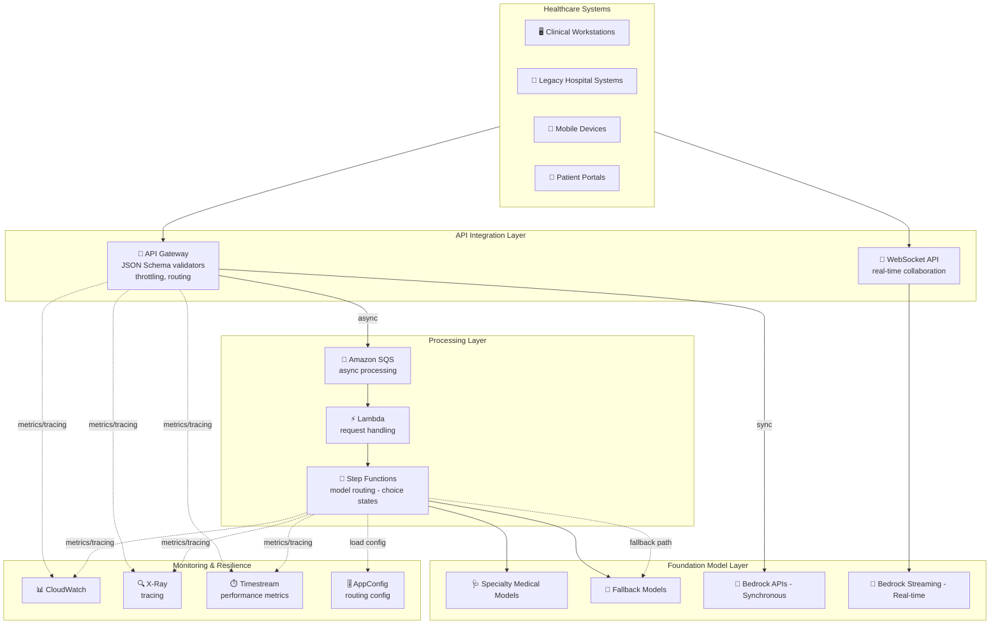

# Case Study 08 — Nền tảng trợ lý AI cấp doanh nghiệp cho y tế

[← Về Case Studies](./README.md)

| | |
|---|---|
| **Concept chính** | Hệ thống tương tác model linh hoạt — sync vs async, streaming, và nhiều lớp fallback cho workflow lâm sàng trọng yếu |
| **Domain liên quan** | D2 (Integration), D4 (Operational Efficiency), D5 (Resilience) |
| **Service trọng tâm** | Bedrock (APIs, streaming), SQS, API Gateway (JSON Schema validators, throttling), Step Functions, AppConfig, X-Ray, Timestream, AWS SDK retry |

---

## 1. Summary use case

> Công ty bạn phát triển nền tảng trợ lý AI cho **nhân viên y tế**, hỗ trợ **ra quyết định lâm sàng, lập tài liệu y khoa, và tương tác bệnh nhân** xuyên môi trường bệnh viện. Yêu cầu: hỗ trợ **nhiều kiểu tương tác** từ nhiều hệ thống/thiết bị bệnh viện; **hỗ trợ AI real-time** trong workflow lâm sàng nhạy thời gian; **vận hành tin cậy khi mạng gián đoạn hoặc dịch vụ suy giảm**; **chọn model theo chuyên khoa & ngữ cảnh lâm sàng**; tuân thủ quy định y tế khi mở rộng.

Hãy hình dung bạn xây trợ lý AI cho bác sĩ trong bệnh viện. Cái khó là **sự đa dạng của tình huống tương tác**: có câu hỏi cấp cứu cần trả lời tức thì (sync), có việc lập hồ sơ sau ca khám có thể chờ (async), có lúc mạng chập chờn nhưng hệ thống **không được chết** vì đang giữa quy trình lâm sàng. Bài toán test khả năng chọn **đúng kiểu tương tác** (sync/async/streaming) và dựng **nhiều lớp dự phòng**.

### Các requirement phải giải

| # | Requirement | Diễn giải (vì sao khó) |
|---|---|---|
| R1 | **Truy vấn lâm sàng đồng bộ, nhanh** | Câu hỏi cấp cứu cần trả lời tức thì với timeout ngắn + retry |
| R2 | **Tài liệu sau ca khám xử lý bất đồng bộ** | Bác sĩ submit rồi tiếp tục chăm sóc, xử lý nền |
| R3 | **Hiển thị real-time (streaming)** | Bác sĩ bắt đầu đọc kết quả khi AI còn đang sinh |
| R4 | **Tin cậy khi mạng gián đoạn** | Stream phải resume được; ưu tiên request cấp cứu |
| R5 | **Chọn model theo chuyên khoa & ngữ cảnh** | Ca đa chuyên khoa cần chọn/chạy song song nhiều model |
| R6 | **Validate ngữ cảnh y khoa + throttle theo khoa** | Kiểm tra trường bắt buộc, mã chuẩn; giới hạn theo phòng ban |

---

## 2. Sơ đồ kiến trúc

---

## 3. Vì sao kiến trúc này đáp ứng được bài toán (Design Rationale)

### R1 → Truy vấn cấp cứu: Bedrock API đồng bộ + retry thông minh

Câu hỏi lâm sàng cần trả lời tức thì → **Bedrock API đồng bộ** với timeout 4–5 giây, custom retry logic có **exponential backoff + jitter** để chịu lúc cao điểm bệnh viện.

### R2 → Tài liệu sau ca: SQS bất đồng bộ

Lập tài liệu sau ca khám không cần tức thì → **Amazon SQS** với visibility timeout 10 phút + **dead letter queue**. Bác sĩ submit rồi tiếp tục chăm sóc bệnh nhân, xử lý chạy nền.

> ⚠️ **Điểm dễ sai:** việc nào **chờ được** (tài liệu nền) → **SQS async**; việc nào **cần ngay** (cấp cứu) → **API đồng bộ**. Đừng nhét mọi thứ vào một kiểu.

### R3 → Hiển thị real-time: Bedrock Streaming + Server-Sent Events

- **Bedrock streaming API** với buffer management ưu tiên hiển thị thông tin lâm sàng trước → bác sĩ bắt đầu đọc decision support khi phân tích còn đang sinh.
- **Server-Sent Events (SSE)** với event ID cho ứng dụng giáo dục bệnh nhân — **resume stream được sau khi mạng gián đoạn**.

### R4 → Tin cậy & dự phòng nhiều lớp

- AWS SDK với retry policy tinh chỉnh + **priority queuing cho request cấp cứu**.
- **API Gateway throttling đa tầng** theo quy mô bệnh viện, burst capacity cho lúc đổi ca/đi buồng sáng.
- **Fallback nhiều lớp (degradation path):** model y khoa chuyên biệt → model general-purpose + prompt y khoa → RAG dùng knowledge base bệnh viện → cuối cùng rule-based cho chức năng trọng yếu.

> ⚠️ **Điểm dễ sai:** hệ thống trọng yếu cần **chuỗi fallback** rõ ràng (specialized → general → RAG → rule-based), không chỉ một model.

### R5 → Chọn model theo chuyên khoa: Step Functions choice states + Timestream

- **Step Functions với choice states** đánh giá dữ liệu bệnh nhân + mã y khoa để chọn model phù hợp, **chạy song song** cho ca đa chuyên khoa (multi-specialty consultation).
- **Metrics-based routing** theo dõi độ chính xác chẩn đoán, chất lượng & thời gian phản hồi trong **Amazon Timestream** (time-series DB) để liên tục tối ưu việc chọn model.

> ⚠️ **Điểm dễ sai:** lưu **metric theo thời gian (time-series)** để tối ưu routing → **Timestream**, không phải DynamoDB thường.

### R6 → Validate & throttle: API Gateway JSON Schema validators + AppConfig

- **API Gateway JSON Schema validators** kiểm tra trường ngữ cảnh y khoa bắt buộc, validate thuật ngữ theo mã chuẩn; usage plan với throttle theo phòng ban.
- **AppConfig** quản lý cấu hình routing tĩnh + mapping template áp prompt/format theo ngữ cảnh lâm sàng, có A/B testing.

---

## 4. Phương án thay thế & đánh đổi (Alternatives & trade-offs)

| Nhu cầu | Lựa chọn đúng | Lựa chọn sai thường gặp | Vì sao |
|---|---|---|---|
| Câu hỏi cấp cứu | **Bedrock API đồng bộ + retry** | Async SQS | Cấp cứu cần ngay, không chờ queue |
| Tài liệu sau ca | **SQS async + DLQ** | Gọi đồng bộ | Cho bác sĩ tiếp tục việc, xử lý nền |
| Hiển thị dần kết quả | **Bedrock streaming + SSE** | Chờ trả về trọn gói | Bác sĩ đọc sớm; SSE resume khi mất mạng |
| Chọn model đa chuyên khoa | **Step Functions choice states** | If-else trong Lambda | SF rẽ nhánh + chạy song song |
| Tối ưu routing theo metric | **Timestream** | DynamoDB | Time-series tối ưu cho metric theo thời gian |
| Độ tin cậy | **Fallback nhiều lớp** | Một model duy nhất | Trọng yếu cần degradation path |

---

## 5. 💡 Bài học rút ra (Lesson learned)

> **Khi gặp bài toán có** **"trợ lý AI trọng yếu + nhiều kiểu tương tác + cần tin cậy khi sự cố"**, nghĩ ngay tới: **chọn đúng kiểu tương tác (sync/async/streaming) + chuỗi fallback nhiều lớp + định tuyến model thông minh.**

- **Sync vs Async:** việc cần ngay → API đồng bộ; việc chờ được → SQS (có DLQ).
- **Streaming + SSE** = hiển thị dần + resume sau mất mạng.
- **Fallback nhiều lớp:** specialized → general+prompt → RAG → rule-based.
- **Step Functions choice states** = chọn/chạy song song model theo ngữ cảnh.
- **Timestream** = lưu metric time-series để tối ưu routing.
- **API Gateway JSON Schema validators** = chặn input thiếu trường y khoa bắt buộc.

🔗 **Liên quan:** [01. Bedrock](../01-basic-knowledge/01-amazon-bedrock-services.md) · [06. Integration & Orchestration](../01-basic-knowledge/06-integration-orchestration-services.md) · [04. Compute & Deployment](../01-basic-knowledge/04-compute-deployment-services.md) · [Practice exam](../03-practice-exam/)
