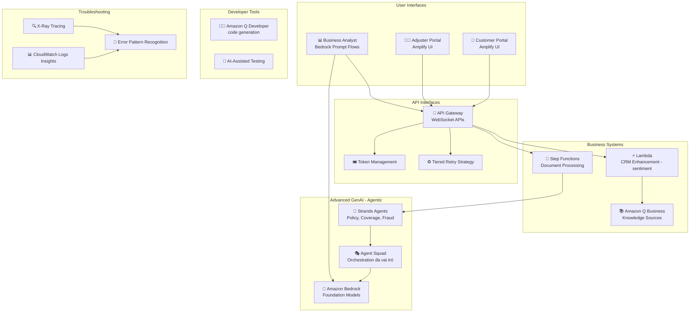

# Case Study 09 — Chuyển đổi xử lý bồi thường bảo hiểm bằng GenAI agentic

[← Về Case Studies](./README.md)

| | |
|---|---|
| **Concept chính** | Điều phối nhiều agent chuyên biệt (multi-agent orchestration) + công cụ năng suất dev (Amazon Q) cho quy trình claims |
| **Domain liên quan** | D2 (Integration), D4 (Operational Efficiency), D5 (Monitoring) |
| **Service trọng tâm** | API Gateway (WebSocket), Bedrock (Prompt Flows), Lambda, Step Functions, Amazon Q Business, Amazon Q Developer, Strands Agents, Agent Squad, Amplify, CloudWatch Logs Insights, X-Ray |

---

## 1. Summary use case

> Một **công ty bảo hiểm đa quốc gia** xử lý **50.000+ claim/tháng** (auto, home, health, commercial) gặp các vấn đề: thời gian xử lý dài, **quyết định bồi thường thiếu nhất quán**, hài lòng khách thấp, và nghẽn ở xử lý tài liệu thủ công. Họ thực hiện chuyển đổi GenAI toàn diện để hiện đại hóa quy trình claims, nâng trải nghiệm khách, và tăng hiệu quả vận hành.

Hãy hình dung bạn không xây một AI trả lời đơn lẻ, mà một **"đội ngũ chuyên gia ảo"** cùng xử lý một hồ sơ claim phức tạp: một agent tra cứu policy, một agent thẩm định thiệt hại, một agent điều tra gian lận, một agent bảo vệ quyền lợi khách. Cái khó là **điều phối các agent này phối hợp nhịp nhàng**, bàn giao mạch lạc, và phục hồi khi một agent gặp giới hạn. Đây là bài toán về **agentic AI** và năng suất phát triển.

### Các requirement phải giải

| # | Requirement | Diễn giải (vì sao khó) |
|---|---|---|
| R1 | **Phiên review claim ổn định, real-time** | Phiên dài cần kết nối bền + quản lý context trong giới hạn token |
| R2 | **Nhiều agent chuyên biệt phối hợp** | Policy lookup, coverage, fraud — phải bàn giao nhất quán, có recovery |
| R3 | **Claim thương mại phức tạp, nhiều vai trò** | Cần dàn nhạc nhiều agent: policy expert, damage assessor, fraud investigator, customer advocate |
| R4 | **Xử lý tài liệu song song có validation** | Nhiều tài liệu cần xử lý song song với checkpoint kiểm tra |
| R5 | **Tăng năng suất phát triển** | Sinh code tuân thủ domain bảo hiểm, refactor, test cho kịch bản GenAI |
| R6 | **Cho người không chuyên thiết kế workflow** | Business analyst tự dựng workflow không cần dev |

---

## 2. Sơ đồ kiến trúc

---

## 3. Vì sao kiến trúc này đáp ứng được bài toán (Design Rationale)

### R1 → Phiên review ổn định: WebSocket + token windowing + tiered retry

**API Gateway WebSocket** với timeout 20 phút cho phiên review claim ổn định; **token windowing** quản lý context trong giới hạn (vd 8.000 token); **tiered retry strategy** với **circuit breaker sau 4 lần lỗi** để chịu lúc cao điểm.

### R2 + R3 → Đa agent: Strands Agents + Agent Squad

Đây là phần "ăn điểm" của case agentic:

- **AWS Strands Agents**: các agent chuyên biệt cho **policy lookup, coverage verification, fraud detection** với workflow điều phối, đảm bảo hiểu claim nhất quán giữa các lần bàn giao (handoff) và **cơ chế recovery** khi agent gặp giới hạn.
- **AWS Agent Squad** cho claim thương mại phức tạp: điều phối nhiều vai trò — **policy expert, damage assessor, fraud investigator, customer advocate**. **Step Functions** chèn bước validation giữa các handoff để đảm bảo nhất quán + recovery khi cần.

> ⚠️ **Điểm dễ sai:** bài toán cần "nhiều chuyên gia phối hợp trên một tác vụ phức tạp" → **multi-agent orchestration (Strands Agents / Agent Squad)** + Step Functions chèn validation giữa handoff, không phải một prompt duy nhất.

### R4 → Xử lý tài liệu song song: Step Functions + Lambda

**Step Functions** điều phối workflow xử lý tài liệu **song song có validation checkpoint**; **Lambda** nâng cấp CRM với phân tích sentiment lúc submit claim. **Amazon Q Business** làm nguồn tri thức với refresh hằng ngày + metadata tag theo loại claim/coverage.

### R5 → Năng suất dev: Amazon Q Developer

**Amazon Q Developer** cấu hình với ngữ cảnh domain bảo hiểm để **sinh code tuân thủ**, pipeline refactor ưu tiên theo impact hiệu năng, và khung test với coverage chuyên cho kịch bản GenAI.

> ⚠️ **Điểm dễ sai:** "tăng năng suất lập trình viên, sinh/refactor code" → **Amazon Q Developer** (coding companion); còn "nguồn tri thức cho nghiệp vụ" → **Amazon Q Business**. Đừng nhầm hai sản phẩm Q.

### R6 → Người không chuyên dựng workflow: Bedrock Prompt Flows + Amplify

**Bedrock Prompt Flows** cho business analyst tự thiết kế workflow tùy biến **không cần dev**; **Amplify UI** dựng giao diện portal nhanh với progressive enhancement; OpenAPI spec cho tích hợp đối tác.

### Giám sát: CloudWatch Logs Insights + X-Ray

**CloudWatch Logs Insights** truy vấn log tìm mẫu trong xử lý claim; **X-Ray** trace với annotation đặc thù bảo hiểm; rule nhận diện lỗi + gợi ý remediation cho các failure mode phổ biến.

---

## 4. Phương án thay thế & đánh đổi (Alternatives & trade-offs)

| Nhu cầu | Lựa chọn đúng | Lựa chọn sai thường gặp | Vì sao |
|---|---|---|---|
| Nhiều chuyên gia phối hợp | **Strands Agents / Agent Squad** | Một prompt khổng lồ | Multi-agent xử lý vai trò chuyên biệt + handoff |
| Bàn giao nhất quán giữa agent | **Step Functions (validation steps)** | Để agent tự gọi nhau | SF chèn checkpoint + recovery |
| Phiên review dài, real-time | **WebSocket + token windowing** | REST | Kết nối bền + quản context |
| Sinh/refactor code | **Amazon Q Developer** | Q Business | Q Developer là coding companion |
| Nguồn tri thức nghiệp vụ | **Amazon Q Business** | Q Developer | Q Business cho enterprise knowledge |
| Workflow cho non-dev | **Bedrock Prompt Flows** | Bắt dev code | Prompt Flows kéo-thả, không cần code |

---

## 5. 💡 Bài học rút ra (Lesson learned)

> **Khi gặp bài toán có** **"tác vụ phức tạp cần nhiều chuyên gia phối hợp + nhiều bước bàn giao"**, nghĩ ngay tới **multi-agent orchestration**: Strands Agents / Agent Squad + Step Functions chèn validation giữa handoff.

- **Multi-agent ≠ một prompt:** chia vai trò chuyên biệt (policy/damage/fraud/advocate), điều phối + recovery.
- **Step Functions** đảm bảo bàn giao nhất quán giữa các agent.
- **Amazon Q Developer ≠ Q Business:** Developer cho sinh/refactor code; Business cho nguồn tri thức nghiệp vụ.
- **Bedrock Prompt Flows** cho người không chuyên tự dựng workflow.
- **WebSocket + token windowing + circuit breaker** cho phiên dài ổn định.

🔗 **Liên quan:** [01. Bedrock](../01-basic-knowledge/01-amazon-bedrock-services.md) · [06. Integration & Orchestration](../01-basic-knowledge/06-integration-orchestration-services.md) · [05. Specialized AI](../01-basic-knowledge/05-specialized-ai-services.md) · [Practice exam](../03-practice-exam/)
