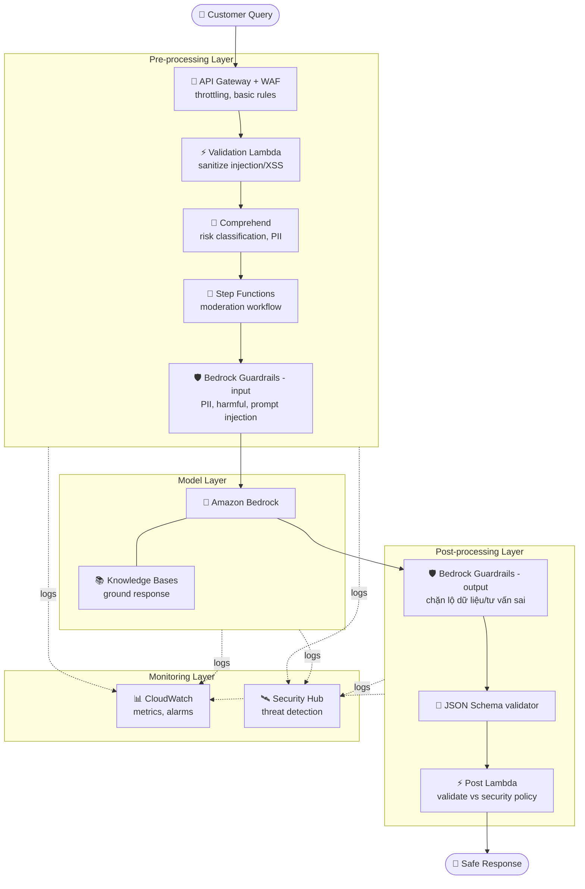
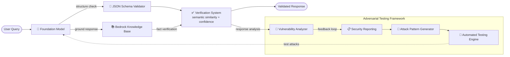

# Case Study 10 — Kiểm soát an toàn đầu vào/đầu ra cho trợ lý AI tài chính

[← Về Case Studies](./README.md)

| | |
|---|---|
| **Concept chính** | Phòng thủ nhiều lớp (defense-in-depth) cho an toàn input/output + chống hallucination + khung kiểm thử đối kháng (adversarial) |
| **Domain liên quan** | D3 (Security/Safety/Guardrails), D5 (Testing) |
| **Service trọng tâm** | Bedrock Guardrails, Knowledge Bases, Comprehend, Lambda, Step Functions, API Gateway + WAF, CloudWatch, Security Hub, AWS Organizations |

---

## 1. Summary use case

> Một **tổ chức tài chính lớn** muốn xây trợ lý AI trả lời thắc mắc khách về tài khoản, sản phẩm tài chính, và câu hỏi ngân hàng chung. Trợ lý phải **an toàn, chính xác, và chống bị lạm dụng** trong khi xử lý thông tin tài chính nhạy cảm.

Hãy hình dung bạn xây một trợ lý ngân hàng mà kẻ xấu liên tục tìm cách **dụ nó lộ thông tin tài khoản** hoặc **lừa nó tư vấn sai**. Cái khó không phải làm AI trả lời được, mà là **bọc nhiều lớp phòng thủ** quanh nó: lọc đầu vào độc hại, chống AI bịa đặt, kiểm tra đầu ra trước khi trả về, và **chủ động tự tấn công chính mình** để tìm lỗ hổng. Bài toán test tư duy **defense-in-depth** và **adversarial testing**.

### Các requirement phải giải

| # | Requirement | Diễn giải (vì sao khó) |
|---|---|---|
| R1 | **Lọc an toàn đầu vào** | Chặn PII, nội dung độc hại, và prompt injection |
| R2 | **Chống bịa đặt (hallucination) đầu ra** | Không được bịa tư vấn tài chính sai lệch |
| R3 | **Ép cấu trúc đầu ra + chống lộ dữ liệu** | Output phải đúng schema, không rò rỉ thông tin tài khoản |
| R4 | **Phòng thủ nhiều lớp (defense-in-depth)** | Một lớp bị thủng vẫn còn lớp khác |
| R5 | **Phát hiện & kiểm thử tấn công đối kháng** | Chủ động phát hiện jailbreak/injection, tự tấn công để tìm lỗ hổng |
| R6 | **Giám sát & tuân thủ** | Audit log + phát hiện mẫu bất thường + báo cáo tuân thủ |

---

## 2. Sơ đồ kiến trúc

### 2.1 Defense-in-depth (phòng thủ nhiều lớp)

### 2.2 Hallucination prevention + Adversarial testing

---

## 3. Vì sao kiến trúc này đáp ứng được bài toán (Design Rationale)

### R1 → An toàn đầu vào: nhiều lớp lọc

- **Validation Lambda** sanitize input (chống SQL injection, XSS), validate format.
- **Amazon Comprehend** phân tích sentiment/key phrase phát hiện đe dọa, nhận diện PII, phân loại rủi ro.
- **Step Functions** điều phối toàn bộ quy trình kiểm duyệt, rẽ nhánh theo mức rủi ro, giữ audit log.
- **Bedrock Guardrails (input)** chặn PII, nội dung độc hại, và **prompt injection**.

### R2 → Chống hallucination: Knowledge Bases + Verification System

**Bedrock Knowledge Bases** lưu thông tin sản phẩm tài chính chính xác để **ground (neo)** câu trả lời. **Verification System** thực hiện kiểm tra **semantic similarity** giữa response và knowledge base, tính **confidence score**, và đánh dấu hallucination tiềm năng để con người review.

> ⚠️ **Điểm dễ sai:** chống bịa đặt trong ngành quản lý chặt → **RAG (Knowledge Bases) + contextual grounding của Guardrails + verification**, không chỉ dựa vào model.

### R3 → Ép cấu trúc đầu ra: JSON Schema + Guardrails output

**JSON Schema** validate cấu trúc response (account info, product recommendation, transaction). **Bedrock Guardrails (output)** lọc tư vấn tài chính sai lệch, chặn lộ thông tin tài khoản nhạy cảm.

### R4 → Defense-in-depth: 4 lớp

Đây là tinh thần cốt lõi. Bốn lớp độc lập, lớp này thủng vẫn còn lớp khác:

- **Pre-processing:** API Gateway + WAF (throttling, rule cơ bản) + Comprehend (phân loại rủi ro) + Lambda (sanitize).
- **Model:** Bedrock Guardrails (an toàn nội dung) + Knowledge Base (neo response).
- **Post-processing:** Lambda validate response theo security policy + API Gateway lọc chống rò rỉ dữ liệu.
- **Monitoring:** CloudWatch (metric + alarm mẫu khả nghi) + **Security Hub** (phát hiện mối đe dọa tập trung).

### R5 → Adversarial testing: tự tấn công để tìm lỗ hổng

Phần đặc sắc của case này. Hệ thống **chủ động tự kiểm thử bảo mật**:

- **Attack Pattern Generator** tạo prompt đối kháng đặc thù tài chính (injection, jailbreak, social engineering nhắm vào trích xuất dữ liệu).
- **Automated Testing Engine** chạy các mẫu tấn công vào hệ thống, đo phản ứng, ghi lại thành công/thất bại.
- **Vulnerability Analyzer** đánh giá response để tìm điểm yếu, đo hiệu quả của các kiểm soát.
- **Security Reporting** tạo báo cáo tuân thủ + tạo **feedback loop** cải tiến liên tục.

> ⚠️ **Điểm dễ sai:** an toàn AI không chỉ là dựng guardrails một lần — cần **adversarial testing tự động liên tục** để phát hiện lỗ hổng mới.

### R6 → Giám sát & tuân thủ: CloudWatch + Security Hub + Organizations

CloudWatch theo dõi metric & cảnh báo mẫu khả nghi; **Security Hub** phát hiện mối đe dọa toàn diện; **AWS Organizations** áp policy quản trị xuyên tài khoản.

---

## 4. Phương án thay thế & đánh đổi (Alternatives & trade-offs)

| Nhu cầu | Lựa chọn đúng | Lựa chọn sai thường gặp | Vì sao |
|---|---|---|---|
| Chặn PII/injection đầu vào | **Guardrails + Comprehend + Lambda** | Chỉ dặn prompt | Nhiều lớp lọc, không dựa vào model tự giác |
| Chống hallucination | **Knowledge Bases + Verification** | Tin model | RAG neo sự thật + verify confidence |
| Cấu trúc đầu ra | **JSON Schema** | Để model tự do | Schema ép định dạng nhất quán |
| Bảo mật tổng thể | **Defense-in-depth 4 lớp** | Một guardrail duy nhất | Một lớp thủng còn lớp khác |
| Tìm lỗ hổng | **Adversarial testing framework** | Test thủ công một lần | Tự động liên tục phát hiện lỗ hổng mới |
| Phát hiện đe dọa | **Security Hub + CloudWatch** | Chỉ log thường | Tập trung threat detection |

---

## 5. 💡 Bài học rút ra (Lesson learned)

> **Khi gặp bài toán có** **"AI an toàn cho ngành nhạy cảm, chống lạm dụng/tấn công"**, nghĩ ngay tới **defense-in-depth** (pre → model → post → monitoring) + **adversarial testing tự động**.

- **An toàn input/output = Guardrails ở cả 2 đầu** (input lọc PII/injection, output chặn lộ dữ liệu/tư vấn sai).
- **Chống hallucination = Knowledge Bases (ground) + verification (confidence + human review)**.
- **Defense-in-depth 4 lớp:** một lớp thủng vẫn còn lớp khác.
- **Adversarial testing** là phần dễ quên: tự sinh tấn công → test → phân tích lỗ hổng → feedback loop.
- **Security Hub** cho threat detection tập trung, không chỉ CloudWatch.

🔗 **Liên quan:** [01. Bedrock](../01-basic-knowledge/01-amazon-bedrock-services.md) · [07. Security & Governance](../01-basic-knowledge/07-security-governance-services.md) · [05. Specialized AI](../01-basic-knowledge/05-specialized-ai-services.md) · [Practice exam](../03-practice-exam/)
