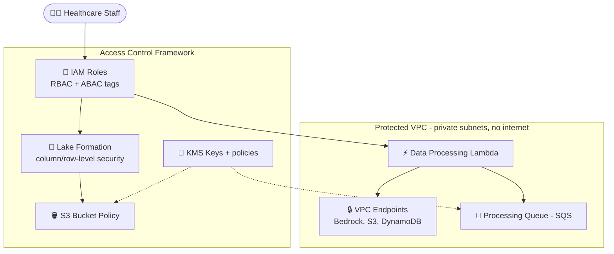
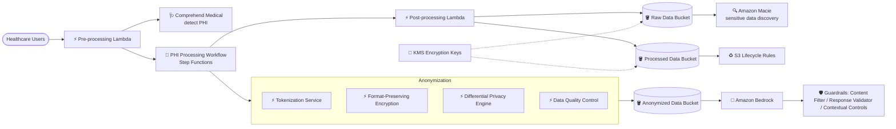

# Case Study 11 — Kiểm soát bảo mật & quyền riêng tư dữ liệu cho AI y tế

[← Về Case Studies](./README.md)

| | |
|---|---|
| **Concept chính** | Bảo mật dữ liệu nhiều tầng (network isolation + access control + PII protection + anonymization) cho FM xử lý dữ liệu HIPAA |
| **Domain liên quan** | D3 (Security/Privacy/Governance), D1 (Data) |
| **Service trọng tâm** | VPC endpoints, IAM (RBAC/ABAC), Lake Formation, KMS, Comprehend Medical, Macie, GuardDuty, CloudTrail, Security Hub, S3 Lifecycle, Bedrock Guardrails, Step Functions, Lambda |

---

## 1. Summary use case

> Một **tổ chức y tế** muốn dùng FM để phân tích hồ sơ bệnh nhân, nghiên cứu y khoa, và kết quả điều trị nhằm cải thiện quyết định lâm sàng. Giải pháp phải **tuân thủ nghiêm ngặt HIPAA** và cung cấp insight giá trị cho chuyên gia y tế.

Hãy hình dung bạn xây nền tảng phân tích y tế bằng AI, nơi mỗi dòng dữ liệu đều là **thông tin sức khỏe cá nhân (PHI)** được luật bảo vệ chặt. Cái khó không phải phân tích, mà là **không để rò rỉ một byte nào** — dữ liệu phải sống trong "phòng kín", chỉ đúng người được vào, mọi PHI phải bị che/ẩn danh, và mọi truy cập đều có dấu vết. Bài toán test tư duy **bảo mật dữ liệu nhiều tầng** quanh FM.

### Các requirement phải giải

| # | Requirement | Diễn giải (vì sao khó) |
|---|---|---|
| R1 | **Cô lập mạng (network isolation)** | Tài nguyên xử lý AI không được có internet trực tiếp |
| R2 | **Kiểm soát truy cập tinh (RBAC/ABAC, column-level)** | Đúng vai trò/phòng ban mới thấy đúng dữ liệu |
| R3 | **Phát hiện & bảo vệ PII/PHI** | Tự động nhận diện PHI trong văn bản phi cấu trúc |
| R4 | **Mã hóa & vòng đời dữ liệu** | Mã hóa at-rest, xoay khóa, giữ/xóa dữ liệu theo quy định |
| R5 | **Ẩn danh hóa (anonymization)** | Token hóa, mã hóa giữ định dạng, differential privacy |
| R6 | **Giám sát, audit & phát hiện vi phạm** | Audit toàn diện + phát hiện rò rỉ dữ liệu |

---

## 2. Sơ đồ kiến trúc

### 2.1 Môi trường cô lập + access control

### 2.2 PII protection + Anonymization

---

## 3. Vì sao kiến trúc này đáp ứng được bài toán (Design Rationale)

### R1 → Cô lập mạng: VPC + VPC Endpoints + Security Groups/NACLs

- **VPC riêng** cho nền tảng phân tích y tế, **private subnets** cho mọi thành phần xử lý AI, **không internet trực tiếp**.
- **VPC Endpoints** (interface cho Bedrock/S3, gateway cho S3/DynamoDB) → mọi traffic ở trong mạng AWS, không ra Internet công cộng.
- **Security groups + Network ACLs** giới hạn traffic giữa thành phần + egress rule chặn data exfiltration.

> ⚠️ **Điểm dễ sai:** dữ liệu nhạy cảm gọi Bedrock/S3 mà không muốn qua Internet → **VPC Endpoints** (PrivateLink), không phải gọi qua public endpoint.

### R2 → Access control tinh: IAM + Lake Formation + resource policies

- **IAM**: RBAC cho mọi thành phần, **least privilege**, và **ABAC** (attribute-based) cho quyền động.
- **AWS Lake Formation**: kiểm soát truy cập tinh cho data lake — **column-level security** cho dữ liệu bệnh nhân nhạy cảm, **row-level security** theo vai trò/phòng ban.
- **Resource-based policies**: S3 bucket policy giới hạn theo role, KMS key policy ép yêu cầu mã hóa, SQS policy giới hạn producer/consumer.

> ⚠️ **Điểm dễ sai:** "kiểm soát ở mức cột/hàng trong data lake" → **Lake Formation**, không phải IAM policy thuần.

### R3 → Phát hiện & bảo vệ PHI: Comprehend Medical + Macie

- **Amazon Comprehend Medical**: tự động phát hiện PHI, nhận diện thực thể y khoa trong văn bản phi cấu trúc, phân loại thông tin nhạy cảm.
- **Amazon Macie**: tự động khám phá dữ liệu nhạy cảm trên S3, quét định kỳ, custom data identifier cho thông tin y tế.
- **Pipeline Lambda**: sanitize input, phát hiện & che PII real-time, log sự kiện cho tuân thủ.

> ⚠️ **Điểm dễ sai:** PHI trong văn bản y khoa → **Comprehend Medical** (chuyên y tế), không phải Comprehend thường; khám phá dữ liệu nhạy cảm trên S3 → **Macie**.

### R4 → Mã hóa & vòng đời: KMS + S3 Lifecycle

- **KMS**: mã hóa tự động mọi dữ liệu, **xoay khóa (key rotation)**, quản lý khóa với access control chặt.
- **S3 Lifecycle**: tự chuyển dữ liệu sang cold storage sau thời gian định, policy xóa theo retention, versioning cho audit.

### R5 → Ẩn danh hóa: tokenization + FPE + differential privacy

- **Data masking**: token hóa định danh bệnh nhân, **format-preserving encryption** cho dữ liệu có cấu trúc, pseudonymization với bảng mapping an toàn.
- **Differential privacy**: thêm nhiễu thống kê bảo vệ bản ghi cá nhân, quản lý privacy budget, cân bằng giữa bảo vệ & tính hữu dụng.
- **De-identification pipeline** (Step Functions): workflow tự động ẩn danh, nhiều kỹ thuật theo độ nhạy, kiểm soát chất lượng sau ẩn danh.

### R6 → Giám sát & audit: CloudTrail + GuardDuty + Macie + Security Hub

- **CloudWatch**: giám sát real-time API call tới Bedrock, custom metric mẫu truy cập, phát hiện bất thường.
- **CloudTrail**: audit log toàn diện, tích hợp **Security Hub**, retention theo HIPAA.
- **GuardDuty + Macie**: phát hiện đe dọa rò rỉ dữ liệu, workflow remediation tự động.
- **Bedrock Guardrails**: contextual controls theo vai trò/mức truy cập, chặn lộ PHI ở cả input/output, log can thiệp cho báo cáo tuân thủ.

---

## 4. Phương án thay thế & đánh đổi (Alternatives & trade-offs)

| Nhu cầu | Lựa chọn đúng | Lựa chọn sai thường gặp | Vì sao |
|---|---|---|---|
| Gọi Bedrock/S3 không qua Internet | **VPC Endpoints (PrivateLink)** | Public endpoint | Giữ traffic trong mạng AWS |
| Kiểm soát cột/hàng data lake | **Lake Formation** | IAM thuần | Column/row-level security |
| Phát hiện PHI trong text | **Comprehend Medical** | Comprehend thường | Chuyên thực thể y khoa |
| Khám phá dữ liệu nhạy cảm S3 | **Macie** | Quét thủ công | Tự động + custom identifier |
| Phát hiện rò rỉ/đe dọa | **GuardDuty + Security Hub** | Chỉ CloudWatch | Threat detection chuyên dụng |
| Ẩn danh dữ liệu | **Tokenization + FPE + differential privacy** | Xóa cột thô | Giữ tính hữu dụng + bảo vệ |

---

## 5. 💡 Bài học rút ra (Lesson learned)

> **Khi gặp bài toán có** **"FM xử lý dữ liệu cực nhạy cảm (y tế/HIPAA) + bảo mật & riêng tư nghiêm ngặt"**, nghĩ ngay tới **bảo mật nhiều tầng**: network isolation (VPC Endpoints) + access control tinh (Lake Formation/ABAC) + PHI protection (Comprehend Medical/Macie) + anonymization + audit (CloudTrail/GuardDuty).

- **VPC Endpoints** = gọi dịch vụ AWS không ra Internet (cốt lõi cho dữ liệu nhạy cảm).
- **Lake Formation** = kiểm soát cột/hàng, vượt IAM thuần.
- **Comprehend Medical** (PHI) + **Macie** (khám phá dữ liệu nhạy cảm S3) — đừng nhầm với Comprehend thường.
- **Anonymization** = tokenization + format-preserving encryption + differential privacy.
- **GuardDuty + Security Hub** cho threat detection, không chỉ log.

🔗 **Liên quan:** [03. Data & RAG](../01-basic-knowledge/03-data-rag-knowledge-services.md) · [07. Security & Governance](../01-basic-knowledge/07-security-governance-services.md) · [05. Specialized AI](../01-basic-knowledge/05-specialized-ai-services.md) · [Practice exam](../03-practice-exam/)
