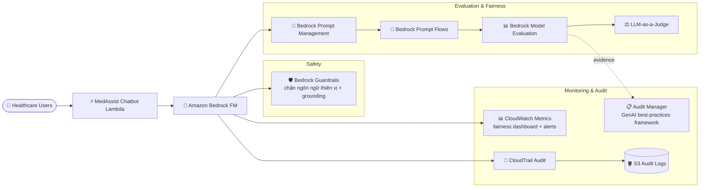

# Case Study 12 — Đánh giá công bằng (fairness) cho chatbot y tế (Responsible AI)

[← Về Case Studies](./README.md)

| | |
|---|---|
| **Concept chính** | Khung đánh giá công bằng (fairness) & Responsible AI: LLM-as-a-judge + human eval + giám sát bias liên tục |
| **Domain liên quan** | D5 (Responsible AI, Testing & Evaluation), D3 (Governance) |
| **Service trọng tâm** | Bedrock (Model Evaluation, LLM-as-a-judge, Prompt Management, Prompt Flows, Guardrails), CloudWatch, CloudTrail, S3, Audit Manager |

---

## 1. Summary use case

> Một công ty phát triển **chatbot y tế** bằng Bedrock FM để cung cấp thông tin y khoa cho bệnh nhân. Nhiệm vụ: triển khai **nguyên tắc Responsible AI**, tập trung vào **đánh giá công bằng (fairness)** để chatbot trả lời **không thiên vị** giữa các nhóm bệnh nhân đa dạng. Đội phát triển cần đánh giá & giảm thiểu bias liên quan tới: nhóm tuổi (già/trẻ), giới tính & bản dạng giới, nền tảng sắc tộc/văn hóa, yếu tố kinh tế-xã hội, và trình độ hiểu biết y tế.

Hãy hình dung bạn xây chatbot y tế và phải đảm bảo nó **không trả lời tệ hơn cho người già, người nghèo, hay người thuộc nhóm thiểu số**. Cái khó: bias rất khó thấy bằng mắt — phải **đo lường có hệ thống** trên nhiều nhóm nhân khẩu, rồi **giám sát liên tục** vì bias có thể trôi theo thời gian. Bài toán test khung **Responsible AI & fairness evaluation**.

### Các requirement phải giải

| # | Requirement | Diễn giải (vì sao khó) |
|---|---|---|
| R1 | **Đánh giá tự động trên nhiều nhóm** | Cần đo correctness/completeness/harmfulness ở quy mô, không thủ công hết |
| R2 | **Đánh giá có con người** | Một số phán xét công bằng cần người đánh giá cuối |
| R3 | **A/B test chiến lược prompt giảm bias** | Thử nhiều prompt variant cho từng nhóm nhân khẩu |
| R4 | **Giám sát fairness liên tục** | Bias có thể trôi; cần theo dõi real-time + cảnh báo |
| R5 | **Audit & bằng chứng tuân thủ** | Tài liệu hóa đánh giá fairness cho compliance |
| R6 | **Guardrails chống output thiên vị** | Chặn ngôn ngữ thiên vị + đảm bảo chính xác thực tế |

---

## 2. Sơ đồ kiến trúc

---

## 3. Vì sao kiến trúc này đáp ứng được bài toán (Design Rationale)

### R1 → Đánh giá tự động: Bedrock Model Evaluation + LLM-as-a-judge

**Bedrock Model Evaluation** với **LLM-as-a-judge** đo các metric correctness, completeness, harmfulness. Quy trình: tạo test dataset đa dạng theo nhóm nhân khẩu → cấu hình evaluation job dùng judge model → định nghĩa fairness metric trên các nhóm → phân tích điểm & giải thích qua console.

> ⚠️ **Điểm dễ sai:** đánh giá chất lượng/bias ở quy mô lớn → **Bedrock Model Evaluation (LLM-as-a-judge)**, không phải tự chấm tay từng câu.

### R2 → Đánh giá có con người: human evaluation

Bổ sung đánh giá tự động bằng **human evaluators** cho phán xét cuối — dùng workforce của mình hoặc **AWS managed custom evaluation**. Human-in-the-loop quan trọng cho các phán xét công bằng tinh tế mà máy khó bắt.

### R3 → A/B test prompt giảm bias: Prompt Management + Prompt Flows

- **Bedrock Prompt Management** tạo nhiều **prompt variant** thiết kế để giảm bias cho từng nhóm.
- **Bedrock Prompt Flows** dựng workflow định tuyến câu hỏi theo nội dung/ngữ cảnh, test các chiến lược prompt khác nhau trên từng phân khúc nhân khẩu, đánh giá bằng fairness metric. Visual builder liên kết FM + prompt + dịch vụ AWS. Phân tích để tìm chiến lược prompt công bằng & hiệu quả nhất.

### R4 → Giám sát fairness liên tục: CloudWatch

**CloudWatch** thu thập metric sử dụng model gần real-time, dashboard tùy biến theo dõi fairness metric trên các nhóm, cảnh báo khi phát hiện bias tiềm năng, theo dõi invocation & token count theo phân khúc người dùng.

> ⚠️ **Điểm dễ sai:** fairness không phải đánh giá một lần — cần **giám sát liên tục** vì bias có thể trôi.

### R5 → Audit & tuân thủ: CloudTrail + Audit Manager

- **CloudTrail** thu thập API data, giao log về S3, audit định kỳ mẫu sử dụng model để phát hiện vấn đề fairness.
- **AWS Audit Manager** với **GenAI best-practices framework** tài liệu hóa đánh giá fairness và giữ bằng chứng tuân thủ.

> ⚠️ **Điểm dễ sai:** "tài liệu hóa đánh giá Responsible AI + bằng chứng tuân thủ" → **Audit Manager** (có sẵn GenAI framework), không tự dựng tài liệu thủ công.

### R6 → Guardrails chống output thiên vị

**Bedrock Guardrails** cấu hình content filter phát hiện & chặn ngôn ngữ thiên vị, **contextual grounding check** đảm bảo response chính xác thực tế, kết hợp guardrails built-in của LLM provider + external guardrails để bảo vệ thêm.

---

## 4. Phương án thay thế & đánh đổi (Alternatives & trade-offs)

| Nhu cầu | Lựa chọn đúng | Lựa chọn sai thường gặp | Vì sao |
|---|---|---|---|
| Đánh giá bias quy mô lớn | **Model Evaluation + LLM-as-a-judge** | Chấm tay | Tự động, đo nhiều metric |
| Phán xét công bằng cuối | **Human evaluation** | Chỉ tự động | Một số bias cần người bắt |
| Thử prompt giảm bias | **Prompt Management + Prompt Flows** | Hard-code prompt | A/B test variant theo nhóm |
| Theo dõi bias theo thời gian | **CloudWatch fairness dashboard** | Đánh giá một lần | Bias trôi, cần liên tục |
| Bằng chứng tuân thủ | **Audit Manager (GenAI framework)** | Tài liệu thủ công | Khung sẵn cho Responsible AI |
| Chặn output thiên vị | **Guardrails + grounding** | Tin model | Cưỡng chế ở tầng hệ thống |

---

## 5. 💡 Bài học rút ra (Lesson learned)

> **Khi gặp bài toán có** **"Responsible AI / fairness / bias / không thiên vị giữa các nhóm"**, nghĩ ngay tới khung: **Model Evaluation (LLM-as-a-judge) + human eval + A/B test prompt (Prompt Flows) + giám sát liên tục (CloudWatch) + audit (Audit Manager) + Guardrails.**

- **LLM-as-a-judge** = đánh giá tự động chất lượng/bias ở quy mô.
- **Fairness là quá trình liên tục**, không phải đánh giá một lần → CloudWatch dashboard + alert.
- **Audit Manager có GenAI best-practices framework** = bằng chứng tuân thủ Responsible AI.
- **Human-in-the-loop** vẫn cần cho phán xét công bằng tinh tế.
- **Guardrails + contextual grounding** chặn output thiên vị & đảm bảo chính xác.

🔗 **Liên quan:** [01. Bedrock](../01-basic-knowledge/01-amazon-bedrock-services.md) · [07. Security & Governance](../01-basic-knowledge/07-security-governance-services.md) · [Practice exam](../03-practice-exam/)
