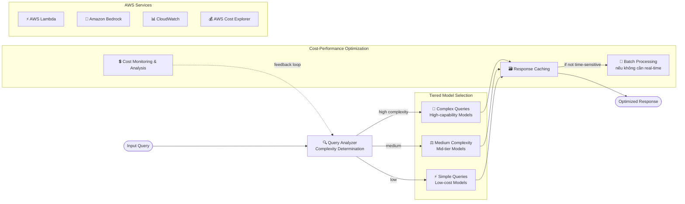

# Case Study 13 — Khung chọn model tối ưu chi phí cho GenAI

[← Về Case Studies](./README.md)

| | |
|---|---|
| **Concept chính** | Khung chọn model dựa trên đánh đổi chi phí–năng lực: tiered usage + intelligent routing + inference patterns tiết kiệm |
| **Domain liên quan** | D4 (Operational Efficiency & Cost Optimization), D1 (FM Selection) |
| **Service trọng tâm** | Bedrock (Model Evaluation, Intelligent Prompt Routing, batch, prompt/response caching), Lambda, CloudWatch, AWS Cost Explorer, cost allocation tags |

---

## 1. Summary use case

> Khi tổ chức ngày càng đưa GenAI vào quy trình vận hành, **quản lý & tối ưu chi phí inference** trở nên quan trọng ngang chi phí cloud truyền thống. Case này khám phá các cách **cân bằng chi phí với yêu cầu hiệu năng** khi triển khai GenAI trên AWS.

Hãy hình dung bạn vận hành một hệ thống GenAI mà hóa đơn inference tăng vọt mỗi tháng. Cái khó: model mạnh nhất thì đắt, nhưng không phải câu hỏi nào cũng cần model mạnh. Dùng model "xịn" để trả lời "đơn hàng của tôi đâu?" là **đốt tiền**. Bài toán test khả năng xây **khung quyết định chọn model theo chi phí–năng lực**: việc dễ giao model rẻ, chỉ dành model đắt cho việc thực sự khó.

### Các requirement phải giải

| # | Requirement | Diễn giải (vì sao khó) |
|---|---|---|
| R1 | **Right-sizing model theo độ phức tạp** | Không dùng model đắt cho task cơ bản |
| R2 | **Cân bằng chi phí vs chất lượng có hệ thống** | Định metric chất lượng + test so sánh + routing thông minh |
| R3 | **Đo price-to-performance** | Tính chi phí trên mỗi đơn vị hiệu năng để quyết định bằng dữ liệu |
| R4 | **Inference patterns tiết kiệm** | Batch cho việc không real-time; caching cho truy vấn lặp |
| R5 | **Giới hạn & điều kiện dừng** | Tránh runaway resource consumption |
| R6 | **Tối ưu liên tục** | Theo dõi chi phí, điều chỉnh tiêu chí theo dữ liệu mới |

---

## 2. Sơ đồ kiến trúc

---

## 3. Vì sao kiến trúc này đáp ứng được bài toán (Design Rationale)

### R1 → Right-sizing: tiered model usage theo độ phức tạp

Tinh thần cốt lõi. **Query Analyzer** xác định độ phức tạp rồi định tuyến:

- **Simple queries** → model nhỏ, rẻ (đủ xử lý yêu cầu đơn giản).
- **Medium complexity** → model tầm trung (cân bằng chi phí–năng lực).
- **Complex queries** → model mạnh nhất nhưng đắt, **chỉ dành cho kịch bản này**.

> ⚠️ **Điểm dễ sai:** đừng dùng model mạnh-đắt cho task cơ bản. Phân tầng theo độ phức tạp là cách giảm chi phí trực tiếp nhất.

### R2 → Cân bằng chi phí vs chất lượng: đánh giá có hệ thống

- **Define quality metrics**: định rõ thế nào là "chất lượng chấp nhận được" cho từng use case.
- **Comparative testing** (Bedrock Model Evaluation): test nhiều model trên các metric chất lượng, đồng thời track chi phí.
- **Intelligent routing** (Bedrock Intelligent Prompt Routing): định tuyến tới model **rẻ nhất đáp ứng ngưỡng chất lượng**.

> ⚠️ **Điểm dễ sai:** "định tuyến tự động tới model rẻ nhất đạt chất lượng" → **Bedrock Intelligent Prompt Routing**, không tự viết logic phức tạp.

### R3 → Đo price-to-performance: cost allocation tags

Dùng **inference-level cost allocation tags** để track & phân tích chi phí ở mức chi tiết. Định performance metric → tính chi phí trên mỗi đơn vị hiệu năng → tạo decision matrix cho quyết định chọn model **dựa trên dữ liệu**.

### R4 → Inference patterns tiết kiệm: batch + caching

- **Batch processing**: với workload **không cần real-time**, xử lý theo lô giảm mạnh chi phí (vd sinh mô tả sản phẩm bằng job ban đêm thay vì on-demand khi user xem).
- **Caching**: **response caching** cho truy vấn phổ biến + **prompt caching** → giảm số lần gọi inference.

> ⚠️ **Điểm dễ sai:** việc không cần ngay → **batch** (rẻ hơn nhiều); truy vấn lặp lại → **caching**. Đừng gọi inference real-time cho mọi thứ.

### R5 → Giới hạn & điều kiện dừng

Đặt **stopping conditions** và giám sát execution pattern để tránh kịch bản workflow ngốn tài nguyên quá mức hoặc chạy vượt mục đích hữu ích (runaway consumption).

### R6 → Tối ưu liên tục: CloudWatch + Cost Explorer

- **AWS Cost Explorer** track chi phí inference & mẫu sử dụng.
- **CloudWatch** đánh giá hiệu năng model liên tục theo metric.
- Tinh chỉnh tiêu chí chọn model theo dữ liệu mới; theo dõi model/giá mới ra mắt có thể ảnh hưởng khung lựa chọn.

---

## 4. Phương án thay thế & đánh đổi (Alternatives & trade-offs)

| Nhu cầu | Lựa chọn đúng | Lựa chọn sai thường gặp | Vì sao |
|---|---|---|---|
| Task cơ bản | **Model nhỏ, rẻ** | Model mạnh nhất | Đốt tiền cho việc đơn giản |
| Định tuyến theo chất lượng/chi phí | **Intelligent Prompt Routing** | Tự viết logic | Managed, tới model rẻ nhất đạt ngưỡng |
| Chọn model rẻ-đủ-tốt | **Model Evaluation + cost tracking** | Chọn cảm tính | So sánh chất lượng + chi phí |
| Việc không real-time | **Batch processing** | On-demand inference | Batch rẻ hơn nhiều |
| Truy vấn lặp lại | **Response/Prompt caching** | Gọi mới mỗi lần | Cache giảm số inference |
| Theo dõi chi phí chi tiết | **Cost allocation tags + Cost Explorer** | Ước lượng | Dữ liệu hóa quyết định |

---

## 5. 💡 Bài học rút ra (Lesson learned)

> **Khi gặp bài toán có** **"tối ưu chi phí inference GenAI mà vẫn giữ chất lượng"**, nghĩ ngay tới: **tiered model usage + intelligent routing + batch/caching + đo price-to-performance.**

- **Tiered usage**: việc dễ → model rẻ; chỉ dành model đắt cho việc thực sự khó.
- **Intelligent Prompt Routing** = tự động tới model rẻ nhất đạt ngưỡng chất lượng.
- **Batch** cho việc không real-time; **caching** (response + prompt) cho truy vấn lặp.
- **Cost allocation tags + Cost Explorer** = đo chi phí chi tiết, quyết định bằng dữ liệu.
- **Stopping conditions** = chống runaway consumption.
- Tối ưu chi phí là **quá trình liên tục**, theo dõi model/giá mới.

🔗 **Liên quan:** [01. Bedrock](../01-basic-knowledge/01-amazon-bedrock-services.md) · [04. Compute & Deployment](../01-basic-knowledge/04-compute-deployment-services.md) · [Practice exam](../03-practice-exam/)
