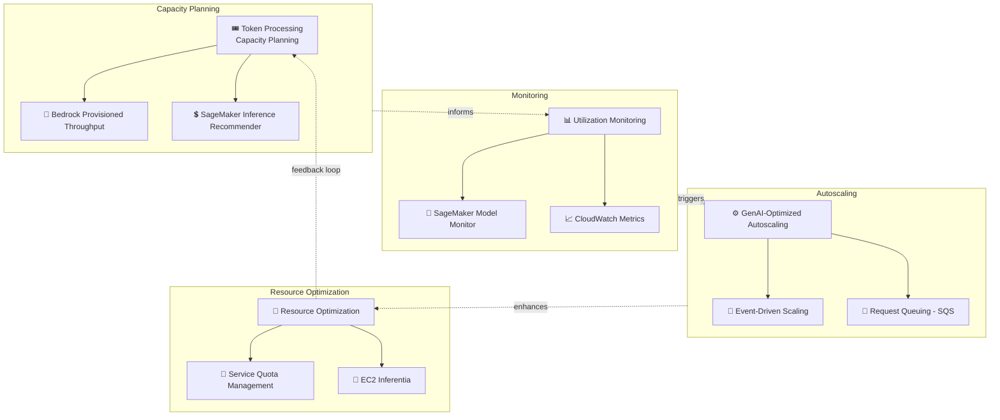

# Case Study 14 — Tối ưu phân bổ tài nguyên cho workload Foundation Model

[← Về Case Studies](./README.md)

| | |
|---|---|
| **Concept chính** | Capacity planning + utilization monitoring + auto scaling tối ưu riêng cho workload GenAI (FinOps cho FM) |
| **Domain liên quan** | D4 (Operational Efficiency & Cost), D2 (Integration) |
| **Service trọng tâm** | SageMaker (Inference Recommender, Model Monitor), Bedrock (Provisioned Throughput, Cross-Region Inference), CloudWatch, EC2 Auto Scaling, EC2 Inferentia, SQS, Terraform (IaC) |

---

## 1. Summary use case

> Các nhà cung cấp **hạ tầng thị trường tài chính** đang chuyển workload trọng yếu lên AWS và triển khai GenAI production. Workload GenAI có thách thức đặc thù so với ứng dụng truyền thống: cần **nhiều tài nguyên tính toán & bộ nhớ**; **latency dao động** lúc nhu cầu inference cao; chạy dưới **throughput quota cụ thể**; **không theo pattern hạ tầng thông thường** → cách FinOps truyền thống không đủ.

Hãy hình dung bạn vận hành nền tảng GenAI cho giao dịch tài chính, nơi nhu cầu **bùng nổ lúc thị trường mở/đóng cửa** và **biến động bất ngờ**. Cái khó: GPU rất đắt, throughput có giới hạn cứng, và pattern tải không giống web thường. Bài toán test khả năng **lập kế hoạch dung lượng + giám sát + auto scaling đặc thù GenAI**, không bê nguyên FinOps truyền thống.

### Các requirement phải giải

| # | Requirement | Diễn giải (vì sao khó) |
|---|---|---|
| R1 | **Lập kế hoạch dung lượng theo token** | Phải benchmark để chọn instance đúng cho nhu cầu token |
| R2 | **Throughput ổn định, vượt quota mặc định** | On-demand quota không đủ lúc đỉnh |
| R3 | **Giám sát mẫu prompt/completion** | Đo token length, phát hiện idle để scale down |
| R4 | **Auto scaling cho pattern GenAI** | Tải bùng nổ lúc thị trường mở/đóng + bất ngờ |
| R5 | **Hosting hiệu quả + chọn phần cứng** | Chọn instance tối ưu hiệu năng/chi phí cho model lớn |
| R6 | **Tự động hóa hạ tầng (IaC)** | Sinh cấu hình hạ tầng theo pattern chuẩn |

---

## 2. Sơ đồ kiến trúc

---

## 3. Vì sao kiến trúc này đáp ứng được bài toán (Design Rationale)

### R1 → Lập kế hoạch dung lượng: SageMaker Inference Recommender

**SageMaker Inference Recommender** chạy **load testing tự động** đánh giá model deployment dưới nhiều mức tải, chọn instance type tối ưu hiệu năng/chi phí, cân nhắc cả real-time và serverless inference. Đây là cách **dữ liệu hóa** việc chọn instance thay vì đoán.

> ⚠️ **Điểm dễ sai:** "benchmark để chọn instance cho FM" → **SageMaker Inference Recommender**.

### R2 → Throughput ổn định: Bedrock Provisioned Throughput + Cross-Region Inference

- **Provisioned Throughput** cấp endpoint hạ tầng chuyên dụng, đạt throughput **cao & ổn định hơn quota on-demand mặc định** — phù hợp workload trọng yếu cần đảm bảo.
- **Cross-Region Inference profiles** phân tán nhu cầu inference qua nhiều region để vượt giới hạn.

> ⚠️ **Điểm dễ sai:** workload trọng yếu cần throughput **đảm bảo, ổn định** → **Provisioned Throughput**; còn vượt quota tạm thời lúc đỉnh → **Cross-Region Inference**.

### R3 → Giám sát: CloudWatch + Model Monitor

- **CloudWatch** track resource metric, **đo token length của prompt & response** để đo utilization, phát hiện **idle period** để scale down/suspend endpoint.
- **SageMaker Model Monitor** giám sát hiệu năng & chất lượng dữ liệu liên tục.

### R4 → Auto scaling đặc thù GenAI: EC2 Auto Scaling + queuing + event-driven

- **EC2 Auto Scaling groups** sau load balancer cho SageMaker endpoint; deploy instance lớn hơn **chủ động** khi nhu cầu throughput dự đoán được (vd thị trường mở/đóng).
- **Queuing (SQS)** giữa ứng dụng và model để **tránh từ chối request** lúc throughput bị giới hạn.
- **Event-driven messaging** cho kiến trúc nhu cầu cao; scale up lúc cao điểm, scale down lúc thấp; right-sizing khớp dung lượng với usage thực tế.

> ⚠️ **Điểm dễ sai:** tải GenAI bùng nổ + throughput giới hạn → chèn **queue (SQS)** để không rớt request; kết hợp scaling theo lịch (thị trường mở/đóng) + theo nhu cầu bất ngờ.

### R5 → Hosting & phần cứng: EC2 Inferentia

Cân nhắc **EC2 Inferentia** (chip inference chuyên dụng của AWS) cho hiệu năng/hiệu quả tốt hơn; với model lớn, scale & phân tán tải qua nhiều instance.

> ⚠️ **Điểm dễ sai:** tối ưu chi phí/hiệu năng hosting model lớn → cân nhắc **Inferentia**, không mặc định GPU đắt.

### R6 → Tự động hóa hạ tầng: IaC (Terraform) + AI agents

Dùng **AI agents** phân tích yêu cầu ứng dụng & sinh cấu hình hạ tầng; triển khai **IaC như Terraform** theo pattern chuẩn nhưng thích ứng nhu cầu cụ thể.

---

## 4. Phương án thay thế & đánh đổi (Alternatives & trade-offs)

| Nhu cầu | Lựa chọn đúng | Lựa chọn sai thường gặp | Vì sao |
|---|---|---|---|
| Chọn instance cho FM | **SageMaker Inference Recommender** | Đoán thủ công | Load test dữ liệu hóa quyết định |
| Throughput ổn định đảm bảo | **Provisioned Throughput** | On-demand | On-demand không đủ lúc đỉnh trọng yếu |
| Vượt quota tạm thời | **Cross-Region Inference** | Mua thêm capacity cố định | Phân tán linh hoạt, rẻ cho spike |
| Tránh rớt request lúc đỉnh | **Queuing (SQS)** | Gọi thẳng | Queue đệm tải, không từ chối |
| Hosting model lớn hiệu quả | **EC2 Inferentia** | GPU đắt mặc định | Chip inference chuyên dụng tiết kiệm |
| Cấu hình hạ tầng | **IaC (Terraform)** | Bấm tay console | Lặp lại, theo pattern chuẩn |

---

## 5. 💡 Bài học rút ra (Lesson learned)

> **Khi gặp bài toán có** **"workload FM trọng yếu + tải dao động mạnh + throughput giới hạn + tối ưu chi phí GPU"**, nghĩ ngay tới: **Inference Recommender (capacity) + Provisioned Throughput/Cross-Region (throughput) + CloudWatch token monitoring + auto scaling đặc thù GenAI (queue + event-driven) + Inferentia.**

- **Inference Recommender** = chọn instance bằng load test, không đoán.
- **Provisioned Throughput** cho throughput đảm bảo; **Cross-Region Inference** cho spike.
- **Giám sát token length + idle period** để right-size và scale down.
- **Queue (SQS)** giữa app và model để không rớt request lúc đỉnh.
- **EC2 Inferentia** cho hosting model lớn hiệu quả chi phí.
- FinOps cho GenAI **khác** FinOps truyền thống — phải đặc thù theo token & throughput.

🔗 **Liên quan:** [02. SageMaker](../01-basic-knowledge/02-sagemaker-services.md) · [04. Compute & Deployment](../01-basic-knowledge/04-compute-deployment-services.md) · [01. Bedrock](../01-basic-knowledge/01-amazon-bedrock-services.md) · [Practice exam](../03-practice-exam/)
